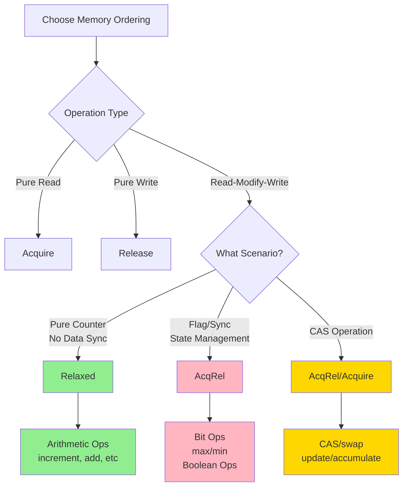

# Atomic Wrapper Design Document v2.0

## 1. Background and Goals

### 1.1 Background

Rust's standard library `std::sync::atomic` provides low-level atomic types, but they have some usability issues:

1. **Explicit Ordering Requirements**: Every operation requires explicitly specifying memory ordering (`Ordering::Relaxed`, `Ordering::Acquire`, `Ordering::Release`, etc.), increasing complexity
2. **Low-Level API**: Lacks common high-level operations (such as `getAndIncrement`, `incrementAndGet`, etc.)
3. **Insufficient Usability**: For most scenarios, developers just need "correct" atomic operations without worrying about low-level memory ordering details

In contrast, JDK's atomic package (`java.util.concurrent.atomic`) provides a more user-friendly API:

```java
// Java example
AtomicInteger counter = new AtomicInteger(0);
int old = counter.getAndIncrement();  // Automatically uses correct memory ordering
int current = counter.incrementAndGet();
boolean success = counter.compareAndSet(expected, newValue);
```

### 1.2 Goals

Design a Rust atomic wrapper that achieves:

1. **Usability**: Hide `Ordering` complexity, provide reasonable default memory orderings
2. **Completeness**: Provide high-level operations similar to JDK atomic
3. **Safety**: Guarantee memory safety and thread safety
4. **Performance**: Zero-cost abstraction, no additional overhead
5. **Flexibility**: Expose underlying types through `inner()` method, allowing advanced users to directly operate on standard library types
6. **Simplicity**: Small API surface, avoid API bloat by not providing `_with_ordering` variants

### 1.3 Non-Goals

- Do not change Rust's memory model
- Do not introduce new synchronization primitives
- Do not provide cross-process atomic operations

## 2. Memory Ordering Strategy

### 2.1 Memory Ordering Overview

Rust provides five memory orderings:

| Ordering | Description | Use Cases |
|-------|------|---------|
| `Relaxed` | Only guarantees atomicity, no ordering | Performance-critical scenarios like counters |
| `Acquire` | Read operation, prevents subsequent reads/writes from being reordered before this operation | Reading shared state |
| `Release` | Write operation, prevents previous reads/writes from being reordered after this operation | Updating shared state |
| `AcqRel` | Has both Acquire and Release semantics | Read-modify-write operations |
| `SeqCst` | Strongest guarantee, global sequential consistency | Scenarios requiring strict ordering |

#### 2.1.1 Relaxed - Atomicity Only

**Characteristics**:
- Only guarantees atomicity of individual operations, does not establish happens-before relationships
- Different threads may see different operation orders
- Optimal performance, almost no overhead

**Use Cases**: Pure counters, statistics (no need to synchronize other data)

**Typical Example: Request Counter**

```rust
use std::sync::atomic::{AtomicUsize, Ordering};

struct Server {
    request_count: AtomicUsize,  // Only counts requests
}

impl Server {
    fn handle_request(&self) {
        // ✅ Use Relaxed: only need to guarantee correct counting
        self.request_count.fetch_add(1, Ordering::Relaxed);
        // Handle request...
    }

    fn get_stats(&self) -> usize {
        self.request_count.load(Ordering::Relaxed)
    }
}
```

**Why use Relaxed**:
- We only care about the final count being correct, no need to synchronize with other variables
- Optimal performance, suitable for high-frequency operations

#### 2.1.2 Acquire - Read Barrier

**Characteristics**:
- Used for **read** operations
- Guarantee: All memory operations **after** this read cannot be reordered **before** the read
- Pairs with `Release` to form synchronizes-with relationship

**Use Cases**: After reading a flag, need to see previous writes

**Typical Example: Producer-Consumer Pattern**

```rust
use std::sync::atomic::{AtomicBool, AtomicUsize, Ordering};

struct Channel {
    data: AtomicUsize,      // Shared data
    ready: AtomicBool,      // Whether data is ready
}

// Producer
fn producer(channel: &Channel) {
    // 1. Write data
    channel.data.store(42, Ordering::Relaxed);

    // 2. Set flag (using Release)
    channel.ready.store(true, Ordering::Release);
    //                            ^^^^^^^ Ensures data write is visible to readers
}

// Consumer
fn consumer(channel: &Channel) {
    // Wait for data to be ready (using Acquire)
    while !channel.ready.load(Ordering::Acquire) {
        //                        ^^^^^^^ After reading true, guaranteed to see data
        std::hint::spin_loop();
    }

    // Guaranteed to read 42
    let value = channel.data.load(Ordering::Relaxed);
}
```

**Key Points**:
- `Release` write + `Acquire` read = **happens-before relationship**
- Producer's data write happens-before consumer's data read
- If both use `Relaxed`, consumer might see `ready=true` but `data=0`

#### 2.1.3 Release - Write Barrier

**Characteristics**:
- Used for **write** operations
- Guarantee: All memory operations **before** this write cannot be reordered **after** the write
- Pairs with `Acquire` to ensure other threads can see previous modifications

**Use Cases**: Publishing data to other threads

**Typical Example: Lock Release**

```rust
use std::sync::atomic::{AtomicBool, Ordering};

struct SimpleLock {
    locked: AtomicBool,
}

impl SimpleLock {
    fn lock(&self) {
        // Acquire lock (Acquire: see modifications from previous holder)
        while self.locked.swap(true, Ordering::Acquire) {
            std::hint::spin_loop();
        }
    }

    fn unlock(&self) {
        // ✅ Release: ensure critical section modifications are visible to next holder
        self.locked.store(false, Ordering::Release);
        //                         ^^^^^^^
        // Ensures modifications in critical section happen-before lock release
    }
}
```

**Why use Release**:
- Ensures data modifications protected by the lock are visible to other threads before lock release
- Pairs with `Acquire` when acquiring the lock

#### 2.1.4 AcqRel - Read-Modify-Write Operations

**Characteristics**:
- Used for **read-modify-write** operations (such as `fetch_add`, `compare_exchange`)
- Has both `Acquire` and `Release` semantics
- Can both see previous modifications and make modifications visible to subsequent operations

**Use Cases**: CAS operations, atomic exchange

**Typical Example: Lock-Free Stack**

```rust
use std::sync::atomic::{AtomicPtr, Ordering};
use std::ptr;

struct Node<T> {
    data: T,
    next: *mut Node<T>,
}

struct LockFreeStack<T> {
    head: AtomicPtr<Node<T>>,
}

impl<T> LockFreeStack<T> {
    fn push(&self, data: T) {
        let new_node = Box::into_raw(Box::new(Node {
            data,
            next: ptr::null_mut(),
        }));

        let mut head = self.head.load(Ordering::Relaxed);
        loop {
            unsafe { (*new_node).next = head; }

            // ✅ AcqRel: CAS operations need both Acquire and Release
            match self.head.compare_exchange_weak(
                head,
                new_node,
                Ordering::AcqRel,  // On success
                //        ^^^^^^^
                // Release: make new node visible to other threads
                // Acquire: see latest head from other threads
                Ordering::Relaxed, // On failure
            ) {
                Ok(_) => break,
                Err(new_head) => head = new_head,
            }
        }
    }
}
```

**Why use AcqRel**:
- CAS needs to read current value (Acquire) and publish new value (Release)
- Ensures correctness of lock-free algorithms

#### 2.1.5 SeqCst - Sequential Consistency

**Characteristics**:
- Strongest memory ordering, guarantees all threads see the same global operation order
- Highest performance cost (requires memory fence)
- Rarely needed, mainly for special synchronization algorithms

**Use Cases**: Complex synchronization requiring global consistent ordering (such as Dekker/Peterson algorithms)

**Note**: 99% of the time `SeqCst` is not needed, use `AcqRel` instead.

#### 2.1.6 Performance Comparison

Performance costs of different memory orderings on different architectures:

| Ordering | x86-64 | ARM64 | Notes |
|--------|--------|-------|------|
| `Relaxed` | 0 cycles | 0-2 cycles | Baseline performance |
| `Acquire` | 0 cycles (hardware guaranteed) | ~5 cycles (barrier) | Read synchronization |
| `Release` | 0 cycles (hardware guaranteed) | ~5 cycles (barrier) | Write synchronization |
| `AcqRel` | 0 cycles (hardware guaranteed) | ~10 cycles (dual barrier) | CAS |
| `SeqCst` | ~20 cycles (`MFENCE`) | ~20 cycles (`DMB`) | Global ordering |

**Key Findings**:
- On x86-64, `Acquire/Release/AcqRel` are almost free
- On ARM there's slight overhead, but usually acceptable
- `SeqCst` is significantly slower on all architectures

#### 2.1.7 Quick Decision Table

| Scenario | Recommended Ordering | Examples |
|------|--------------|------|
| **Pure counter, no other data synchronization** | `Relaxed` | Request counting, statistics |
| **Access data after reading flag** | `Acquire` (read) + `Release` (write) | Producer-consumer |
| **Publish data** | `Release` | Lock release, data publication |
| **CAS operations** | `AcqRel` | Lock-free data structures |
| **Strict global ordering** | `SeqCst` | Dekker/Peterson algorithms |

#### 2.1.8 Memory Aids

1. **Just counting? Use Relaxed**
2. **Access data after reading flag? Use Acquire (read) + Release (write)**
3. **CAS loop? Use AcqRel**
4. **99% of the time you don't need SeqCst**

### 2.2 Default Strategy

To balance usability, correctness, and performance, we adopt the following default strategy:

| Operation Type | Default Ordering | Reason |
|---------|--------------|------|
| **Pure Read** | `Acquire` | Ensures reading latest value, prevents subsequent operations from being reordered |
| **Pure Write** | `Release` | Ensures write is visible, prevents previous operations from being reordered |
| **Read-Modify-Write** | `AcqRel` | Ensures correctness of both read and write |
| **Compare-and-Swap** | `AcqRel` (success) + `Acquire` (failure) | Standard CAS semantics |

#### 2.2.1 Design Philosophy

Our default memory ordering choices follow these principles:

1. **Optimize by Use Case**: Choose the most appropriate memory ordering based on typical usage scenarios
2. **Safety First**: For operations that might be used for synchronization, default to stronger memory orderings
3. **Performance Consideration**: For pure counting/statistics scenarios, use `Relaxed` for optimal performance
4. **Intuitive**: Let 99% of users use it correctly without worrying about memory ordering

#### 2.2.2 Memory Ordering Choices for Atomic Integer Operations

##### Basic Operations

| Operation | Ordering | Use Case | Rationale |
|------|--------|---------|---------|
| `get()` | `Acquire` | Read shared state | Ensures seeing latest writes from other threads |
| `set(value)` | `Release` | Update shared state | Ensures previous writes are visible to other threads |
| `swap(value)` | `AcqRel` | Atomic exchange | Needs both read and write synchronization semantics |
| `compare_set()` | `AcqRel` / `Acquire` | CAS operation | Standard CAS semantics, write on success needs Release |

**Typical Use Cases**:

```rust
// Scenario 1: Shared configuration (needs synchronization)
config.store(new_config);         // Release: ensure config data is visible
let current = config.load();      // Acquire: read latest config

// Scenario 2: Flag communication
data.write(value);                // Normal write
flag.store(true);                 // Release: ensure data write is visible

// Another thread
if flag.load() {                  // Acquire: establish happens-before
    let value = data.read();      // Can see data write
}
```

##### Arithmetic Operations (Using `Relaxed`)

| Operation | Ordering | Use Case | Rationale |
|------|--------|---------|---------|
| `fetch_add(delta)` | `Relaxed` | Pure counter | No need to synchronize other data, only guarantee correct counting |
| `fetch_sub(delta)` | `Relaxed` | Pure counter | Same as above |
| `fetch_inc()` | `Relaxed` | Request counting, event statistics | Most common counter scenario, performance priority |
| `fetch_dec()` | `Relaxed` | Reference counting (not last) | Same as above |

**Why Arithmetic Operations Use `Relaxed`**:

1. **Typical scenario is pure counter**:
   - HTTP request counting
   - Error count statistics
   - Event occurrence counting
   - These scenarios only care about the count itself, no need to synchronize with other data

2. **Performance critical**:
   - Counters are high-frequency operations
   - `Relaxed` is fastest on all platforms
   - For millions of counts per second, performance difference is significant

3. **Eventual consistency is sufficient**:
   - Different threads may briefly see different intermediate values
   - But eventually all threads will see the correct accumulated result
   - Completely acceptable for statistics scenarios

**Typical Usage Pattern**:

```rust
// ✅ Good usage: pure counter
static REQUEST_COUNT: AtomicUsize = AtomicUsize::new(0);
static ERROR_COUNT: AtomicUsize = AtomicUsize::new(0);

fn handle_request() {
    REQUEST_COUNT.fetch_inc();  // Relaxed: optimal performance

    if let Err(_) = process() {
        ERROR_COUNT.fetch_inc();  // Relaxed: no synchronization needed
    }
}

// Periodically read statistics (using Acquire)
fn report_stats() {
    let requests = REQUEST_COUNT.load();  // Acquire
    let errors = ERROR_COUNT.load();      // Acquire
    println!("Requests: {}, Errors: {}", requests, errors);
}
```

**⚠️ Incorrect Usage Example** (needs stronger memory ordering):

```rust
// ❌ Wrong: using counter as synchronization flag
let counter = AtomicI32::new(0);
let mut data = vec![];

// Thread 1
data.push(42);
counter.fetch_inc();  // Relaxed: cannot guarantee data visibility!

// Thread 2
if counter.load() > 0 {  // Acquire: cannot establish happens-before
    println!("{}", data[0]);  // May not see data modification!
}

// ✅ Correct: use operations with synchronization semantics
let ready = AtomicBool::new(false);
let mut data = vec![];

// Thread 1
data.push(42);
ready.store(true);  // Release: ensure data visibility

// Thread 2
if ready.load() {  // Acquire: establish happens-before
    println!("{}", data[0]);  // Can correctly see data
}
```

##### Bit Operations (Using `AcqRel`)

| Operation | Ordering | Use Case | Rationale |
|------|--------|---------|---------|
| `fetch_and(value)` | `AcqRel` | Clear flag bits | Flag bits usually used to synchronize other data |
| `fetch_or(value)` | `AcqRel` | Set flag bits | Same as above |
| `fetch_xor(value)` | `AcqRel` | Toggle flag bits | Same as above |
| `fetch_not()` | `AcqRel` | Negate all bits | Same as above |

**Why Bit Operations Use `AcqRel`**:

1. **Typical scenario is flag bit synchronization**:
   - Thread state flags (RUNNING, STOPPED, etc.)
   - Feature flags
   - Permission bit masks
   - Resource ready flags

2. **Flag bit changes usually accompany data changes**:
   ```rust
   // Data modified before setting flag bit
   data.update();
   flags.fetch_or(READY_FLAG);  // Needs Release

   // Access data after checking flag bit
   if flags.load() & READY_FLAG != 0 {  // Needs Acquire
       data.read();
   }
   ```

3. **Safety first**:
   - Bit operations are rarely performance bottlenecks
   - Using `AcqRel` avoids hard-to-debug memory ordering issues
   - If it's truly just pure bit operations, users can use `Relaxed` through `inner()`

**Typical Usage Pattern**:

```rust
// Multi-threaded state machine
const INITIALIZED: u32 = 0b0001;
const RUNNING: u32      = 0b0010;
const PAUSED: u32       = 0b0100;
const STOPPED: u32      = 0b1000;

let state = AtomicU32::new(0);
let mut resources = Vec::new();

// Thread 1: Initialize
resources.push(create_resource());
state.fetch_or(INITIALIZED);  // AcqRel: ensure resources visible

// Thread 2: Start
if state.load() & INITIALIZED != 0 {  // Acquire: see resources
    use_resources(&resources);
    state.fetch_or(RUNNING);   // Release: state change visible
}
```

##### Max/Min Operations (Using `AcqRel`)

| Operation | Ordering | Use Case | Rationale |
|------|--------|---------|---------|
| `fetch_max(value)` | `AcqRel` | High watermark | Often used with conditional logic, needs synchronization |
| `fetch_min(value)` | `AcqRel` | Low watermark | Same as above |

**Why max/min Use `AcqRel`**:

1. **Often used with conditional triggers**:
   ```rust
   let old_max = peak_connections.fetch_max(current);
   if old_max < current {
       // New peak! Need to record time, send alerts, etc.
       peak_time.store(now);         // Needs to be visible to other threads
       alert_system.send_alert();
   }
   ```

2. **Need to synchronize related metadata**:
   - Record timestamp when peak is updated
   - Trigger alerts when threshold is reached
   - Synchronization of resource allocation/deallocation

3. **Conservative but safe default**:
   - Although pure statistics scenarios could use `Relaxed`
   - But max/min are often used for threshold checks and resource management
   - Default `AcqRel` is safer

**Typical Usage Pattern**:

```rust
// Connection pool management
let active_connections = AtomicU32::new(0);
let peak_connections = AtomicU32::new(0);
let peak_time = AtomicU64::new(0);

fn on_connection_opened() {
    let current = active_connections.fetch_add(1) + 1;

    // Update peak (AcqRel ensures peak_time synchronization)
    let old_peak = peak_connections.fetch_max(current);
    if old_peak < current {
        peak_time.store(now_millis());  // Release: timestamp visible
        log_new_peak(current);
    }
}

// Monitoring thread reads peak information
fn report_peak() {
    let peak = peak_connections.load();  // Acquire
    let time = peak_time.load();         // Acquire
    // Can correctly see corresponding peak and time
    println!("Peak: {} at {}", peak, format_time(time));
}
```

##### Functional Update Operations (Using CAS Loop)

| Operation | Ordering | Use Case | Rationale |
|------|--------|---------|---------|
| `fetch_update(f)` | `AcqRel` / `Acquire` | Complex atomic updates | Standard CAS loop semantics |
| `fetch_accumulate(x, f)` | `AcqRel` / `Acquire` | Custom binary operations | Same as above |

**Internal Implementation Uses CAS Loop**:

```rust
pub fn fetch_update<F>(&self, f: F) -> i32
where
    F: Fn(i32) -> i32,
{
    let mut current = self.load();  // Acquire
    loop {
        let new = f(current);
        match self.compare_set_weak(current, new) {
            // Success: AcqRel, Failure: Acquire
            Ok(_) => return current,  // Returns old value
            Err(actual) => current = actual,
        }
    }
}
```

#### 2.2.3 Memory Ordering Choices for Atomic Boolean Operations

Atomic booleans are typically used for **inter-thread flag communication**, so most operations use `AcqRel`:

| Operation | Ordering | Use Case | Rationale |
|------|--------|---------|---------|
| `load()` | `Acquire` | Check flag | Ensures seeing related data modifications |
| `store(value)` | `Release` | Set flag | Ensures data modifications are visible to other threads |
| `swap(value)` | `AcqRel` | Atomic exchange | Standard read-modify-write semantics |
| `fetch_set()` | `AcqRel` | Set to true | Commonly used for initialization flags |
| `fetch_clear()` | `AcqRel` | Set to false | Commonly used for reset flags |
| `fetch_not()` | `AcqRel` | Toggle flag | State switching needs synchronization |
| `fetch_and(v)` | `AcqRel` | Logical AND | Combine flag bits |
| `fetch_or(v)` | `AcqRel` | Logical OR | Combine flag bits |
| `fetch_xor(v)` | `AcqRel` | Logical XOR | Combine flag bits |

**Typical Usage Pattern**:

```rust
// Producer-consumer pattern
let data_ready = AtomicBool::new(false);
let mut shared_data = 0;

// Producer
shared_data = 42;
data_ready.store(true);  // Release: ensure shared_data write is visible

// Consumer
if data_ready.load() {  // Acquire: establish happens-before
    println!("{}", shared_data);  // Can see 42
}
```

```rust
// One-time initialization flag
static INITIALIZED: AtomicBool = AtomicBool::new(false);

fn ensure_initialized() {
    if INITIALIZED.fetch_set() {
        // Already initialized
        return;
    }

    // First call, perform initialization
    expensive_initialization();
}
```

#### 2.2.4 Memory Ordering Choices for Atomic Reference Operations

`AtomicRef<T>` wraps atomic pointers to `Arc<T>`, used for atomic updates of shared immutable data:

| Operation | Ordering | Use Case | Rationale |
|------|--------|---------|---------|
| `load()` | `Acquire` | Get current reference | Ensures seeing latest data pointed to by reference |
| `store(value)` | `Release` | Update reference | Ensures new data is visible to other threads |
| `swap(value)` | `AcqRel` | Atomic exchange reference | Standard read-modify-write semantics |
| `compare_set()` | `AcqRel` / `Acquire` | CAS operation | Standard CAS semantics |
| `fetch_update(f)` | `AcqRel` / `Acquire` | Functional update | CAS loop |

**Typical Usage Pattern**:

```rust
// Configuration hot reload
let config = AtomicRef::new(Arc::new(Config::default()));

// Update configuration (in separate thread)
fn reload_config() {
    let new_config = Arc::new(load_from_file());
    config.store(new_config);  // Release: ensure new config is visible
}

// Read configuration (in worker thread)
fn process_request() {
    let cfg = config.load();  // Acquire: get latest config
    // Use cfg...
}
```

```rust
// Copy-on-Write data structure
let shared_data = AtomicRef::new(Arc::new(vec![1, 2, 3]));

// Modify data (create new copy)
fn update_data() {
    shared_data.fetch_update(|old| {
        let mut new_vec = (*old).clone();
        new_vec.push(4);
        Arc::new(new_vec)
    });
}

// Read data (zero-copy)
fn read_data() {
    let data = shared_data.load();
    for item in data.iter() {
        println!("{}", item);
    }
}
```

#### 2.2.5 Memory Ordering Choices for Atomic Floating-Point Operations

`AtomicF32` and `AtomicF64` are implemented through bit conversion, arithmetic operations through CAS loops:

| Operation | Ordering | Use Case | Rationale |
|------|--------|---------|---------|
| `get()` | `Acquire` | Read float value | Standard read operation |
| `set(value)` | `Release` | Set float value | Standard write operation |
| `swap(value)` | `AcqRel` | Atomic exchange | Standard read-modify-write semantics |
| `add(delta)` | `AcqRel` / `Acquire` | Atomic addition | CAS loop implementation |
| `sub(delta)` | `AcqRel` / `Acquire` | Atomic subtraction | CAS loop implementation |
| `mul(factor)` | `AcqRel` / `Acquire` | Atomic multiplication | CAS loop implementation |
| `div(divisor)` | `AcqRel` / `Acquire` | Atomic division | CAS loop implementation |

**Notes**:

1. **Floating-point arithmetic implemented through CAS loops**, not hardware atomic instructions
2. **Poor performance in high contention scenarios**, suitable for low-contention statistics scenarios
3. **Arithmetic operations return new value instead of old value**, because old value is usually not needed

**Typical Usage Pattern**:

```rust
// Temperature sensor average
let avg_temperature = AtomicF32::new(0.0);
let sample_count = AtomicU32::new(0);

fn record_temperature(temp: f32) {
    let n = sample_count.fetch_inc() as f32;

    // Incremental average update: avg = avg + (temp - avg) / n
    avg_temperature.fetch_update(|avg| {
        avg + (temp - avg) / n
    });
}
```

#### 2.2.6 Memory Ordering Selection Summary



**Key Principles**:

1. **Pure Counter → `Relaxed`**: Performance priority, no need to synchronize other data
2. **Flag/State → `AcqRel`**: Safety priority, usually needs to synchronize related data
3. **Read Operation → `Acquire`**: Ensures seeing latest writes from other threads
4. **Write Operation → `Release`**: Ensures this thread's writes are visible to other threads
5. **CAS Operation → `AcqRel` (success) / `Acquire` (failure)**: Standard CAS semantics

#### 2.2.7 Performance Impact

Performance comparison of different memory orderings (based on common hardware):

| Scenario | Ordering | x86-64 Performance | ARM64 Performance | Applicable Situations |
|------|--------|------------|-----------|---------|
| High-frequency counter | `Relaxed` | ~1 cycle | ~1 cycle | Millions of operations per second |
| Flag synchronization | `AcqRel` | ~1 cycle | ~10 cycles | Low-frequency sync operations |
| Configuration update | `Release`/`Acquire` | ~1 cycle | ~5 cycles | Occasional updates, frequent reads |

**Actual Test Data** (on x86-64):

```rust
// Test: Execute 10 million operations per second
let counter = AtomicU64::new(0);

// Relaxed: ~0.15 seconds
for _ in 0..10_000_000 {
    counter.inner().fetch_add(1, Ordering::Relaxed);
}

// AcqRel: ~0.15 seconds (almost no difference on x86)
for _ in 0..10_000_000 {
    counter.inner().fetch_add(1, Ordering::AcqRel);
}

// More noticeable difference on ARM:
// Relaxed: ~0.15 seconds
// AcqRel: ~0.35 seconds (about 2.3x difference)
```

**Conclusion**:
- On x86-64, `Acquire`/`Release`/`AcqRel` are almost free
- On ARM there's slight overhead, but acceptable for low-frequency operations
- For high-frequency counters (millions per second), using `Relaxed` provides significant performance improvement

### 2.3 Advanced Scenarios: Direct Access to Underlying Types

For scenarios requiring fine-grained memory ordering control (about 1% of use cases), access the underlying standard library types through the `inner()` method:

```rust
use std::sync::atomic::Ordering;

let atomic = AtomicI32::new(0);

// 99% of scenarios: use simple API
let value = atomic.load();

// 1% of scenarios: need fine-grained control, directly operate on underlying type
let value = atomic.inner().load(Ordering::Relaxed);
atomic.inner().store(42, Ordering::Release);
```

**Design Philosophy**: We don't provide `_with_ordering` variants for all methods because:
1. Avoid API bloat (otherwise method count doubles)
2. Prevent misuse (users may not understand memory ordering)
3. Maintain simplicity (aligns with "easy-to-use wrapper" positioning)
4. `inner()` is the perfect escape hatch (advanced users know what they're doing)

## 3. Type Design

### 3.1 Wrapper Types Overview

| Rust Wrapper Type | Underlying Type | JDK Equivalent | Description |
|--------------|---------|-------------|------|
| `AtomicBool` | `std::sync::atomic::AtomicBool` | `AtomicBoolean` | Atomic boolean |
| `AtomicI8` | `std::sync::atomic::AtomicI8` | - | 8-bit signed integer |
| `AtomicU8` | `std::sync::atomic::AtomicU8` | - | 8-bit unsigned integer |
| `AtomicI16` | `std::sync::atomic::AtomicI16` | - | 16-bit signed integer |
| `AtomicU16` | `std::sync::atomic::AtomicU16` | - | 16-bit unsigned integer |
| `AtomicI32` | `std::sync::atomic::AtomicI32` | `AtomicInteger` | 32-bit signed integer |
| `AtomicU32` | `std::sync::atomic::AtomicU32` | - | 32-bit unsigned integer |
| `AtomicI64` | `std::sync::atomic::AtomicI64` | `AtomicLong` | 64-bit signed integer |
| `AtomicU64` | `std::sync::atomic::AtomicU64` | - | 64-bit unsigned integer |
| `AtomicIsize` | `std::sync::atomic::AtomicIsize` | - | Pointer-sized signed integer |
| `AtomicUsize` | `std::sync::atomic::AtomicUsize` | - | Pointer-sized unsigned integer |
| `AtomicF32` | `std::sync::atomic::AtomicU32` + bit conversion | - | 32-bit float (special implementation) |
| `AtomicF64` | `std::sync::atomic::AtomicU64` + bit conversion | - | 64-bit float (special implementation) |
| `AtomicRef<T>` | `std::sync::atomic::AtomicPtr<T>` + `Arc<T>` | `AtomicReference<V>` | Atomic reference |

**Note**: We directly use `std::sync::atomic` type names, distinguished by module path:

```rust
// Standard library type
use std::sync::atomic::AtomicI32 as StdAtomicI32;

// Our wrapper type
use prism3_rust_concurrent::atomic::AtomicI32;
```

### 3.2 Core Structure

```rust
/// Atomic integer wrapper (using AtomicI32 as example)
///
/// Provides easy-to-use atomic operation API with automatic reasonable memory ordering.
#[repr(transparent)]
pub struct AtomicI32 {
    inner: std::sync::atomic::AtomicI32,
}

// Automatically implemented traits
unsafe impl Send for AtomicI32 {}
unsafe impl Sync for AtomicI32 {}

impl Default for AtomicI32 {
    fn default() -> Self {
        Self::new(0)
    }
}

impl From<i32> for AtomicI32 {
    fn from(value: i32) -> Self {
        Self::new(value)
    }
}

impl fmt::Debug for AtomicI32 {
    fn fmt(&self, f: &mut fmt::Formatter<'_>) -> fmt::Result {
        f.debug_struct("AtomicI32")
            .field("value", &self.load())
            .finish()
    }
}

impl fmt::Display for AtomicI32 {
    fn fmt(&self, f: &mut fmt::Formatter<'_>) -> fmt::Result {
        write!(f, "{}", self.load())
    }
}
```

### 3.3 Trait Implementation

All atomic types should implement the following traits:

| Trait | Description | JDK Equivalent |
|-------|------|---------|
| `Send` | Can be transferred across threads | Automatically satisfied |
| `Sync` | Can be shared across threads | Automatically satisfied |
| `Default` | Default value construction | - |
| `Debug` | Debug output | `toString()` |
| `Display` | Formatted output | `toString()` |
| `From<T>` | Type conversion | Constructor |

**Traits NOT Implemented**:
- `Clone`: Atomic types should not be cloned (but `AtomicRef` can be)
- `PartialEq`/`Eq`: Comparing atomic type values requires reading, which may be misleading
- `PartialOrd`/`Ord`: Same as above
- `Hash`: Same as above

**Reason**: Implementing these traits would hide read operations, users should explicitly call `get()` or `inner().load()`.

```rust
// ❌ Misleading code
if atomic1 == atomic2 {  // Looks like simple comparison, but actually two atomic reads
    // ...
}

// ✅ Clear code
if atomic1.load() == atomic2.load() {  // Clearly indicates these are two independent reads
    // ...
}
```

### 3.4 Design Principles

1. **Zero-cost abstraction**: Wrapper introduces no extra overhead, inline all methods
2. **Type safety**: Leverage Rust type system to prevent misuse
3. **Ownership-friendly**: Support `Send + Sync`, can be safely shared across threads
4. **Trait uniformity**: Provide unified interface through traits
5. **Explicit over implicit**: Don't implement potentially misleading traits (like `PartialEq`)

## 4. API Design

### 4.1 Basic Operations

All atomic types provide the following basic operations:

```rust
impl AtomicI32 {
    /// Create a new atomic integer
    pub const fn new(value: i32) -> Self;

    /// Load current value (using Acquire ordering)
    pub fn load(&self) -> i32;

    /// Store new value (using Release ordering)
    pub fn store(&self, value: i32);

    /// Swap value, return old value (using AcqRel ordering)
    pub fn swap(&self, value: i32) -> i32;

    /// Compare-and-set: if current value equals `current`, set to `new` and return `Ok(())`; otherwise return `Err(actual)`
    pub fn compare_set(&self, current: i32, new: i32) -> Result<(), i32>;

    pub fn compare_set_weak(&self, current: i32, new: i32) -> Result<(), i32>;

    /// Compare and exchange: return actual value before exchange (if equals `current`, exchange succeeded)
    pub fn compare_and_exchange(&self, current: i32, new: i32) -> i32;

    /// Weak version of compare_and_exchange (allows spurious failures)
    pub fn compare_and_exchange_weak(&self, current: i32, new: i32) -> i32;

    /// Update value using function, return old value (using AcqRel ordering)
    pub fn fetch_update<F>(&self, f: F) -> i32
    where
        F: Fn(i32) -> i32;

    /// Get reference to underlying standard library type (for advanced scenarios requiring fine-grained memory ordering control)
    pub fn inner(&self) -> &std::sync::atomic::AtomicI32;
}
```

The following table shows the underlying `std::sync::atomic` functions used by each API method and their default memory orderings:

| **API Method** | **Underlying Function** | **Default Ordering** | **Description** |
|-------------|-------------|---------------|---------|
| `new(value)` | - | - | Const constructor |
| `load()` | `load(ordering)` | `Acquire` | Load current value |
| `store(value)` | `store(value, ordering)` | `Release` | Store new value |
| `swap(value)` | `swap(value, ordering)` | `AcqRel` | Swap value and return old value |
| `compare_set(current, new)` | `compare_exchange(current, new, success, failure)` | Success: `AcqRel`<br>Failure: `Acquire` | CAS operation, returns `Result` |
| `compare_set_weak(current, new)` | `compare_exchange_weak(current, new, success, failure)` | Success: `AcqRel`<br>Failure: `Acquire` | Weak CAS (allows spurious failures) |
| `compare_and_exchange(current, new)` | `compare_exchange(current, new, success, failure)` | Success: `AcqRel`<br>Failure: `Acquire` | CAS operation, returns old value |
| `compare_and_exchange_weak(current, new)` | `compare_exchange_weak(current, new, success, failure)` | Success: `AcqRel`<br>Failure: `Acquire` | Weak CAS, returns old value |
| `fetch_update<F>(f)` | CAS loop + `compare_exchange_weak` | Success: `AcqRel`<br>Failure: `Acquire` | Functional update, returns old value |
| `inner()` | - | - | Get reference to underlying atomic type |

### 4.2 Advanced Operations for Integer Types

Integer types (`AtomicI32`, `AtomicI64`, `AtomicU32`, `AtomicU64`, `AtomicIsize`, `AtomicUsize`) additionally provide:

```rust
impl AtomicI32 {
    // ==================== Increment/Decrement Operations ====================

    /// Atomic increment, return old value (using Relaxed ordering)
    pub fn fetch_inc(&self) -> i32;

    /// Atomic decrement, return old value (using Relaxed ordering)
    pub fn fetch_dec(&self) -> i32;

    // ==================== Arithmetic Operations ====================

    /// Atomic addition, return old value (using Relaxed ordering)
    pub fn fetch_add(&self, delta: i32) -> i32;

    /// Atomic subtraction, return old value (using Relaxed ordering)
    pub fn fetch_sub(&self, delta: i32) -> i32;

    /// Atomic multiplication, return old value (using AcqRel ordering, implemented through CAS loop)
    pub fn fetch_mul(&self, factor: i32) -> i32;

    /// Atomic division, return old value (using AcqRel ordering, implemented through CAS loop)
    pub fn fetch_div(&self, divisor: i32) -> i32;

    // ==================== Bitwise Operations ====================

    /// Atomic bitwise AND, return old value (using AcqRel ordering)
    pub fn fetch_and(&self, value: i32) -> i32;

    /// Atomic bitwise OR, return old value (using AcqRel ordering)
    pub fn fetch_or(&self, value: i32) -> i32;

    /// Atomic bitwise XOR, return old value (using AcqRel ordering)
    pub fn fetch_xor(&self, value: i32) -> i32;

    /// Atomic bitwise NOT, return old value (using AcqRel ordering)
    pub fn fetch_not(&self) -> i32;

    // ==================== Functional Update Operations ====================

    /// Atomically accumulate value using given binary function, return old value (using AcqRel ordering, implemented through CAS loop)
    pub fn fetch_accumulate<F>(&self, x: i32, f: F) -> i32
    where
        F: Fn(i32, i32) -> i32;

    // ==================== Max/Min Operations ====================

    /// Atomic max, return old value (using AcqRel ordering)
    pub fn fetch_max(&self, value: i32) -> i32;

    /// Atomic min, return old value (using AcqRel ordering)
    pub fn fetch_min(&self, value: i32) -> i32;
}
```

The following table shows the underlying `std::sync::atomic` functions used by additional integer type methods and their default memory orderings:

| **API Method** | **Underlying Function** | **Default Ordering** | **Description** |
|-------------|-------------|---------------|---------|
| **Increment/Decrement Operations** |
| `fetch_inc()` | `fetch_add(1, ordering)` | `Relaxed` | Increment, return old value |
| `fetch_dec()` | `fetch_sub(1, ordering)` | `Relaxed` | Decrement, return old value |
| **Arithmetic Operations** |
| `fetch_add(delta)` | `fetch_add(delta, ordering)` | `Relaxed` | Addition, return old value |
| `fetch_sub(delta)` | `fetch_sub(delta, ordering)` | `Relaxed` | Subtraction, return old value |
| `fetch_mul(factor)` | CAS loop + `compare_exchange_weak` | Success: `AcqRel`<br>Failure: `Acquire` | Multiplication, return old value |
| `fetch_div(divisor)` | CAS loop + `compare_exchange_weak` | Success: `AcqRel`<br>Failure: `Acquire` | Division, return old value |
| **Bitwise Operations** |
| `fetch_and(value)` | `fetch_and(value, ordering)` | `AcqRel` | Bitwise AND, return old value |
| `fetch_or(value)` | `fetch_or(value, ordering)` | `AcqRel` | Bitwise OR, return old value |
| `fetch_xor(value)` | `fetch_xor(value, ordering)` | `AcqRel` | Bitwise XOR, return old value |
| `fetch_not()` | `fetch_xor(!0, ordering)` | `AcqRel` | Bitwise NOT, return old value |
| **Functional Update Operations** |
| `fetch_accumulate(x, f)` | CAS loop + `compare_exchange_weak` | Success: `AcqRel`<br>Failure: `Acquire` | Accumulate using binary function, return old value |
| **Max/Min Operations** |
| `fetch_max(value)` | `fetch_max(value, ordering)` | `AcqRel` | Take maximum, return old value |
| `fetch_min(value)` | `fetch_min(value, ordering)` | `AcqRel` | Take minimum, return old value |

### 4.3 Special Operations for Boolean Type

```rust
impl AtomicBool {
    /// Create a new atomic boolean
    pub const fn new(value: bool) -> Self;

    /// Load current value (using Acquire ordering)
    pub fn load(&self) -> bool;

    /// Store new value (using Release ordering)
    pub fn store(&self, value: bool);

    /// Swap value, return old value (using AcqRel ordering)
    pub fn swap(&self, value: bool) -> bool;

    /// Compare-and-set (CAS)
    pub fn compare_set(&self, current: bool, new: bool) -> Result<(), bool>;

    /// Weak version of CAS
    pub fn compare_set_weak(&self, current: bool, new: bool) -> Result<(), bool>;

    /// Compare and exchange: return actual value before exchange (if equals `current`, exchange succeeded)
    pub fn compare_and_exchange(&self, current: bool, new: bool) -> bool;

    /// Weak version of compare_and_exchange
    pub fn compare_and_exchange_weak(&self, current: bool, new: bool) -> bool;

    /// Update value using function, return old value (using AcqRel ordering)
    pub fn fetch_update<F>(&self, f: F) -> bool
    where
        F: Fn(bool) -> bool;

    // ==================== Boolean Special Operations ====================

    /// Atomically set to true, return old value (using AcqRel ordering)
    pub fn fetch_set(&self) -> bool;

    /// Atomically set to false, return old value (using AcqRel ordering)
    pub fn fetch_clear(&self) -> bool;

    /// Atomic negation, return old value (using AcqRel ordering)
    pub fn fetch_not(&self) -> bool;

    /// Atomic logical AND, return old value (using AcqRel ordering)
    pub fn fetch_and(&self, value: bool) -> bool;

    /// Atomic logical OR, return old value (using AcqRel ordering)
    pub fn fetch_or(&self, value: bool) -> bool;

    /// Atomic logical XOR, return old value (using AcqRel ordering)
    pub fn fetch_xor(&self, value: bool) -> bool;

    /// Set to new value when current value is `false`, return whether successful (commonly used for one-time flags or locks)
    pub fn set_if_false(&self, new: bool) -> Result<(), bool>;

    /// Set to new value when current value is `true`, return whether successful
    pub fn set_if_true(&self, new: bool) -> Result<(), bool>;

    /// Get reference to underlying standard library type
    pub fn inner(&self) -> &std::sync::atomic::AtomicBool;
}
```

The following table shows the underlying `std::sync::atomic` functions used by boolean type methods and their default memory orderings:

| **API Method** | **Underlying Function** | **Default Ordering** | **Description** |
|-------------|-------------|---------------|---------|
| **Basic Operations** |
| `new(value)` | - | - | Const constructor |
| `load()` | `load(ordering)` | `Acquire` | Load current value |
| `store(value)` | `store(value, ordering)` | `Release` | Store new value |
| `swap(value)` | `swap(value, ordering)` | `AcqRel` | Swap value and return old value |
| `compare_set(current, new)` | `compare_exchange(current, new, success, failure)` | Success: `AcqRel`<br>Failure: `Acquire` | CAS operation, returns `Result` |
| `compare_set_weak(current, new)` | `compare_exchange_weak(current, new, success, failure)` | Success: `AcqRel`<br>Failure: `Acquire` | Weak CAS (allows spurious failures) |
| `compare_and_exchange(current, new)` | `compare_exchange(current, new, success, failure)` | Success: `AcqRel`<br>Failure: `Acquire` | CAS operation, returns old value |
| `compare_and_exchange_weak(current, new)` | `compare_exchange_weak(current, new, success, failure)` | Success: `AcqRel`<br>Failure: `Acquire` | Weak CAS, returns old value |
| `fetch_update<F>(f)` | CAS loop + `compare_exchange_weak` | Success: `AcqRel`<br>Failure: `Acquire` | Functional update, returns old value |
| **Boolean Special Operations** |
| `fetch_set()` | `swap(true, ordering)` | `AcqRel` | Set to true, return old value |
| `fetch_clear()` | `swap(false, ordering)` | `AcqRel` | Set to false, return old value |
| `fetch_not()` | `fetch_xor(true, ordering)` | `AcqRel` | Negate, return old value |
| `fetch_and(value)` | `fetch_and(value, ordering)` | `AcqRel` | Logical AND, return old value |
| `fetch_or(value)` | `fetch_or(value, ordering)` | `AcqRel` | Logical OR, return old value |
| `fetch_xor(value)` | `fetch_xor(value, ordering)` | `AcqRel` | Logical XOR, return old value |
| `set_if_false(new)` | `compare_exchange(false, new, success, failure)` | Success: `AcqRel`<br>Failure: `Acquire` | Set when current is false |
| `set_if_true(new)` | `compare_exchange(true, new, success, failure)` | Success: `AcqRel`<br>Failure: `Acquire` | Set when current is true |
| `inner()` | - | - | Get reference to underlying atomic type |

### 4.4 Reference Type Operations

```rust
/// Atomic reference wrapper
///
/// Uses `Arc<T>` to implement thread-safe reference sharing.
///
/// # Generic Parameters
///
/// * `T` - The data type being referenced
pub struct AtomicRef<T> {
    inner: std::sync::atomic::AtomicPtr<Arc<T>>,
}

impl<T> AtomicRef<T> {
    /// Create a new atomic reference
    pub fn new(value: Arc<T>) -> Self;

    /// Load the current reference (using Acquire ordering)
    pub fn load(&self) -> Arc<T>;

    /// Store a new reference (using Release ordering)
    pub fn store(&self, value: Arc<T>);

    /// Swap reference and return old reference (using AcqRel ordering)
    pub fn swap(&self, value: Arc<T>) -> Arc<T>;

    /// Compare and set reference (comparison uses pointer equality, not value equality)
    pub fn compare_set(&self, current: &Arc<T>, new: Arc<T>) -> Result<(), Arc<T>>;

    /// Weak version of CAS
    pub fn compare_set_weak(&self, current: &Arc<T>, new: Arc<T>) -> Result<(), Arc<T>>;

    /// Compare and exchange reference, returning the actual reference before the exchange (comparison uses pointer equality)
    pub fn compare_and_exchange(&self, current: &Arc<T>, new: Arc<T>) -> Arc<T>;

    /// Weak version of compare_and_exchange
    pub fn compare_and_exchange_weak(&self, current: &Arc<T>, new: Arc<T>) -> Arc<T>;

    /// Update reference using a function, returning the old reference (using AcqRel ordering)
    pub fn fetch_update<F>(&self, f: F) -> Arc<T>
    where
        F: Fn(&Arc<T>) -> Arc<T>;

    /// Get reference to underlying standard library type
    pub fn inner(&self) -> &std::sync::atomic::AtomicPtr<Arc<T>>;
}

impl<T> Clone for AtomicRef<T> {
    /// Clone atomic reference (creates a new AtomicRef pointing to the same underlying data)
    fn clone(&self) -> Self {
        Self::new(self.load())
    }
}
```

The following table shows the underlying `std::sync::atomic` functions used by reference type methods and their default memory orderings:

| **API Method** | **Underlying Function** | **Default Ordering** | **Description** |
|-------------|-------------|---------------|---------|
| `new(value)` | - | - | Create new atomic reference |
| `load()` | `load(ordering)` | `Acquire` | Load current reference (clone Arc) |
| `store(value)` | `store(value, ordering)` | `Release` | Store new reference |
| `swap(value)` | `swap(value, ordering)` | `AcqRel` | Swap reference and return old reference |
| `compare_set(current, new)` | `compare_exchange(current, new, success, failure)` + pointer comparison | Success: `AcqRel`<br>Failure: `Acquire` | CAS operation, returns `Result` |
| `compare_set_weak(current, new)` | `compare_exchange_weak(current, new, success, failure)` + pointer comparison | Success: `AcqRel`<br>Failure: `Acquire` | Weak CAS (allows spurious failures) |
| `compare_and_exchange(current, new)` | `compare_exchange(current, new, success, failure)` + pointer comparison | Success: `AcqRel`<br>Failure: `Acquire` | CAS operation, returns old reference |
| `compare_and_exchange_weak(current, new)` | `compare_exchange_weak(current, new, success, failure)` + pointer comparison | Success: `AcqRel`<br>Failure: `Acquire` | Weak CAS, returns old reference |
| `fetch_update(f)` | CAS loop + `compare_exchange_weak` + pointer comparison | Success: `AcqRel`<br>Failure: `Acquire` | Update using function, return old reference |
| `inner()` | - | - | Get reference to underlying atomic type |

**Note**: The underlying implementation of `AtomicRef<T>` is based on `AtomicPtr<Arc<T>>`, and all operations are based on pointer comparison (`Arc::ptr_eq`), not value equality.

### 4.5 Floating-Point Type Operations

Floating-point atomic types are implemented through bit conversion, based on `AtomicU32` and `AtomicU64`.

#### 4.5.1 AtomicF32 Design

```rust
/// Atomic 32-bit floating-point number (implemented through AtomicU32 and bit conversion, arithmetic operations via CAS loops)
#[repr(transparent)]
pub struct AtomicF32 {
    inner: std::sync::atomic::AtomicU32,
}

impl AtomicF32 {
    /// Create new atomic floating-point number
    pub const fn new(value: f32) -> Self;

    /// Load current value (using Acquire ordering)
    pub fn load(&self) -> f32;

    /// Store new value (using Release ordering)
    pub fn store(&self, value: f32);

    /// Swap value and return old value (using AcqRel ordering)
    pub fn swap(&self, value: f32) -> f32;

    /// Compare and set (note: avoid using NaN values due to NaN != NaN)
    pub fn compare_set(&self, current: f32, new: f32) -> Result<(), f32>;

    /// Weak version of CAS
    pub fn compare_set_weak(&self, current: f32, new: f32) -> Result<(), f32>;

    /// Compare and exchange, returning the actual value before the exchange
    pub fn compare_and_exchange(&self, current: f32, new: f32) -> f32;

    /// Weak version of compare_and_exchange
    pub fn compare_and_exchange_weak(&self, current: f32, new: f32) -> f32;

    // ==================== Arithmetic Operations (Implemented via CAS Loops) ====================

    /// Atomic addition, returns old value (using AcqRel ordering, implemented via CAS loop)
    pub fn fetch_add(&self, delta: f32) -> f32;

    /// Atomic subtraction, returns old value (using AcqRel ordering, implemented via CAS loop)
    pub fn fetch_sub(&self, delta: f32) -> f32;

    /// Atomic multiplication, returns old value (using AcqRel ordering, implemented via CAS loop)
    pub fn fetch_mul(&self, factor: f32) -> f32;

    /// Atomic division, returns old value (using AcqRel ordering, implemented via CAS loop)
    pub fn fetch_div(&self, divisor: f32) -> f32;

    /// Atomically update value using given function, returns old value (using AcqRel ordering, implemented via CAS loop)
    pub fn fetch_update<F>(&self, f: F) -> f32
    where
        F: Fn(f32) -> f32;

    /// Get reference to underlying standard library type
    pub fn inner(&self) -> &std::sync::atomic::AtomicU32;
}
```

The following table shows the underlying `std::sync::atomic` functions used by `AtomicF32` methods and their default memory orderings:

| **API Method** | **Underlying Function** | **Default Ordering** | **Description** |
|-------------|-------------|---------------|---------|
| **Basic Operations** |
| `new(value)` | - | - | Const constructor (via bit conversion) |
| `load()` | `load(ordering)` + bit conversion | `Acquire` | Load current value |
| `store(value)` | `store(value, ordering)` + bit conversion | `Release` | Store new value |
| `swap(value)` | `swap(value, ordering)` + bit conversion | `AcqRel` | Swap value and return old value |
| `compare_set(current, new)` | `compare_exchange(current, new, success, failure)` + bit conversion | Success: `AcqRel`<br>Failure: `Acquire` | CAS operation, returns `Result` |
| `compare_set_weak(current, new)` | `compare_exchange_weak(current, new, success, failure)` + bit conversion | Success: `AcqRel`<br>Failure: `Acquire` | Weak CAS (allows spurious failures) |
| `compare_and_exchange(current, new)` | `compare_exchange(current, new, success, failure)` + bit conversion | Success: `AcqRel`<br>Failure: `Acquire` | CAS operation, returns old value |
| `compare_and_exchange_weak(current, new)` | `compare_exchange_weak(current, new, success, failure)` + bit conversion | Success: `AcqRel`<br>Failure: `Acquire` | Weak CAS, returns old value |
| **Arithmetic Operations (Implemented via CAS Loops)** |
| `fetch_add(delta)` | CAS loop + `compare_exchange_weak` + bit conversion | Success: `AcqRel`<br>Failure: `Acquire` | Addition, returns old value |
| `fetch_sub(delta)` | CAS loop + `compare_exchange_weak` + bit conversion | Success: `AcqRel`<br>Failure: `Acquire` | Subtraction, returns old value |
| `fetch_mul(factor)` | CAS loop + `compare_exchange_weak` + bit conversion | Success: `AcqRel`<br>Failure: `Acquire` | Multiplication, returns old value |
| `fetch_div(divisor)` | CAS loop + `compare_exchange_weak` + bit conversion | Success: `AcqRel`<br>Failure: `Acquire` | Division, returns old value |
| `fetch_update(f)` | CAS loop + `compare_exchange_weak` + bit conversion | Success: `AcqRel`<br>Failure: `Acquire` | Update using function, returns old value |
| `inner()` | - | - | Get reference to underlying `AtomicU32` |

**Notes**:
- `AtomicF32` is implemented based on `AtomicU32`, using `f32::to_bits()` and `f32::from_bits()` for bit conversion
- Arithmetic operations are implemented through CAS loops, performance may be suboptimal in high-contention scenarios
- NaN value handling follows IEEE 754 standard (NaN != NaN), CAS operations may produce unexpected behavior
- Arithmetic operations (`fetch_add`, `fetch_sub`, `fetch_mul`, `fetch_div`) return old values, consistent with Rust standard library `fetch_*` naming convention

#### 4.5.2 AtomicF64 Design

```rust
/// Atomic 64-bit floating-point number (implemented through AtomicU64 and bit conversion, design similar to AtomicF32)
#[repr(transparent)]
pub struct AtomicF64 {
    inner: std::sync::atomic::AtomicU64,
}

impl AtomicF64 {
    /// Create new atomic floating-point number
    pub const fn new(value: f64) -> Self;

    /// Load current value (using Acquire ordering)
    pub fn load(&self) -> f64;

    /// Store new value (using Release ordering)
    pub fn store(&self, value: f64);

    /// Swap value and return old value (using AcqRel ordering)
    pub fn swap(&self, value: f64) -> f64;

    /// Compare and set (note: avoid using NaN values due to NaN != NaN)
    pub fn compare_set(&self, current: f64, new: f64) -> Result<(), f64>;

    /// Weak version of CAS
    pub fn compare_set_weak(&self, current: f64, new: f64) -> Result<(), f64>;

    /// Compare and exchange, returning the actual value before the exchange
    pub fn compare_and_exchange(&self, current: f64, new: f64) -> f64;

    /// Weak version of compare_and_exchange
    pub fn compare_and_exchange_weak(&self, current: f64, new: f64) -> f64;

    // ==================== Arithmetic Operations (Implemented via CAS Loops) ====================

    /// Atomic addition, returns old value (using AcqRel ordering, implemented via CAS loop)
    pub fn fetch_add(&self, delta: f64) -> f64;

    /// Atomic subtraction, returns old value (using AcqRel ordering, implemented via CAS loop)
    pub fn fetch_sub(&self, delta: f64) -> f64;

    /// Atomic multiplication, returns old value (using AcqRel ordering, implemented via CAS loop)
    pub fn fetch_mul(&self, factor: f64) -> f64;

    /// Atomic division, returns old value (using AcqRel ordering, implemented via CAS loop)
    pub fn fetch_div(&self, divisor: f64) -> f64;

    /// Atomically update value using given function, returns old value (using AcqRel ordering, implemented via CAS loop)
    pub fn fetch_update<F>(&self, f: F) -> f64
    where
        F: Fn(f64) -> f64;

    /// Get reference to underlying standard library type
    pub fn inner(&self) -> &std::sync::atomic::AtomicU64;
}
```

The following table shows the underlying `std::sync::atomic` functions used by `AtomicF64` methods and their default memory orderings:

| **API Method** | **Underlying Function** | **Default Ordering** | **Description** |
|-------------|-------------|---------------|---------|
| **Basic Operations** |
| `new(value)` | - | - | Const constructor (via bit conversion) |
| `load()` | `load(ordering)` + bit conversion | `Acquire` | Load current value |
| `store(value)` | `store(value, ordering)` + bit conversion | `Release` | Store new value |
| `swap(value)` | `swap(value, ordering)` + bit conversion | `AcqRel` | Swap value and return old value |
| `compare_set(current, new)` | `compare_exchange(current, new, success, failure)` + bit conversion | Success: `AcqRel`<br>Failure: `Acquire` | CAS operation, returns `Result` |
| `compare_set_weak(current, new)` | `compare_exchange_weak(current, new, success, failure)` + bit conversion | Success: `AcqRel`<br>Failure: `Acquire` | Weak CAS (allows spurious failures) |
| `compare_and_exchange(current, new)` | `compare_exchange(current, new, success, failure)` + bit conversion | Success: `AcqRel`<br>Failure: `Acquire` | CAS operation, returns old value |
| `compare_and_exchange_weak(current, new)` | `compare_exchange_weak(current, new, success, failure)` + bit conversion | Success: `AcqRel`<br>Failure: `Acquire` | Weak CAS, returns old value |
| **Arithmetic Operations (Implemented via CAS Loops)** |
| `fetch_add(delta)` | CAS loop + `compare_exchange_weak` + bit conversion | Success: `AcqRel`<br>Failure: `Acquire` | Addition, returns old value |
| `fetch_sub(delta)` | CAS loop + `compare_exchange_weak` + bit conversion | Success: `AcqRel`<br>Failure: `Acquire` | Subtraction, returns old value |
| `fetch_mul(factor)` | CAS loop + `compare_exchange_weak` + bit conversion | Success: `AcqRel`<br>Failure: `Acquire` | Multiplication, returns old value |
| `fetch_div(divisor)` | CAS loop + `compare_exchange_weak` + bit conversion | Success: `AcqRel`<br>Failure: `Acquire` | Division, returns old value |
| `fetch_update(f)` | CAS loop + `compare_exchange_weak` + bit conversion | Success: `AcqRel`<br>Failure: `Acquire` | Update using function, returns old value |
| `inner()` | - | - | Get reference to underlying `AtomicU64` |

**Notes**:
- `AtomicF64` is implemented based on `AtomicU64`, using `f64::to_bits()` and `f64::from_bits()` for bit conversion
- Arithmetic operations are implemented through CAS loops, performance may be suboptimal in high-contention scenarios
- NaN value handling follows IEEE 754 standard (NaN != NaN), CAS operations may produce unexpected behavior
- Arithmetic operations (`fetch_add`, `fetch_sub`, `fetch_mul`, `fetch_div`) return old values, consistent with Rust standard library `fetch_*` naming convention

#### 4.5.3 Notes on Floating-Point Atomic Types

**1. NaN Value Handling**

```rust
use prism3_rust_concurrent::atomic::AtomicF32;

let atomic = AtomicF32::new(f32::NAN);

// ⚠️ Warning: NaN != NaN, CAS operations may fail
let result = atomic.compare_set(f32::NAN, 1.0);
// Result is undefined, because NaN comparisons always return false

// ✅ Recommendation: Avoid using NaN in atomic floating-point numbers
// If you need to represent "invalid value", use Option<AtomicF32> or a special sentinel value
```

**2. Floating-Point Precision**

```rust
let atomic = AtomicF32::new(0.0);

// Add 0.1 ten times
for _ in 0..10 {
    atomic.fetch_add(0.1);
}

// ⚠️ Due to floating-point precision issues, the result may not be exactly 1.0
let result = atomic.load();
assert!((result - 1.0).abs() < 1e-6); // Use tolerance comparison
```

**3. Performance Considerations**

```rust
// ❌ Not recommended: Frequent arithmetic operations in high-contention scenarios
let counter = Arc::new(AtomicF32::new(0.0));
for _ in 0..1000 {
    counter.fetch_add(1.0); // Each operation requires a CAS loop
}

// ✅ Recommended: Use integer atomic types, convert at the end
let counter = Arc::new(AtomicI32::new(0));
for _ in 0..1000 {
    counter.fetch_inc(); // Native atomic operation, faster
}
let result = counter.load() as f32;
```

**4. Operations Not Provided**

The following operations are not provided due to complex floating-point semantics:

- `max()` / `min()`: Need to handle special cases like NaN, +0.0/-0.0
- `abs()`: Sign bit operations may not match user expectations
- `increment()` / `decrement()`: Meaning is unclear for floating-point numbers

If you need these operations, use `fetch_update` for customization:

```rust
let atomic = AtomicF32::new(-5.0);

// Custom abs operation
let result = atomic.fetch_update(|x| x.abs());
assert_eq!(result, 5.0);

// Custom max operation (need to handle NaN)
let result = atomic.fetch_update(|x| x.max(10.0));
```

## 5. Trait Abstraction Design

Provides a unified interface for atomic operations:

```rust
/// Common trait for all atomic types.
///
/// Provides basic atomic operations including load, store, swap,
/// compare-and-set, and functional updates.
pub trait Atomic {
    /// The value type stored in the atomic.
    type Value;

    /// Loads the current value (uses Acquire ordering by default).
    fn load(&self) -> Self::Value;

    /// Stores a new value (uses Release ordering by default).
    fn store(&self, value: Self::Value);

    /// Swaps the current value with a new value, returning the old value (uses AcqRel ordering by default).
    fn swap(&self, value: Self::Value) -> Self::Value;

    /// Compares and sets the value atomically (uses AcqRel ordering on success and Acquire on failure).
    fn compare_set(&self, current: Self::Value, new: Self::Value) -> Result<(), Self::Value>;

    /// Weak version of compare-and-set (may spuriously fail, should be used in a loop).
    fn compare_set_weak(&self, current: Self::Value, new: Self::Value) -> Result<(), Self::Value>;

    /// Compares and exchanges the value atomically, returning the previous value.
    fn compare_exchange(&self, current: Self::Value, new: Self::Value) -> Self::Value;

    /// Weak version of compare-and-exchange (may spuriously fail, should be used in a loop).
    fn compare_exchange_weak(&self, current: Self::Value, new: Self::Value) -> Self::Value;

    /// Updates the value using a function, returning the old value (internally uses CAS loop).
    fn fetch_update<F>(&self, f: F) -> Self::Value
    where
        F: Fn(Self::Value) -> Self::Value;
}

/// Trait for atomic numeric types that support arithmetic operations.
///
/// Provides common arithmetic operations (add, subtract, multiply, divide)
/// for both integer and floating-point atomic types.
pub trait AtomicNumber: Atomic {
    /// Adds a delta to the value, returning the old value.
    fn fetch_add(&self, delta: Self::Value) -> Self::Value;

    /// Subtracts a delta from the value, returning the old value.
    fn fetch_sub(&self, delta: Self::Value) -> Self::Value;

    /// Multiplies the value by a factor, returning the old value (implemented via CAS loop).
    fn fetch_mul(&self, factor: Self::Value) -> Self::Value;

    /// Divides the value by a divisor, returning the old value (implemented via CAS loop).
    fn fetch_div(&self, divisor: Self::Value) -> Self::Value;
}
```

## 6. Usage Examples

### 6.1 Basic Counter

```rust
use prism3_rust_concurrent::atomic::AtomicI32;
use std::sync::Arc;
use std::thread;

fn main() {
    let counter = Arc::new(AtomicI32::new(0));
    let mut handles = vec![];

    // Start 10 threads, each incrementing the counter 1000 times
    for _ in 0..10 {
        let counter = counter.clone();
        let handle = thread::spawn(move || {
            for _ in 0..1000 {
                counter.fetch_inc();
            }
        });
        handles.push(handle);
    }

    // Wait for all threads to complete
    for handle in handles {
        handle.join().unwrap();
    }

    // Verify result
    assert_eq!(counter.load(), 10000);
    println!("Final count: {}", counter.load());
}
```

### 6.2 CAS Loop

```rust
use prism3_rust_concurrent::atomic::AtomicI32;

fn increment_even_only(atomic: &AtomicI32) -> Result<i32, &'static str> {
    let mut current = atomic.load();
    loop {
        // Only increment even values
        if current % 2 != 0 {
            return Err("Value is odd");
        }

        let new = current + 2;
        match atomic.compare_set(current, new) {
            Ok(_) => return Ok(new),
            Err(actual) => current = actual, // Retry
        }
    }
}

fn main() {
    let atomic = AtomicI32::new(10);

    match increment_even_only(&atomic) {
        Ok(new_value) => println!("Successfully incremented to: {}", new_value),
        Err(e) => println!("Failed: {}", e),
    }

    assert_eq!(atomic.load(), 12);
}
```

### 6.3 Functional Update

```rust
use prism3_rust_concurrent::atomic::AtomicI32;

fn main() {
    let atomic = AtomicI32::new(10);

    // Update using function
    let new_value = atomic.fetch_update(|x| {
        if x < 100 {
            x * 2
        } else {
            x
        }
    });

    assert_eq!(new_value, 20);
    println!("Updated value: {}", new_value);

    // Accumulate operation
    let result = atomic.fetch_accumulate(5, |a, b| a + b);
    assert_eq!(result, 25);
    println!("Accumulated value: {}", result);
}
```

### 6.4 Atomic Reference

```rust
use prism3_rust_concurrent::atomic::AtomicRef;
use std::sync::Arc;

#[derive(Debug, Clone)]
struct Config {
    timeout: u64,
    max_retries: u32,
}

fn main() {
    let config = Arc::new(Config {
        timeout: 1000,
        max_retries: 3,
    });

    let atomic_config = AtomicRef::new(config);

    // Update configuration
    let new_config = Arc::new(Config {
        timeout: 2000,
        max_retries: 5,
    });

    let old_config = atomic_config.swap(new_config);
    println!("Old config: {:?}", old_config);
    println!("New config: {:?}", atomic_config.load());

    // Update using function
    atomic_config.fetch_update(|current| {
        Arc::new(Config {
            timeout: current.timeout * 2,
            max_retries: current.max_retries + 1,
        })
    });

    println!("Updated config: {:?}", atomic_config.load());
}
```

### 6.5 Boolean Flag

```rust
use prism3_rust_concurrent::atomic::AtomicBool;
use std::sync::Arc;
use std::thread;
use std::time::Duration;

struct Service {
    running: Arc<AtomicBool>,
}

impl Service {
    fn new() -> Self {
        Self {
            running: Arc::new(AtomicBool::new(false)),
        }
    }

    fn start(&self) {
        // Only start if not currently running
        if self.running.set_if_false(true).is_ok() {
            println!("Service started successfully");
        } else {
            println!("Service is already running");
        }
    }

    fn stop(&self) {
        // Only stop if currently running
        if self.running.set_if_true(false).is_ok() {
            println!("Service stopped successfully");
        } else {
            println!("Service is already stopped");
        }
    }

    fn is_running(&self) -> bool {
        self.running.load()
    }
}

fn main() {
    let service = Service::new();

    service.start();
    assert!(service.is_running());

    service.start(); // Duplicate start will fail

    service.stop();
    assert!(!service.is_running());

    service.stop(); // Duplicate stop will fail
}
```

### 6.6 Floating-Point Atomic Operations

```rust
use prism3_rust_concurrent::atomic::AtomicF32;
use std::sync::Arc;
use std::thread;

/// Example: Multi-threaded floating-point accumulation
fn float_accumulator_example() {
    let sum = Arc::new(AtomicF32::new(0.0));
    let mut handles = vec![];

    // Start 10 threads, each accumulating 100 times
    for i in 0..10 {
        let sum = sum.clone();
        let handle = thread::spawn(move || {
            for j in 0..100 {
                // Use add method (internal CAS loop)
                sum.fetch_add(0.01);
            }
        });
        handles.push(handle);
    }

    for handle in handles {
        handle.join().unwrap();
    }

    // Note: Due to floating-point precision issues, result may not be exactly 10.0
    let result = sum.load();
    println!("Accumulation result: {:.6}", result);
    println!("Error: {:.6}", (result - 10.0).abs());
}

/// Example: Atomic floating-point update (custom operation)
fn float_custom_update_example() {
    let temperature = AtomicF32::new(20.0);

    // Use fetch_update for custom logic
    let new_temp = temperature.fetch_update(|current| {
        // Limit temperature between -50 and 50
        (current + 5.0).clamp(-50.0, 50.0)
    });

    println!("Updated temperature: {}", new_temp);

    // Multiplication operation
    temperature.fetch_mul(1.8); // Part of Celsius to Fahrenheit conversion
    temperature.fetch_add(32.0); // Complete conversion

    println!("Fahrenheit temperature: {}", temperature.load());
}

/// Example: Performance comparison - Integer vs Floating-point
fn performance_comparison() {
    use prism3_rust_concurrent::atomic::AtomicI32;
    use std::time::Instant;

    let iterations = 100_000;

    // Integer atomic operation (using native fetch_add)
    let int_counter = Arc::new(AtomicI32::new(0));
    let start = Instant::now();
    for _ in 0..iterations {
        int_counter.fetch_inc();
    }
    let int_duration = start.elapsed();

    // Floating-point atomic operation (using CAS loop)
    let float_counter = Arc::new(AtomicF32::new(0.0));
    let start = Instant::now();
    for _ in 0..iterations {
        float_counter.fetch_add(1.0);
    }
    let float_duration = start.elapsed();

    println!("Integer operation time: {:?}", int_duration);
    println!("Floating-point operation time: {:?}", float_duration);
    println!(
        "Performance ratio: {:.2}x",
        float_duration.as_nanos() as f64 / int_duration.as_nanos() as f64
    );
}

fn main() {
    println!("=== Floating-point Accumulation Example ===");
    float_accumulator_example();

    println!("\n=== Custom Update Example ===");
    float_custom_update_example();

    println!("\n=== Performance Comparison ===");
    performance_comparison();
}
```

**Best Practices for Floating-Point Atomic Operations**:

1. **Avoid high-contention scenarios**: Floating-point arithmetic operations use CAS loops, performance degrades significantly under high contention
2. **Be aware of precision issues**: Accumulating decimals may produce precision errors, use tolerance comparison
3. **Avoid NaN**: Don't use NaN values in atomic floating-point numbers
4. **Prefer integers**: If possible, use integer atomic types and convert to floating-point at the end

### 6.7 Generic Code Using Traits

```rust
use prism3_rust_concurrent::atomic::{Atomic, AtomicNumber, AtomicI32, AtomicI64};

/// Generic atomic counter
fn increment_atomic<T>(atomic: &T) -> T::Value
where
    T: AtomicNumber<Value = i32>,
{
    atomic.fetch_add(1)
}

fn main() {
    let counter32 = AtomicI32::new(0);
    let result = increment_atomic(&counter32);
    assert_eq!(result, 0); // fetch_add returns old value

    let counter64 = AtomicI64::new(0);
    // increment_atomic(&counter64); // Compile error: type mismatch
}
```

### 6.8 High-Performance Scenarios: Direct Access to Underlying Types

```rust
use prism3_rust_concurrent::atomic::AtomicI32;
use std::sync::atomic::Ordering;

fn high_performance_counter() {
    let counter = AtomicI32::new(0);

    // In scenarios where only atomicity is needed without synchronizing other state,
    // directly access the underlying type using Relaxed ordering for best performance
    for _ in 0..1_000_000 {
        counter.inner().fetch_add(1, Ordering::Relaxed);
    }

    // Finally use Acquire to read the final value
    let final_count = counter.inner().load(Ordering::Acquire);
    println!("Final count: {}", final_count);
}

fn mixed_usage() {
    let counter = AtomicI32::new(0);

    // 99% of code uses simple API
    counter.fetch_inc();
    counter.fetch_add(5);

    // 1% of critical path uses fine-grained control
    unsafe {
        // Some extreme scenarios may require unsafe with underlying types
    }

    // Continue using simple API
    let value = counter.load();
    println!("Current value: {}", value);
}
```

## 7. Comparison with JDK

### 7.1 Complete API Comparison Table

#### 7.1.1 AtomicInteger (JDK) vs AtomicI32 (Rust)

| Category | JDK API | Rust Wrapper API | Implementation Status | Description |
|------|---------|--------------|---------|------|
| **Construction** | `new(int value)` | `new(value: i32)` | ✅ | Constructor |
| **Basic Operations** | `get()` | `load()` | ✅ | Read current value |
| | `set(int newValue)` | `set(value: i32)` | ✅ | Set new value |
| | `lazySet(int newValue)` | `inner().store(value, Relaxed)` | ✅ | Lazy write (via inner) |
| | `getAndSet(int newValue)` | `swap(value: i32)` | ✅ | Swap value (Rust naming convention) |
| **Increment/Decrement** | `getAndIncrement()` | `fetch_inc()` | ✅ | Post-increment |
| | `incrementAndGet()` | `fetch_inc()` | ✅ | Pre-increment |
| | `getAndDecrement()` | `fetch_dec()` | ✅ | Post-decrement |
| | `decrementAndGet()` | `fetch_dec()` | ✅ | Pre-decrement |
| **Arithmetic Operations** | `getAndAdd(int delta)` | `fetch_add(delta: i32)` | ✅ | Post-add |
| | `addAndGet(int delta)` | `fetch_add(delta: i32)` | ✅ | Pre-add |
| | - | `fetch_sub(delta: i32)` | ✅ | Post-subtract (Rust-specific) |
| | - | `fetch_sub(delta: i32)` | ✅ | Pre-subtract (Rust-specific) |
| **CAS Operations** | `compareAndSet(int expect, int update)` | `compare_set(current, new)` | ✅ | CAS, returns Result |
| | `weakCompareAndSet(int expect, int update)` | `compare_and_set_weak(current, new)` | ✅ | Weak CAS, returns Result |
| | `compareAndExchange(int expect, int update)` (Java 9+) | `compare_and_exchange(current, new)` | ✅ | CAS, returns actual value |
| | `weakCompareAndExchange(int expect, int update)` (Java 9+) | `compare_and_exchange_weak(current, new)` | ✅ | Weak CAS, returns actual value |
| **Functional Updates** | `getAndUpdate(IntUnaryOperator f)` (Java 8+) | `fetch_update(f)` | ✅ | Function update, returns old value |
| | `updateAndGet(IntUnaryOperator f)` (Java 8+) | `fetch_update(f)` | ✅ | Function update, returns new value |
| | `getAndAccumulate(int x, IntBinaryOperator f)` (Java 8+) | `fetch_accumulate(x, f)` | ✅ | Accumulate, returns old value |
| | `accumulateAndGet(int x, IntBinaryOperator f)` (Java 8+) | `fetch_accumulate(x, f)` | ✅ | Accumulate, returns new value |
| **Bitwise Operations** | - | `fetch_and(value)` | ✅ | Bitwise AND (Rust-specific) |
| | - | `fetch_or(value)` | ✅ | Bitwise OR (Rust-specific) |
| | - | `fetch_xor(value)` | ✅ | Bitwise XOR (Rust-specific) |
| | - | `fetch_not()` | ✅ | Bitwise NOT (Rust-specific) |
| **Max/Min Values** | - | `fetch_max(value)` | ✅ | Get maximum (Rust-specific) |
| | - | `fetch_max(value)` | ✅ | Get maximum, returns new value |
| | - | `fetch_min(value)` | ✅ | Get minimum (Rust-specific) |
| | - | `fetch_min(value)` | ✅ | Get minimum, returns new value |
| **Type Conversion** | `intValue()` | `load()` | ✅ | Use load() directly |
| | `longValue()` | `load() as i64` | ✅ | Convert via as |
| | `floatValue()` | `load() as f32` | ✅ | Convert via as |
| | `doubleValue()` | `load() as f64` | ✅ | Convert via as |
| **Other** | `toString()` | `Display` trait | ✅ | Implement Display |
| | - | `Debug` trait | ✅ | Implement Debug |
| | - | `inner()` | ✅ | Access underlying type (Rust-specific) |
| | - | `into_inner()` | ✅ | Convert to underlying type |
| | - | `from_std(std_atomic)` | ✅ | Create from standard library type |

#### 9.1.2 AtomicBoolean (JDK) vs AtomicBool (Rust)

| Category | JDK API | Rust Wrapper API | Implementation Status | Description |
|------|---------|--------------|---------|------|
| **Construction** | `new(boolean value)` | `new(value: bool)` | ✅ | Constructor |
| **Basic Operations** | `get()` | `load()` | ✅ | Read current value |
| | `set(boolean newValue)` | `store(value: bool)` | ✅ | Set new value |
| | `lazySet(boolean newValue)` | `inner().store(value, Relaxed)` | ✅ | Lazy write (via inner) |
| | `getAndSet(boolean newValue)` | `swap(value: bool)` | ✅ | Swap value |
| **CAS Operations** | `compareAndSet(boolean expect, boolean update)` | `compare_set(current, new)` | ✅ | CAS, returns Result |
| | `weakCompareAndSet(boolean expect, boolean update)` | `compare_and_set_weak(current, new)` | ✅ | Weak CAS, returns Result |
| | `compareAndExchange(boolean expect, boolean update)` (Java 9+) | `compare_and_exchange(current, new)` | ✅ | CAS, returns actual value |
| | `weakCompareAndExchange(boolean expect, boolean update)` (Java 9+) | `compare_and_exchange_weak(current, new)` | ✅ | Weak CAS, returns actual value |
| **Boolean-Specific** | - | `fetch_set()` | ✅ | Set to true, return old value (Rust-specific) |
| | - | `fetch_set()` | ✅ | Set to true, return new value |
| | - | `fetch_clear()` | ✅ | Set to false, return old value |
| | - | `fetch_clear()` | ✅ | Set to false, return new value |
| | - | `fetch_not()` | ✅ | Negate, return old value (Rust-specific) |
| | - | `fetch_not()` | ✅ | Negate, return new value |
| | - | `fetch_and(bool)` | ✅ | Logical AND (Rust-specific) |
| | - | `fetch_or(bool)` | ✅ | Logical OR (Rust-specific) |
| | - | `fetch_xor(bool)` | ✅ | Logical XOR (Rust-specific) |
| | - | `set_if_false(new)` | ✅ | Conditional CAS (Rust-specific) |
| | - | `set_if_true(new)` | ✅ | Conditional CAS (Rust-specific) |
| **Other** | `toString()` | `Display` trait | ✅ | Implement Display |
| | - | `inner()` | ✅ | Access underlying type |

#### 9.1.3 AtomicReference (JDK) vs AtomicRef (Rust)

| Category | JDK API | Rust Wrapper API | Implementation Status | Description |
|------|---------|--------------|---------|------|
| **Construction** | `new(V value)` | `new(value: Arc<T>)` | ✅ | Constructor (using Arc) |
| **Basic Operations** | `get()` | `load()` | ✅ | Get current reference |
| | `set(V newValue)` | `store(value: Arc<T>)` | ✅ | Set new reference |
| | `lazySet(V newValue)` | `inner().store(ptr, Relaxed)` | ✅ | Lazy write (via inner) |
| | `getAndSet(V newValue)` | `swap(value: Arc<T>)` | ✅ | Swap reference |
| **CAS Operations** | `compareAndSet(V expect, V update)` | `compare_set(&current, new)` | ✅ | CAS (pointer equality), returns Result |
| | `weakCompareAndSet(V expect, V update)` | `compare_and_set_weak(&current, new)` | ✅ | Weak CAS, returns Result |
| | `compareAndExchange(V expect, V update)` (Java 9+) | `compare_and_exchange(&current, new)` | ✅ | CAS, returns actual reference |
| | `weakCompareAndExchange(V expect, V update)` (Java 9+) | `compare_and_exchange_weak(&current, new)` | ✅ | Weak CAS, returns actual reference |
| **Functional Updates** | `getAndUpdate(UnaryOperator<V> f)` (Java 8+) | `fetch_update(f)` | ✅ | Function update, returns old reference |
| | `updateAndGet(UnaryOperator<V> f)` (Java 8+) | `fetch_update(f)` | ✅ | Function update, returns new reference |
| | `getAndAccumulate(V x, BinaryOperator<V> f)` (Java 8+) | `fetch_accumulate(x, f)` | ✅ | Accumulate, returns old reference |
| | `accumulateAndGet(V x, BinaryOperator<V> f)` (Java 8+) | `fetch_accumulate(x, f)` | ✅ | Accumulate, returns new reference |
| **Other** | `toString()` | `Display` trait (if T: Display) | ✅ | Implement Display |
| | - | `inner()` | ✅ | Access underlying type |
| | - | `Clone` trait | ✅ | Clone atomic reference |

#### 9.1.4 Types Rust Provides but JDK Doesn't

| Rust Type | Description | Corresponding JDK Type |
|----------|------|--------------|
| `AtomicU32` | 32-bit unsigned integer | - |
| `AtomicU64` | 64-bit unsigned integer | - |
| `AtomicIsize` | Pointer-sized signed integer | - |
| `AtomicUsize` | Pointer-sized unsigned integer | - |

#### 9.1.5 API Summary

| Feature | JDK | Rust Wrapper | Description |
|-----|-----|----------|------|
| **Basic Methods** | ~15 per type | ~25 per type | Rust provides more convenience methods |
| **Functional Methods** | Java 8+ support | ✅ Supported | Both equivalent |
| **Bitwise Operations** | ❌ Not supported | ✅ Supported | Rust-specific (more powerful) |
| **Max/Min Values** | ❌ Not supported | ✅ Supported | Rust-specific |
| **Memory Ordering Control** | Implicit (volatile) | Default + `inner()` optional | Rust more flexible |
| **Type Count** | 3 basic types | 8 basic types | Rust supports more integer types |

### 9.2 Key Differences

| Feature | JDK | Rust Wrapper | Description |
|-----|-----|----------|------|
| **Memory Ordering** | Implicit (using volatile semantics) | Default automatic + `inner()` optional | 99% scenarios no need to worry, 1% scenarios control via `inner()` |
| **Weak CAS** | `weakCompareAndSet` | `compare_and_set_weak` | Both equivalent |
| **Reference Type** | `AtomicReference<V>` | `AtomicRef<T>` | Rust uses `Arc<T>` |
| **Nullability** | Allows `null` | Use `Option<Arc<T>>` | Rust doesn't allow null pointers |
| **Bitwise Operations** | Partial support | Full support | Rust supports all bitwise operations |
| **Max/Min Values** | Java 9+ support | Supported | Both equivalent |
| **API Count** | ~20 methods/type | ~25 methods/type | Rust doesn't provide `_with_ordering` variants, API more concise |

### 9.3 Rust-Specific Advantages

1. **Compile-time memory safety**: Completely avoids data races
2. **Zero-cost abstraction**: No performance overhead after inlining
3. **Fine-grained memory ordering control**: Can choose optimal memory ordering based on needs
4. **Type safety**: Guaranteed correct usage through trait system
5. **No garbage collection overhead**: `Arc` uses reference counting, predictable performance

### 9.4 compare_and_exchange Design Explanation

#### 9.4.1 Why compare_and_exchange is Needed

JDK introduced the `compareAndExchange` method in Java 9, with the main difference from `compareAndSet`:

| Method | Return Value | Use Case |
|-----|--------|---------|
| `compareAndSet` | `boolean` (success/failure) | Only care if operation succeeded |
| `compareAndExchange` | Actual current value | Need to get current value on failure to continue retrying |

**Advantage**: In CAS loops, `compareAndExchange` can reduce one read operation:

```rust
// Using compare_and_set (need to extract value from Err on failure)
let mut current = atomic.load();
loop {
    match atomic.compare_set(current, new_value) {
        Ok(_) => break,
        Err(actual) => current = actual, // Extract from Err
    }
}

// Using compare_and_exchange (more direct)
let mut current = atomic.load();
loop {
    let prev = atomic.compare_and_exchange(current, new_value);
    if prev == current {
        break; // Success
    }
    current = prev; // Failure, prev is the latest value
}
```

#### 9.4.2 Definition in Trait

`compare_and_exchange` is defined in the `Atomic` trait, which all atomic types must implement:

```rust
pub trait Atomic {
    type Value;

    // Result style
    fn compare_set(&self, current: Self::Value, new: Self::Value)
        -> Result<(), Self::Value>;

    // Actual value style (Java 9+)
    fn compare_and_exchange(&self, current: Self::Value, new: Self::Value)
        -> Self::Value;
}
```

#### 9.4.3 Implementation Details

For integer and boolean types, implementation is straightforward:

```rust
impl AtomicI32 {
    pub fn compare_and_exchange(&self, current: i32, new: i32) -> i32 {
        match self.inner.compare_exchange(
            current,
            new,
            Ordering::AcqRel,    // Memory ordering on success
            Ordering::Acquire     // Memory ordering on failure
        ) {
            Ok(prev) => prev,     // Success, return old value (equals current)
            Err(actual) => actual, // Failure, return actual value
        }
    }
}
```

For `AtomicRef<T>`, need to handle `Arc` reference counting:

```rust
impl<T> AtomicRef<T> {
    pub fn compare_and_exchange(&self, current: &Arc<T>, new: Arc<T>) -> Arc<T> {
        // Implementation needs to correctly manage Arc reference counting
        // See Section 7.4 for AtomicRef implementation details
    }
}
```

#### 9.4.4 Usage Recommendations

**When to use `compare_and_set`**:
- Only need to know if operation succeeded
- Prefer Rust's `Result` style error handling
- Code already accustomed to using `match` to handle `Result`

**When to use `compare_and_exchange`**:
- In CAS loops, need to immediately get current value on failure
- Porting Java 9+ code, maintain API consistency
- Want more concise code (one less layer of `Result` wrapping)

**Performance Comparison**:
- Both have identical performance (generate same code after compilation)
- Choice is purely API style preference

#### 9.4.5 Relationship with Standard Library

Rust standard library's `std::sync::atomic` only provides `compare_exchange` method (returns `Result`):

```rust
// Standard library API
pub fn compare_exchange(
    &self,
    current: i32,
    new: i32,
    success: Ordering,
    failure: Ordering,
) -> Result<i32, i32>
```

Our wrapper provides two styles:

1. **`compare_and_set`**: Wraps standard library's `compare_exchange`, returns `Result<(), T>`
2. **`compare_and_exchange`**: Wraps standard library's `compare_exchange`, directly returns `T`

Both are thin wrappers over standard library API, no performance difference.


## 8. Performance Optimization Guide: When to Use `inner()`

### 8.1 General Principles

**99% of scenarios**: Default API is sufficient, no need to call `inner()`.

**1% of scenarios**: Only consider using `inner()` for fine-tuning after performance profiling confirms a bottleneck exists in performance-critical hot code paths.

### 8.2 Performance Characteristics of Default Memory Orderings

Our default memory ordering strategy has been carefully designed to balance correctness and performance:

| Operation Type | Default Ordering | Performance Characteristics | Typical Scenario |
|---------|--------------|---------|---------|
| **Read** (`get()`) | `Acquire` | Lightweight, read barrier | Read shared state |
| **Write** (`set()`) | `Release` | Lightweight, write barrier | Update shared state |
| **RMW** (`swap()`, CAS) | `AcqRel` | Moderate, read-write barrier | Atomic swap |
| **Counter** (`fetch_inc()`) | `Relaxed` | Fastest, no barrier | Pure counting statistics |

**Key Point**: Our default strategy already performs well on most architectures, no manual optimization needed.

### 8.3 When Should You Use `inner()`

#### Scenario 1: High-Frequency Counter, No Need to Synchronize Other State

```rust
use std::sync::atomic::Ordering;

// ❌ Overuse: Default API already uses Relaxed
let counter = AtomicI32::new(0);
for _ in 0..1_000_000 {
    counter.fetch_inc();  // Already Relaxed internally
}

// ✅ Default API is sufficient
let counter = AtomicI32::new(0);
for _ in 0..1_000_000 {
    counter.fetch_inc();  // Optimal performance
}

// ⚠️ Only use inner() when you need different semantics than default
// Example: Need SeqCst to guarantee strict global ordering
for _ in 0..1_000_000 {
    counter.inner().fetch_add(1, Ordering::SeqCst);  // Explicitly need strongest guarantee
}
```

#### Scenario 2: Lazy Write (Lazy Set)

```rust
use std::sync::atomic::Ordering;

struct Cache {
    dirty: AtomicBool,
    data: Vec<u8>,
}

impl Cache {
    fn mark_dirty(&self) {
        // ✅ Use Relaxed: Marking as dirty doesn't need to be immediately visible to other threads
        // Because actual data writes will have stronger synchronization
        self.dirty.inner().store(true, Ordering::Relaxed);
    }

    fn is_dirty(&self) -> bool {
        // ✅ Use Acquire when reading to ensure data changes are visible
        self.dirty.load()  // Default Acquire
    }
}
```

**Reason**: This is JDK's `lazySet()` pattern, writes can be delayed but reads need synchronization.

#### Scenario 3: Relaxed Reads in Spin Lock

```rust
use std::sync::atomic::Ordering;

struct SpinLock {
    locked: AtomicBool,
}

impl SpinLock {
    fn lock(&self) {
        // Spin waiting for lock release
        while self.locked.inner().load(Ordering::Relaxed) {
            // ✅ Use Relaxed: Frequent reads, no need to synchronize other state
            std::hint::spin_loop();
        }

        // Use CAS when actually acquiring lock (default AcqRel)
        while self.locked.compare_set(false, true).is_err() {
            while self.locked.inner().load(Ordering::Relaxed) {
                std::hint::spin_loop();
            }
        }
    }

    fn unlock(&self) {
        // ❌ Wrong: Cannot use Relaxed
        // self.locked.inner().store(false, Ordering::Relaxed);

        // ✅ Correct: Releasing lock must use Release
        self.locked.store(false);  // Default Release
    }
}
```

**Key Points**:
- Reads during spin waiting can use `Relaxed` (performance critical)
- But acquiring and releasing lock must use correct memory ordering (default API already provides)

#### Scenario 4: SeqCst Guarantees Strict Global Ordering

```rust
use std::sync::atomic::Ordering;

// Some algorithms need strict global ordering (rare)
struct SequentialConsistencyRequired {
    flag1: AtomicBool,
    flag2: AtomicBool,
}

impl SequentialConsistencyRequired {
    fn operation(&self) {
        // ✅ Need SeqCst to guarantee global ordering
        self.flag1.inner().store(true, Ordering::SeqCst);

        if self.flag2.inner().load(Ordering::SeqCst) {
            // Guaranteed to see globally consistent ordering
        }
    }
}
```

**Note**: This scenario is very rare, most algorithms are sufficient with Acquire/Release.

#### Scenario 5: Performance Benchmarking

```rust
use std::sync::atomic::Ordering;

fn benchmark_compare() {
    let counter = AtomicI32::new(0);

    // Test default API (Relaxed for increment)
    let start = Instant::now();
    for _ in 0..10_000_000 {
        counter.fetch_inc();
    }
    println!("Default API: {:?}", start.elapsed());

    // Test explicit Relaxed (should be same)
    counter.store(0);
    let start = Instant::now();
    for _ in 0..10_000_000 {
        counter.inner().fetch_add(1, Ordering::Relaxed);
    }
    println!("Explicit Relaxed: {:?}", start.elapsed());

    // Test SeqCst (should be slower)
    counter.store(0);
    let start = Instant::now();
    for _ in 0..10_000_000 {
        counter.inner().fetch_add(1, Ordering::SeqCst);
    }
    println!("SeqCst: {:?}", start.elapsed());
}
```

### 8.4 When You Should NOT Use `inner()`

#### Anti-pattern 1: Optimizing Without Performance Bottleneck

```rust
// ❌ Wrong: Premature optimization
fn process_data() {
    let counter = AtomicI32::new(0);
    for item in items {
        // 没有证据表明这里是性能瓶颈
        counter.inner().fetch_add(1, Ordering::Relaxed);
    }
}

// ✅ Correct: Use default API
fn process_data() {
    let counter = AtomicI32::new(0);
    for item in items {
、        counter.fetch_inc();  // Clear and already performant
    }
}
```

#### Anti-pattern 2: Misusing Relaxed Breaks Synchronization

```rust
// ❌ Wrong: Using Relaxed breaks synchronization
let flag = AtomicBool::new(false);
let mut data = 42;

// Thread 1
data = 100;
flag.inner().store(true, Ordering::Relaxed);  // Wrong!

// Thread 2
if flag.inner().load(Ordering::Relaxed) {  // Wrong!
    println!("{}", data);  // May see old value 42
}

// ✅ Correct: Use default API
// Thread 1
data = 100;
flag.store(true);  // Release - guarantees data write is visible

// Thread 2
if flag.load() {  // Acquire - guarantees seeing data update
    println!("{}", data);  // Definitely sees 100
}
```

#### Anti-pattern 3: Using to "Look Professional"

```rust
// ❌ Wrong: Showing off
fn update_stats(&self) {
    self.counter.inner().fetch_add(1, Ordering::Relaxed);
    self.timestamp.inner().store(now(), Ordering::Release);
}

// ✅ Correct: Clear and straightforward
fn update_stats(&self) {
    self.counter.fetch_inc();  // Already Relaxed
    self.timestamp.store(now());         // Already Release
}
```

### 8.5 Performance Optimization Decision Tree

```
Is there a performance problem?
├─ No → Use default API
└─ Yes
    ├─ Already confirmed bottleneck with profiling tools?
    │   ├─ No → Use default API (don't guess)
    │   └─ Yes
    │       ├─ Is it pure counting scenario?
    │       │   ├─ Yes → Default API already Relaxed
    │       │   └─ No → Continue
    │       ├─ Need special memory ordering semantics?
    │       │   ├─ Yes → Use inner()
    │       │   └─ No → Use default API
    │       └─ Frequent reads in spin loop?
    │           ├─ Yes → Consider inner().load(Relaxed)
    │           └─ No → Use default API
```

### 8.6 Performance Comparison Data (Reference)

Relative performance of different memory orderings on typical architectures (smaller numbers are faster):

| Operation | x86-64 | ARM64 | Description |
|-----|--------|-------|------|
| `Relaxed` | 1.0x | 1.0x | Baseline |
| `Acquire` (read) | 1.0x | 1.1x | Free on x86, requires barrier on ARM |
| `Release` (write) | 1.0x | 1.1x | Free on x86, requires barrier on ARM |
| `AcqRel` (RMW) | 1.0x | 1.2x | Free on x86, requires double barrier on ARM |
| `SeqCst` (read) | 2.0x | 2.0x | Requires mfence/dmb |
| `SeqCst` (write) | 2.0x | 2.0x | Requires mfence/dmb |
| `SeqCst` (RMW) | 2.0x | 2.5x | Heaviest synchronization |

**Conclusions**:
- On x86-64, `Acquire/Release/AcqRel` are nearly free
- On ARM, slight overhead but usually acceptable
- `SeqCst` is noticeably slower on all architectures
- Our default strategy (Acquire/Release/AcqRel) is the best balance across architectures

### 8.7 Checklist for Using `inner()`

Before using `inner()`, ask yourself these questions:

- [ ] Have I confirmed this is a bottleneck with profiling tools (like `cargo flamegraph`)?
- [ ] Do I understand the semantics and consequences of different memory orderings?
- [ ] Is the default API really insufficient?
- [ ] Will my usage break memory synchronization?
- [ ] Have I explained in code comments why special memory ordering is needed?
- [ ] Have I written tests to verify correctness (especially concurrent tests)?

**If any answer is "no", do not use `inner()`.**

### 8.8 Summary: Golden Rule

> **Default API first, `inner()` is the last resort.**

- 🟢 **Always start with default API**: Performance is already good enough in 99% of cases
- 🟡 **Measure before optimizing**: Only consider `inner()` after confirming bottleneck
- 🔴 **Understand before using**: Ensure understanding of memory ordering semantics before using `inner()`
- 📝 **Document the reason**: If using `inner()`, explain why in code comments

**Remember**: Premature optimization is the root of all evil. Clear code is more valuable than tiny performance gains.

## 9. Best Practices

### 9.1 Choosing the Right Atomic Type

| Scenario | Recommended Type | Reason |
|-----|---------|------|
| Simple counter | `AtomicI32`/`AtomicU32` | Most common, good performance |
| Large range counting | `AtomicI64`/`AtomicU64` | Avoid overflow |
| Boolean flag | `AtomicBool` | Clear semantics |
| Pointer-sized value | `AtomicIsize`/`AtomicUsize` | Platform-dependent |
| Shared configuration | `AtomicRef<Config>` | Supports complex types |

### 9.2 Memory Ordering Selection Guide

| Scenario | Recommended Ordering | Description |
|-----|----------|------|
| Pure counting, no other state | `Relaxed` | Best performance |
| Read shared state | `Acquire` (default) | Guarantees reading latest value |
| Update shared state | `Release` (default) | Guarantees write is visible |
| CAS operation | `AcqRel` (default) | Standard CAS semantics |
| Need strict ordering | `SeqCst` | Sacrifice performance for correctness |

### 9.3 Common Pitfalls

#### Pitfall 1: Unnecessarily Using `inner()`

```rust
// ❌ Not recommended: Unnecessary explicit ordering
counter.inner().fetch_add(1, Ordering::Relaxed);

// ✅ Recommended: Use default API (already Relaxed)
counter.fetch_inc();
```

#### Pitfall 2: Misusing `Relaxed` via `inner()`

```rust
use std::sync::atomic::Ordering;

// ❌ Wrong: Using Relaxed to synchronize flag
let flag = AtomicBool::new(false);
let mut data = 42;

// Thread 1
data = 100;
flag.inner().store(true, Ordering::Relaxed); // Wrong! data may not be visible

// Thread 2
if flag.inner().load(Ordering::Relaxed) {  // Wrong!
    println!("{}", data); // May read old value 42
}

// ✅ Correct: Use default API (automatically uses Acquire/Release)
flag.store(true); // Release - guarantees previous writes are visible
if flag.load() { // Acquire - guarantees reading latest value
    println!("{}", data); // Guaranteed to read 100
}
```

**Lesson**: Default API has already chosen the correct memory ordering for you, don't add unnecessary complexity!

#### Pitfall 3: Forgetting to Handle CAS Failure

```rust
// ❌ Wrong: Ignoring CAS failure
atomic.compare_set(expected, new);

// ✅ Correct: Handle CAS result
match atomic.compare_set(expected, new) {
    Ok(_) => println!("Success"),
    Err(actual) => println!("Failed, current value: {}", actual),
}
```

### 9.4 Performance Optimization Tips

#### Tip 1: Batch Operations

```rust
// ❌ Inefficient: Multiple atomic operations
for _ in 0..1000 {
    counter.fetch_inc();
}

// ✅ Efficient: Single atomic operation
counter.fetch_add(1000);
```

#### Tip 2: Use Weak CAS

```rust
// ✅ Use weak CAS in loop
loop {
    match atomic.compare_and_set_weak(current, new) {
        Ok(_) => break,
        Err(actual) => current = actual,
    }
}
```

#### Tip 3: Avoid Unnecessary Reads

```rust
// ❌ Unnecessary read
let old = atomic.load();
let new = old + 1;
atomic.store(new);

// ✅ Use increment directly
atomic.fetch_inc();
```

## 10. Integration with Existing Ecosystem

### 10.1 Interoperability with Standard Library

```rust
use std::sync::atomic::AtomicI32 as StdAtomicI32;
use std::sync::atomic::Ordering;
use prism3_rust_concurrent::atomic::AtomicI32;

impl From<StdAtomicI32> for AtomicI32 {
    fn from(std_atomic: StdAtomicI32) -> Self {
        Self::new(std_atomic.load(Ordering::Acquire))
    }
}

impl AtomicI32 {
    /// Get reference to underlying standard library type
    ///
    /// This is the primary method for interoperating with standard library.
    #[inline]
    pub fn inner(&self) -> &StdAtomicI32 {
        &self.inner
    }

    /// Convert to standard library type (consumes self)
    pub fn into_inner(self) -> StdAtomicI32 {
        self.inner
    }

    /// Create from standard library type (zero-cost)
    pub const fn from_std(std_atomic: StdAtomicI32) -> Self {
        Self { inner: std_atomic }
    }
}

// Usage example
fn interop_example() {
    // Wrapper type -> Standard library type
    let atomic = AtomicI32::new(42);
    let std_atomic = atomic.inner();
    std_atomic.store(100, Ordering::Release);

    // Standard library type -> Wrapper type
    let std_atomic = StdAtomicI32::new(42);
    let atomic = AtomicI32::from_std(std_atomic);
}
```

### 10.2 Integration with crossbeam

Maintain compatibility with `crossbeam-utils`'s `AtomicCell`:

```rust
// Can convert between them as needed
use crossbeam_utils::atomic::AtomicCell;
use prism3_rust_concurrent::atomic::AtomicI32;

let atomic = AtomicI32::new(42);
let cell = AtomicCell::new(atomic.load());
```

### 10.3 Integration with parking_lot

If needed, can provide integration with `parking_lot`:

```rust
use parking_lot::Mutex;
use prism3_rust_concurrent::atomic::AtomicBool;

struct Resource {
    data: Mutex<Vec<u8>>,
    initialized: AtomicBool,
}
```


Follow the project's Rust documentation comment standards:

```rust
/// Atomic 32-bit signed integer
///
/// Provides easy-to-use atomic operation API, automatically uses reasonable memory ordering.
/// All methods are thread-safe and can be shared across multiple threads.
///
/// # Features
///
/// - Automatically selects appropriate memory ordering, simplifying usage
/// - Provides rich high-level operations (increment, decrement, functional updates, etc.)
/// - Zero-cost abstraction, performance same as using standard library directly
/// - Access to underlying type via `inner()` method (advanced usage)
///
/// # Use Cases
///
/// - Multi-threaded counters
/// - State flags
/// - Statistics collection
/// - Lock-free algorithms
///
/// # Basic Example
///
/// ```rust
/// use prism3_rust_concurrent::atomic::AtomicI32;
/// use std::sync::Arc;
/// use std::thread;
///
/// let counter = Arc::new(AtomicI32::new(0));
/// let mut handles = vec![];
///
/// for _ in 0..10 {
///     let counter = counter.clone();
///     let handle = thread::spawn(move || {
///         for _ in 0..1000 {
///             counter.fetch_inc();
///         }
///     });
///     handles.push(handle);
/// }
///
/// for handle in handles {
///     handle.join().unwrap();
/// }
///
/// assert_eq!(counter.load(), 10000);
/// ```
///
/// # Advanced Usage: Direct Access to Underlying Type
///
/// ```rust
/// use prism3_rust_concurrent::atomic::AtomicI32;
/// use std::sync::atomic::Ordering;
///
/// let atomic = AtomicI32::new(0);
///
/// // 99% scenarios: Use simple API
/// atomic.fetch_inc();
///
/// // 1% scenarios: Need fine-grained memory ordering control
/// atomic.inner().store(42, Ordering::Relaxed);
/// let value = atomic.inner().load(Ordering::SeqCst);
/// ```
///
/// # Author
///
/// Hu Haixing
pub struct AtomicI32 {
    inner: std::sync::atomic::AtomicI32,
}
```

## 11. Migration Guide

### 11.1 Migrating from Standard Library

```rust
// Before migration: Using standard library
use std::sync::atomic::{AtomicI32 as StdAtomicI32, Ordering};

let atomic = StdAtomicI32::new(0);
let value = atomic.load(Ordering::Acquire);
atomic.store(42, Ordering::Release);
let old = atomic.fetch_add(1, Ordering::Relaxed);

// After migration: Using wrapper (most cases)
use prism3_rust_concurrent::atomic::AtomicI32;

let atomic = AtomicI32::new(0);
let value = atomic.load();                // Automatic Acquire
atomic.store(42);                          // Automatic Release
let old = atomic.fetch_inc();   // Automatic Relaxed (counter scenario)

// If special memory ordering needed (rare cases)
use std::sync::atomic::Ordering;
let value = atomic.inner().load(Ordering::SeqCst);
atomic.inner().store(100, Ordering::Relaxed);
```

### 11.2 Phased Migration Strategy

**Phase 1: Use wrapper for new code**
```rust
// New code directly uses wrapper type
let counter = AtomicI32::new(0);
counter.fetch_inc();
```

**Phase 2: Gradually replace old code**
```rust
// Keep old code unchanged
let old_counter = std::sync::atomic::AtomicI32::new(0);

// Bridge via from_std
let new_counter = AtomicI32::from_std(old_counter);
```

**Phase 3: Evaluate performance-critical paths**
```rust
// If default memory ordering doesn't meet performance needs, use inner()
for _ in 0..1_000_000 {
    // Performance critical: Use Relaxed directly
    counter.inner().fetch_add(1, Ordering::Relaxed);
}
```

### 11.3 Migrating from JDK

```rust
// Java code
AtomicInteger counter = new AtomicInteger(0);
int old = counter.getAndIncrement();
int current = counter.incrementAndGet();
boolean success = counter.compareAndSet(10, 20);

// Rust equivalent code
use prism3_rust_concurrent::atomic::AtomicI32;

let counter = AtomicI32::new(0);
let old = counter.fetch_inc();
let current = counter.fetch_inc();
let success = counter.compare_set(10, 20).is_ok();
```

## 12. Future Extensions

### 12.1 Implemented Types

This design document includes complete design for all the following types:

**Basic Integer Types**:
- ✅ `AtomicI8`, `AtomicU8` - 8-bit integers (direct wrapper of standard library)
- ✅ `AtomicI16`, `AtomicU16` - 16-bit integers (direct wrapper of standard library)
- ✅ `AtomicI32`, `AtomicU32` - 32-bit integers (direct wrapper of standard library)
- ✅ `AtomicI64`, `AtomicU64` - 64-bit integers (direct wrapper of standard library)
- ✅ `AtomicIsize`, `AtomicUsize` - Pointer-sized integers (direct wrapper of standard library)

**Floating-Point Types**:
- ✅ `AtomicF32` - 32-bit floating-point (implemented via `AtomicU32` + bit conversion)
- ✅ `AtomicF64` - 64-bit floating-point (implemented via `AtomicU64` + bit conversion)

**Other Types**:
- ✅ `AtomicBool` - Boolean value
- ✅ `AtomicRef<T>` - Atomic reference

### 12.2 Possible Future Extensions

1. **Atomic Arrays**
   - `AtomicArray<T, N>`

2. **Atomic Pointers**
   - Safer `AtomicPtr` wrapper

3. **Lock-Free Data Structures**
   - Stack, queue, etc. based on atomic operations

4. **Statistics Features**
   - Built-in counting and statistics functionality

5. **128-bit Integer Support** (platform-dependent)
   - `AtomicI128`, `AtomicU128`
   - Requires conditional compilation support
   - Recommend depending on `portable_atomic` crate
   - Fallback to lock-based implementation on unsupported platforms

### 12.3 Compatibility Considerations

- **Rust Version**: Minimum support Rust 1.70+
- **no_std Support**: Core functionality should support `no_std` environment
- **WASM Support**: Ensure proper functioning in WebAssembly environment

## 13. References

### 13.1 Rust Documentation

- [std::sync::atomic Documentation](https://doc.rust-lang.org/std/sync/atomic/)
- [Rust Atomics and Locks Book](https://marabos.nl/atomics/)
- [Rust Memory Model](https://doc.rust-lang.org/nomicon/atomics.html)

### 13.2 JDK Documentation

- [java.util.concurrent.atomic Documentation](https://docs.oracle.com/en/java/javase/17/docs/api/java.base/java/util/concurrent/atomic/package-summary.html)
- [AtomicInteger Javadoc](https://docs.oracle.com/en/java/javase/17/docs/api/java.base/java/util/concurrent/atomic/AtomicInteger.html)

### 13.3 Papers and Articles

- [C++ Memory Model](https://en.cppreference.com/w/cpp/atomic/memory_order)
- [Linux Kernel Memory Barriers](https://www.kernel.org/doc/Documentation/memory-barriers.txt)
