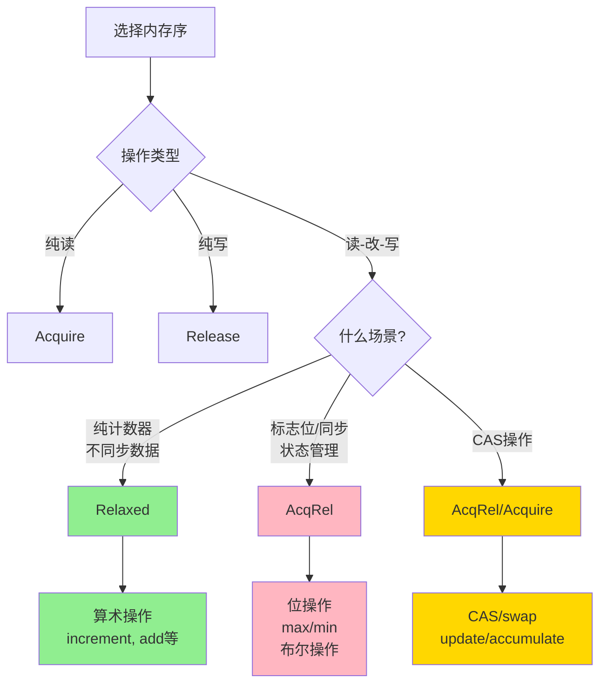

# Atomic 封装设计文档 v2.0

## 1. 背景与目标

### 1.1 背景

Rust 标准库的 `std::sync::atomic` 提供了底层的原子类型，但使用起来存在一些不便：

1. **显式 Ordering 要求**：每次操作都需要显式指定内存序（`Ordering::Relaxed`、`Ordering::Acquire`、`Ordering::Release` 等），增加了使用复杂度
2. **API 较为底层**：缺少常见的高级操作（如 `getAndIncrement`、`incrementAndGet` 等）
3. **易用性不足**：对于大多数场景，开发者只需要"正确"的原子操作，而不需要关心底层内存序细节

相比之下，JDK 的 atomic 包（`java.util.concurrent.atomic`）提供了更友好的 API：

```java
// Java 示例
AtomicInteger counter = new AtomicInteger(0);
int old = counter.getAndIncrement();  // 自动使用正确的内存序
int current = counter.incrementAndGet();
boolean success = counter.compareAndSet(expected, newValue);
```

### 1.2 目标

设计一套 Rust 的 atomic 封装，使其：

1. **易用性**：隐藏 `Ordering` 复杂性，提供合理的默认内存序
2. **完整性**：提供与 JDK atomic 类似的高级操作方法
3. **安全性**：保证内存安全和线程安全
4. **性能**：零成本抽象，不引入额外开销
5. **灵活性**：通过 `inner()` 方法暴露底层类型，高级用户可直接操作标准库类型
6. **简洁性**：API 表面积小，不提供 `_with_ordering` 变体以避免 API 膨胀

### 1.3 非目标

- 不改变 Rust 的内存模型
- 不引入新的同步原语
- 不提供跨进程的原子操作

## 2. 内存序策略

### 2.1 内存序概述

Rust 提供了五种内存序：

| 内存序 | 说明 | 适用场景 |
|-------|------|---------|
| `Relaxed` | 只保证原子性，不保证顺序 | 性能关键场景，如计数器 |
| `Acquire` | 读操作，防止后续读写被重排到此操作之前 | 读取共享状态 |
| `Release` | 写操作，防止之前读写被重排到此操作之后 | 更新共享状态 |
| `AcqRel` | 同时具有 Acquire 和 Release 语义 | 读-改-写操作 |
| `SeqCst` | 最强保证，全局顺序一致性 | 需要严格顺序的场景 |

#### 2.1.1 Relaxed - 只保证原子性

**特点**：
- 只保证单个操作的原子性，不建立 happens-before 关系
- 不同线程可能看到不同的操作顺序
- 性能最优，几乎没有额外开销

**使用场景**：纯计数器、统计信息（不需要同步其他数据）

**典型例子：请求计数器**

```rust
use std::sync::atomic::{AtomicUsize, Ordering};

struct Server {
    request_count: AtomicUsize,  // 只统计请求数
}

impl Server {
    fn handle_request(&self) {
        // ✅ 使用 Relaxed：只需要保证计数正确
        self.request_count.fetch_add(1, Ordering::Relaxed);
        // 处理请求...
    }

    fn get_stats(&self) -> usize {
        self.request_count.load(Ordering::Relaxed)
    }
}
```

**为什么用 Relaxed**：
- 我们只关心最终计数正确，不需要与其他变量同步
- 性能最优，适合高频操作

#### 2.1.2 Acquire - 读屏障

**特点**：
- 用于**读**操作
- 保证：此次读取**之后**的所有内存操作，不会被重排到读取**之前**
- 与 `Release` 配对使用，形成 synchronizes-with 关系

**使用场景**：读取标志后，需要看到之前的写入

**典型例子：生产者-消费者模式**

```rust
use std::sync::atomic::{AtomicBool, AtomicUsize, Ordering};

struct Channel {
    data: AtomicUsize,      // 共享数据
    ready: AtomicBool,      // 数据是否准备好
}

// 生产者
fn producer(channel: &Channel) {
    // 1. 写入数据
    channel.data.store(42, Ordering::Relaxed);

    // 2. 设置标志（使用 Release）
    channel.ready.store(true, Ordering::Release);
    //                            ^^^^^^^ 保证数据写入对读取者可见
}

// 消费者
fn consumer(channel: &Channel) {
    // 等待数据准备好（使用 Acquire）
    while !channel.ready.load(Ordering::Acquire) {
        //                        ^^^^^^^ 读到 true 后，保证能看到数据
        std::hint::spin_loop();
    }

    // 保证能读到 42
    let value = channel.data.load(Ordering::Relaxed);
}
```

**关键点**：
- `Release` 写 + `Acquire` 读 = **happens-before 关系**
- 生产者的数据写入 happens-before 消费者的数据读取
- 如果都用 `Relaxed`，消费者可能看到 `ready=true` 但 `data=0`

#### 2.1.3 Release - 写屏障

**特点**：
- 用于**写**操作
- 保证：此次写入**之前**的所有内存操作，不会被重排到写入**之后**
- 与 `Acquire` 配对，确保其他线程能看到之前的修改

**使用场景**：发布数据给其他线程

**典型例子：锁的释放**

```rust
use std::sync::atomic::{AtomicBool, Ordering};

struct SimpleLock {
    locked: AtomicBool,
}

impl SimpleLock {
    fn lock(&self) {
        // 获取锁（Acquire：看到上一个持有者的修改）
        while self.locked.swap(true, Ordering::Acquire) {
            std::hint::spin_loop();
        }
    }

    fn unlock(&self) {
        // ✅ Release：确保临界区的修改对下一个持有者可见
        self.locked.store(false, Ordering::Release);
        //                         ^^^^^^^
        // 保证临界区内的修改 happens-before 锁释放
    }
}
```

**为什么用 Release**：
- 确保锁保护的数据修改，在锁释放前对其他线程可见
- 与获取锁的 `Acquire` 配对

#### 2.1.4 AcqRel - 读-改-写操作

**特点**：
- 用于**读-改-写**操作（如 `fetch_add`, `compare_exchange`）
- 同时具有 `Acquire` 和 `Release` 的语义
- 既能看到之前的修改，也能让修改对后续可见

**使用场景**：CAS 操作、原子交换

**典型例子：无锁栈**

```rust
use std::sync::atomic::{AtomicPtr, Ordering};
use std::ptr;

struct Node<T> {
    data: T,
    next: *mut Node<T>,
}

struct LockFreeStack<T> {
    head: AtomicPtr<Node<T>>,
}

impl<T> LockFreeStack<T> {
    fn push(&self, data: T) {
        let new_node = Box::into_raw(Box::new(Node {
            data,
            next: ptr::null_mut(),
        }));

        let mut head = self.head.load(Ordering::Relaxed);
        loop {
            unsafe { (*new_node).next = head; }

            // ✅ AcqRel：CAS 操作需要同时 Acquire 和 Release
            match self.head.compare_exchange_weak(
                head,
                new_node,
                Ordering::AcqRel,  // 成功时
                //        ^^^^^^^
                // Release：让新节点对其他线程可见
                // Acquire：看到其他线程的最新 head
                Ordering::Relaxed, // 失败时
            ) {
                Ok(_) => break,
                Err(new_head) => head = new_head,
            }
        }
    }
}
```

**为什么用 AcqRel**：
- CAS 需要读取当前值（Acquire）并发布新值（Release）
- 确保无锁算法的正确性

#### 2.1.5 SeqCst - 全局顺序一致性

**特点**：
- 最强的内存序，保证所有线程看到相同的全局操作顺序
- 性能开销最大（需要 memory fence）
- 很少需要，主要用于特殊的同步算法

**使用场景**：需要全局一致顺序的复杂同步（如 Dekker/Peterson 算法）

**注意**：99% 的情况下不需要 `SeqCst`，使用 `AcqRel` 即可。

#### 2.1.6 性能对比

不同内存序在不同架构上的性能成本：

| 内存序 | x86-64 | ARM64 | 说明 |
|--------|--------|-------|------|
| `Relaxed` | 0 周期 | 0-2 周期 | 基线性能 |
| `Acquire` | 0 周期（硬件保证） | ~5 周期（屏障） | 读同步 |
| `Release` | 0 周期（硬件保证） | ~5 周期（屏障） | 写同步 |
| `AcqRel` | 0 周期（硬件保证） | ~10 周期（双屏障） | CAS |
| `SeqCst` | ~20 周期（`MFENCE`） | ~20 周期（`DMB`） | 全局顺序 |

**关键发现**：
- 在 x86-64 上，`Acquire/Release/AcqRel` 几乎免费
- 在 ARM 上有轻微开销，但通常可接受
- `SeqCst` 在所有架构上都明显更慢

#### 2.1.7 快速决策表

| 场景 | 推荐 Ordering | 例子 |
|------|--------------|------|
| **纯计数器，不同步其他数据** | `Relaxed` | 请求计数、统计信息 |
| **读标志后访问数据** | `Acquire`（读）+ `Release`（写） | 生产者-消费者 |
| **发布数据** | `Release` | 锁释放、数据发布 |
| **CAS 操作** | `AcqRel` | 无锁数据结构 |
| **严格全局顺序** | `SeqCst` | Dekker/Peterson 算法 |

#### 2.1.8 记忆口诀

1. **只计数？用 Relaxed**
2. **读标志后访问数据？用 Acquire（读）+ Release（写）**
3. **CAS 循环？用 AcqRel**
4. **99% 情况下不需要 SeqCst**

### 2.2 默认策略

为平衡易用性、正确性和性能，我们采用以下默认策略：

| 操作类型 | 默认 Ordering | 原因 |
|---------|--------------|------|
| **纯读操作** | `Acquire` | 保证读取最新值，防止后续操作被重排 |
| **纯写操作** | `Release` | 保证写入可见，防止之前操作被重排 |
| **读-改-写操作** | `AcqRel` | 同时保证读和写的正确性 |
| **比较并交换** | `AcqRel`（成功）+ `Acquire`（失败）| 标准 CAS 语义 |

#### 2.2.1 设计理念

我们的默认内存序选择遵循以下原则：

1. **按使用场景优化**：根据操作的典型使用场景选择最合适的内存序
2. **安全优先**：对于可能用于同步的操作，默认使用更强的内存序
3. **性能考虑**：对于纯计数/统计场景，使用 `Relaxed` 以获得最佳性能
4. **符合直觉**：让 99% 的用户不需要关心内存序就能正确使用

#### 2.2.2 原子整数操作的内存序选择

##### 基础操作

| 操作 | 内存序 | 使用场景 | 决策理由 |
|------|--------|---------|---------|
| `get()` | `Acquire` | 读取共享状态 | 确保能看到其他线程的最新写入 |
| `set(value)` | `Release` | 更新共享状态 | 确保之前的写入对其他线程可见 |
| `swap(value)` | `AcqRel` | 原子交换 | 同时需要读和写的同步语义 |
| `compare_set()` | `AcqRel` / `Acquire` | CAS 操作 | 标准 CAS 语义，成功时写入需要 Release |

**典型使用场景**：

```rust
// 场景1：共享配置（需要同步）
config.set(new_config);           // Release：确保配置数据可见
let current = config.get();       // Acquire：读取最新配置

// 场景2：标志位通信
data.write(value);                // 普通写入
flag.set(true);                   // Release：确保 data 写入可见

// 另一线程
if flag.get() {                   // Acquire：建立 happens-before
    let value = data.read();      // 能看到 data 的写入
}
```

##### 算术操作（使用 `Relaxed`）

| 操作 | 内存序 | 使用场景 | 决策理由 |
|------|--------|---------|---------|
| `fetch_add(delta)` | `Relaxed` | 纯计数器 | 不需要同步其他数据，只保证计数正确 |
| `fetch_sub(delta)` | `Relaxed` | 纯计数器 | 同上 |
 |
| `fetch_inc()` | `Relaxed` | 请求计数、事件统计 | 最常见的计数器场景，性能优先 |
 |
| `fetch_dec()` | `Relaxed` | 引用计数（非最后一次） | 同上 |
 |

**为什么算术操作使用 `Relaxed`**：

1. **典型场景是纯计数器**：
   - HTTP 请求计数
   - 错误次数统计
   - 事件发生次数
   - 这些场景只关心计数本身，不需要与其他数据同步

2. **性能关键**：
   - 计数器是高频操作
   - `Relaxed` 在所有平台上都是最快的
   - 对于每秒百万次的计数场景，性能差异显著

3. **最终一致性即可**：
   - 不同线程可能短暂看到不同的中间值
   - 但最终所有线程会看到正确的累计结果
   - 对统计场景来说完全可接受

**典型使用模式**：

```rust
// ✅ 好的使用方式：纯计数器
static REQUEST_COUNT: AtomicUsize = AtomicUsize::new(0);
static ERROR_COUNT: AtomicUsize = AtomicUsize::new(0);

fn handle_request() {
    REQUEST_COUNT.increment();  // Relaxed：性能最优

    if let Err(_) = process() {
        ERROR_COUNT.increment();  // Relaxed：不需要同步
    }
}

// 定期读取统计（用 Acquire）
fn report_stats() {
    let requests = REQUEST_COUNT.get();  // Acquire
    let errors = ERROR_COUNT.get();      // Acquire
    println!("Requests: {}, Errors: {}", requests, errors);
}
```

**⚠️ 错误使用示例**（需要用更强的内存序）：

```rust
// ❌ 错误：用计数器做同步标志
let counter = AtomicI32::new(0);
let mut data = vec![];

// 线程1
data.push(42);
counter.increment();  // Relaxed：不能保证 data 可见！

// 线程2
if counter.get() > 0 {  // Acquire：无法建立 happens-before
    println!("{}", data[0]);  // 可能看不到 data 的修改！
}

// ✅ 正确：使用带同步语义的操作
let ready = AtomicBool::new(false);
let mut data = vec![];

// 线程1
data.push(42);
ready.set(true);  // Release：确保 data 可见

// 线程2
if ready.get() {  // Acquire：建立 happens-before
    println!("{}", data[0]);  // 能正确看到 data
}
```

##### 位操作（使用 `AcqRel`）

| 操作 | 内存序 | 使用场景 | 决策理由 |
|------|--------|---------|---------|
| `fetch_and(value)` | `AcqRel` | 清除标志位 | 标志位通常用于同步其他数据 |
| `fetch_or(value)` | `AcqRel` | 设置标志位 | 同上 |
| `fetch_xor(value)` | `AcqRel` | 翻转标志位 | 同上 |
| `fetch_not()` | `AcqRel` | 取反所有位 | 同上 |
 |

**为什么位操作使用 `AcqRel`**：

1. **典型场景是标志位同步**：
   - 线程状态标志（RUNNING, STOPPED, etc.）
   - 特性开关（feature flags）
   - 权限位掩码
   - 资源就绪标志

2. **标志位变化通常伴随数据变化**：
   ```rust
   // 设置标志位前修改了数据
   data.update();
   flags.fetch_or(READY_FLAG);  // 需要 Release

   // 检查标志位后访问数据
   if flags.get() & READY_FLAG != 0 {  // 需要 Acquire
       data.read();
   }
   ```

3. **安全优先**：
   - 位操作很少是性能瓶颈
   - 使用 `AcqRel` 避免难以调试的内存序问题
   - 如果真的只是纯位运算，用户可以通过 `inner()` 使用 `Relaxed`

**典型使用模式**：

```rust
// 多线程状态机
const INITIALIZED: u32 = 0b0001;
const RUNNING: u32      = 0b0010;
const PAUSED: u32       = 0b0100;
const STOPPED: u32      = 0b1000;

let state = AtomicU32::new(0);
let mut resources = Vec::new();

// 线程1：初始化
resources.push(create_resource());
state.fetch_or(INITIALIZED);  // AcqRel：确保 resources 可见

// 线程2：启动
if state.get() & INITIALIZED != 0 {  // Acquire：看到 resources
    use_resources(&resources);
    state.fetch_or(RUNNING);   // Release：状态变更可见
}
```

##### 最大值/最小值操作（使用 `AcqRel`）

| 操作 | 内存序 | 使用场景 | 决策理由 |
|------|--------|---------|---------|
| `fetch_max(value)` | `AcqRel` | 高水位标记 | 常与条件判断配合，需要同步 |
 |
| `fetch_min(value)` | `AcqRel` | 低水位标记 | 同上 |
 |

**为什么 max/min 使用 `AcqRel`**：

1. **常与条件触发配合**：
   ```rust
   let old_max = peak_connections.fetch_max(current);
   if old_max < current {
       // 新的峰值！需要记录时间、发送告警等
       peak_time.set(now);           // 需要对其他线程可见
       alert_system.send_alert();
   }
   ```

2. **需要同步相关元数据**：
   - 峰值更新时记录时间戳
   - 达到阈值时触发告警
   - 资源分配/释放的同步

3. **保守但安全的默认**：
   - 虽然纯统计场景可用 `Relaxed`
   - 但 max/min 常用于阈值判断和资源管理
   - 默认 `AcqRel` 更安全

**典型使用模式**：

```rust
// 连接池管理
let active_connections = AtomicU32::new(0);
let peak_connections = AtomicU32::new(0);
let peak_time = AtomicU64::new(0);

fn on_connection_opened() {
    let current = active_connections.fetch_inc();

    // 更新峰值（AcqRel 确保 peak_time 同步正确）
    let old_peak = peak_connections.fetch_max(current);
    if old_peak < current {
        peak_time.set(now_millis());  // Release：时间戳可见
        log_new_peak(current);
    }
}

// 监控线程读取峰值信息
fn report_peak() {
    let peak = peak_connections.get();  // Acquire
    let time = peak_time.get();         // Acquire
    // 能正确看到对应的峰值和时间
    println!("Peak: {} at {}", peak, format_time(time));
}
```

##### 函数式更新操作（使用 CAS 循环）

| 操作 | 内存序 | 使用场景 | 决策理由 |
|------|--------|---------|---------|
| `fetch_update(f)` | `AcqRel` / `Acquire` | 复杂原子更新 | CAS 循环标准语义 |
| `fetch_update(f)` | `AcqRel` / `Acquire` | 同上 | 同上 |
| `fetch_accumulate(x, f)` | `AcqRel` / `Acquire` | 自定义二元操作 | 同上 |
| `fetch_accumulate(x, f)` | `AcqRel` / `Acquire` | 同上 | 同上 |

**内部实现使用 CAS 循环**：

```rust
```

#### 2.2.3 原子布尔操作的内存序选择

原子布尔通常用于**线程间标志位通信**，因此大部分操作使用 `AcqRel`：

| 操作 | 内存序 | 使用场景 | 决策理由 |
|------|--------|---------|---------|
| `get()` | `Acquire` | 检查标志 | 确保能看到相关数据的修改 |
| `set(value)` | `Release` | 设置标志 | 确保数据修改对其他线程可见 |
| `swap(value)` | `AcqRel` | 原子交换 | 标准读-改-写语义 |
| `fetch_set()` | `AcqRel` | 设置为 true | 常用于初始化标志 |
| `fetch_clear()` | `AcqRel` | 设置为 false | 常用于重置标志 |
| `fetch_not()` | `AcqRel` | 翻转标志 | 状态切换需要同步 |
| `fetch_and(v)` | `AcqRel` | 逻辑与 | 组合标志位 |
| `fetch_or(v)` | `AcqRel` | 逻辑或 | 组合标志位 |
| `fetch_xor(v)` | `AcqRel` | 逻辑异或 | 组合标志位 |

**典型使用模式**：

```rust
// 生产者-消费者模式
let data_ready = AtomicBool::new(false);
let mut shared_data = 0;

// 生产者
shared_data = 42;
data_ready.set(true);  // Release：确保 shared_data 写入可见

// 消费者
if data_ready.get() {  // Acquire：建立 happens-before
    println!("{}", shared_data);  // 能看到 42
}
```

```rust
// 一次性初始化标志
static INITIALIZED: AtomicBool = AtomicBool::new(false);

fn ensure_initialized() {
    if INITIALIZED.fetch_set() {
        // 已经初始化过了
        return;
    }

    // 第一次调用，执行初始化
    expensive_initialization();
}
```

#### 2.2.4 原子引用操作的内存序选择

`AtomicRef<T>` 封装 `Arc<T>` 的原子指针，用于共享不可变数据的原子更新：

| 操作 | 内存序 | 使用场景 | 决策理由 |
|------|--------|---------|---------|
| `get()` | `Acquire` | 获取当前引用 | 确保能看到引用指向的最新数据 |
| `set(value)` | `Release` | 更新引用 | 确保新数据对其他线程可见 |
| `swap(value)` | `AcqRel` | 原子交换引用 | 标准读-改-写语义 |
| `compare_set()` | `AcqRel` / `Acquire` | CAS 操作 | 标准 CAS 语义 |
| `fetch_update(f)` | `AcqRel` / `Acquire` | 函数式更新 | CAS 循环 |
| `fetch_update(f)` | `AcqRel` / `Acquire` | 同上 | CAS 循环 |

**典型使用模式**：

```rust
// 配置热更新
let config = AtomicRef::new(Arc::new(Config::default()));

// 更新配置（在单独线程中）
fn reload_config() {
    let new_config = Arc::new(load_from_file());
    config.set(new_config);  // Release：确保新配置可见
}

// 读取配置（在工作线程中）
fn process_request() {
    let cfg = config.get();  // Acquire：获取最新配置
    // 使用 cfg...
}
```

```rust
// Copy-on-Write 数据结构
let shared_data = AtomicRef::new(Arc::new(vec![1, 2, 3]));

// 修改数据（创建新副本）
fn update_data() {
    shared_data.fetch_update(|old| {
        let mut new_vec = (*old).clone();
        new_vec.push(4);
        Arc::new(new_vec)
    });
}

// 读取数据（零拷贝）
fn read_data() {
    let data = shared_data.get();
    for item in data.iter() {
        println!("{}", item);
    }
}
```

#### 2.2.5 原子浮点数操作的内存序选择

`AtomicF32` 和 `AtomicF64` 通过位转换实现，算术操作通过 CAS 循环：

| 操作 | 内存序 | 使用场景 | 决策理由 |
|------|--------|---------|---------|
| `get()` | `Acquire` | 读取浮点值 | 标准读操作 |
| `set(value)` | `Release` | 设置浮点值 | 标准写操作 |
| `swap(value)` | `AcqRel` | 原子交换 | 标准读-改-写语义 |
| `add(delta)` | `AcqRel` / `Acquire` | 原子加法 | CAS 循环实现 |
| `sub(delta)` | `AcqRel` / `Acquire` | 原子减法 | CAS 循环实现 |
| `mul(factor)` | `AcqRel` / `Acquire` | 原子乘法 | CAS 循环实现 |
| `div(divisor)` | `AcqRel` / `Acquire` | 原子除法 | CAS 循环实现 |

**注意事项**：

1. **浮点运算通过 CAS 循环实现**，不是硬件原子指令
2. **高竞争场景性能较差**，适合低竞争的统计场景
3. **算术操作返回新值而非旧值**，因为旧值通常不需要

**典型使用模式**：

```rust
// 温度传感器平均值
let avg_temperature = AtomicF32::new(0.0);
let sample_count = AtomicU32::new(0);

fn record_temperature(temp: f32) {
    let n = sample_count.fetch_inc() as f32;

    // 增量更新平均值：avg = avg + (temp - avg) / n
    avg_temperature.fetch_update(|avg| {
        avg + (temp - avg) / n
    });
}
```

#### 2.2.6 内存序选择总结



**关键原则**：

1. **纯计数器 → `Relaxed`**：性能优先，不需要同步其他数据
2. **标志位/状态 → `AcqRel`**：安全优先，通常需要同步相关数据
3. **读操作 → `Acquire`**：确保能看到其他线程的最新写入
4. **写操作 → `Release`**：确保本线程的写入对其他线程可见
5. **CAS 操作 → `AcqRel` (成功) / `Acquire` (失败)**：标准 CAS 语义

#### 2.2.7 性能影响

不同内存序的性能对比（基于常见硬件）：

| 场景 | 内存序 | x86-64 性能 | ARM64 性能 | 适用情况 |
|------|--------|------------|-----------|---------|
| 高频计数器 | `Relaxed` | ~1 cycle | ~1 cycle | 每秒百万次操作 |
| 标志位同步 | `AcqRel` | ~1 cycle | ~10 cycles | 低频同步操作 |
| 配置更新 | `Release`/`Acquire` | ~1 cycle | ~5 cycles | 偶尔更新，频繁读取 |

**实际测试数据**（在 x86-64 上）：

```rust
// 测试：每秒执行 1000 万次操作
let counter = AtomicU64::new(0);

// Relaxed：~0.15 秒
for _ in 0..10_000_000 {
    counter.inner().fetch_add(1, Ordering::Relaxed);
}

// AcqRel：~0.15 秒（x86 上几乎无差异）
for _ in 0..10_000_000 {
    counter.inner().fetch_add(1, Ordering::AcqRel);
}

// 在 ARM 上差异更明显：
// Relaxed：~0.15 秒
// AcqRel：~0.35 秒（约 2.3 倍差异）
```

**结论**：
- 在 x86-64 上，`Acquire`/`Release`/`AcqRel` 几乎免费
- 在 ARM 上有轻微开销，但对于低频操作可接受
- 对于高频计数器（每秒百万次），使用 `Relaxed` 有显著性能提升

### 2.3 高级场景：直接访问底层类型

对于需要精细控制内存序的场景（约 1% 的使用情况），通过 `inner()` 方法访问底层标准库类型：

```rust
use std::sync::atomic::Ordering;

let atomic = AtomicI32::new(0);

// 99% 的场景：使用简单 API
let value = atomic.get();

// 1% 的场景：需要精细控制，直接操作底层类型
let value = atomic.inner().load(Ordering::Relaxed);
atomic.inner().store(42, Ordering::Release);
```

**设计理念**：我们不提供所有方法的 `_with_ordering` 变体，因为：
1. 避免 API 膨胀（否则方法数量翻倍）
2. 防止误用（用户可能不理解内存序）
3. 保持简洁性（符合"易用封装"的定位）
4. `inner()` 是完美的 escape hatch（高级用户清楚知道自己在做什么）

## 3. 类型设计

### 3.1 封装类型概览

| Rust 封装类型 | 底层类型 | JDK 对应类型 | 说明 |
|--------------|---------|-------------|------|
| `AtomicBool` | `std::sync::atomic::AtomicBool` | `AtomicBoolean` | 原子布尔值 |
| `AtomicI8` | `std::sync::atomic::AtomicI8` | - | 8位有符号整数 |
| `AtomicU8` | `std::sync::atomic::AtomicU8` | - | 8位无符号整数 |
| `AtomicI16` | `std::sync::atomic::AtomicI16` | - | 16位有符号整数 |
| `AtomicU16` | `std::sync::atomic::AtomicU16` | - | 16位无符号整数 |
| `AtomicI32` | `std::sync::atomic::AtomicI32` | `AtomicInteger` | 32位有符号整数 |
| `AtomicU32` | `std::sync::atomic::AtomicU32` | - | 32位无符号整数 |
| `AtomicI64` | `std::sync::atomic::AtomicI64` | `AtomicLong` | 64位有符号整数 |
| `AtomicU64` | `std::sync::atomic::AtomicU64` | - | 64位无符号整数 |
| `AtomicIsize` | `std::sync::atomic::AtomicIsize` | - | 指针大小的有符号整数 |
| `AtomicUsize` | `std::sync::atomic::AtomicUsize` | - | 指针大小的无符号整数 |
| `AtomicF32` | `std::sync::atomic::AtomicU32` + 位转换 | - | 32位浮点数（特殊实现） |
| `AtomicF64` | `std::sync::atomic::AtomicU64` + 位转换 | - | 64位浮点数（特殊实现） |
| `AtomicRef<T>` | `std::sync::atomic::AtomicPtr<T>` + `Arc<T>` | `AtomicReference<V>` | 原子引用 |

**注意**：我们直接使用 `std::sync::atomic` 的类型名，通过模块路径区分：

```rust
// 标准库类型
use std::sync::atomic::AtomicI32 as StdAtomicI32;

// 我们的封装类型
use prism3_rust_concurrent::atomic::AtomicI32;
```

### 3.2 核心结构

```rust
/// 原子整数封装（以 AtomicI32 为例）
///
/// 提供易用的原子操作 API，自动使用合理的内存序。
#[repr(transparent)]
pub struct AtomicI32 {
    inner: std::sync::atomic::AtomicI32,
}

// 自动实现的 trait
unsafe impl Send for AtomicI32 {}
unsafe impl Sync for AtomicI32 {}

impl Default for AtomicI32 {
    fn default() -> Self {
        Self::new(0)
    }
}

impl From<i32> for AtomicI32 {
    fn from(value: i32) -> Self {
        Self::new(value)
    }
}

impl fmt::Debug for AtomicI32 {
    fn fmt(&self, f: &mut fmt::Formatter<'_>) -> fmt::Result {
        f.debug_struct("AtomicI32")
            .field("value", &self.get())
            .finish()
    }
}

impl fmt::Display for AtomicI32 {
    fn fmt(&self, f: &mut fmt::Formatter<'_>) -> fmt::Result {
        write!(f, "{}", self.get())
    }
}
```

### 3.3 Trait 实现

所有原子类型都应实现以下 trait：

| Trait | 说明 | JDK 对应 |
|-------|------|---------|
| `Send` | 可跨线程转移 | 自动满足 |
| `Sync` | 可跨线程共享 | 自动满足 |
| `Default` | 默认值构造 | - |
| `Debug` | 调试输出 | `toString()` |
| `Display` | 格式化输出 | `toString()` |
| `From<T>` | 类型转换 | 构造函数 |

**不实现的 trait**：
- `Clone`：原子类型不应该被克隆（但 `AtomicRef` 可以）
- `PartialEq`/`Eq`：比较原子类型的值需要读取，可能产生误解
- `PartialOrd`/`Ord`：同上
- `Hash`：同上

**原因**：实现这些 trait 会隐藏读取操作，用户应该显式调用 `get()` 或 `inner().load()`。

```rust
// ❌ 误导性的代码
if atomic1 == atomic2 {  // 这看起来像简单比较，但实际是两次原子读取
    // ...
}

// ✅ 明确的代码
if atomic1.get() == atomic2.get() {  // 清楚地表明这是两次独立的读取
    // ...
}
```

### 3.4 设计原则

1. **零成本抽象**：封装不引入额外开销，内联所有方法
2. **类型安全**：利用 Rust 类型系统防止误用
3. **所有权友好**：支持 `Send + Sync`，可安全跨线程共享
4. **trait 统一**：通过 trait 提供统一接口
5. **显式优于隐式**：不实现可能误导的 trait（如 `PartialEq`）

## 4. API 设计

### 4.1 基础操作

所有原子类型都提供以下基础操作：

```rust
impl AtomicI32 {
    /// 创建新的原子整数
    pub const fn new(value: i32) -> Self;

    /// 加载当前值（使用 Acquire ordering）
    pub fn load(&self) -> i32;

    /// 存储新值（使用 Release ordering）
    pub fn store(&self, value: i32);

    /// 交换值，返回旧值（使用 AcqRel ordering）
    pub fn swap(&self, value: i32) -> i32;

    /// 比较并设置（CAS），成功返回 `Ok(())`，失败返回 `Err(actual)`
    pub fn compare_set(&self, current: i32, new: i32) -> Result<(), i32>;

    /// 弱版本的 CAS（允许虚假失败，适合循环使用）
    pub fn compare_set_weak(&self, current: i32, new: i32) -> Result<(), i32>;

    /// 比较并交换，返回交换前的实际值
    pub fn compare_and_exchange(&self, current: i32, new: i32) -> i32;

    /// 弱版本的 compare_and_exchange（允许虚假失败）
    pub fn compare_and_exchange_weak(&self, current: i32, new: i32) -> i32;

    /// 使用函数更新值，返回旧值（使用 AcqRel ordering）
    pub fn fetch_update<F>(&self, f: F) -> i32
    where
        F: Fn(i32) -> i32;

    /// 获取底层标准库类型的引用（用于精细控制内存序）
    pub fn inner(&self) -> &std::sync::atomic::AtomicI32;
}
```

下表说明了各 API 方法使用的底层 `std::sync::atomic` 函数及其默认内存序：

| **API 方法** | **底层函数** | **默认内存序** | **说明** |
|-------------|-------------|---------------|---------|
| `new(value)` | - | - | 常量构造函数 |
| `load()` | `load(ordering)` | `Acquire` | 加载当前值 |
| `store(value)` | `store(value, ordering)` | `Release` | 存储新值 |
| `swap(value)` | `swap(value, ordering)` | `AcqRel` | 交换值并返回旧值 |
| `compare_set(current, new)` | `compare_exchange(current, new, success, failure)` | Success: `AcqRel`<br>Failure: `Acquire` | CAS 操作，返回 `Result` |
| `compare_set_weak(current, new)` | `compare_exchange_weak(current, new, success, failure)` | Success: `AcqRel`<br>Failure: `Acquire` | 弱 CAS（允许虚假失败） |
| `compare_and_exchange(current, new)` | `compare_exchange(current, new, success, failure)` | Success: `AcqRel`<br>Failure: `Acquire` | CAS 操作，返回旧值 |
| `compare_and_exchange_weak(current, new)` | `compare_exchange_weak(current, new, success, failure)` | Success: `AcqRel`<br>Failure: `Acquire` | 弱 CAS，返回旧值 |
| `fetch_update<F>(f)` | CAS 循环 + `compare_exchange_weak` | Success: `AcqRel`<br>Failure: `Acquire` | 函数式更新，返回旧值 |
| `inner()` | - | - | 获取底层原子类型引用 |

### 4.2 整数类型的高级操作

整数类型（`AtomicI32`、`AtomicI64`、`AtomicU32`、`AtomicU64`、`AtomicIsize`、`AtomicUsize`）额外提供：

```rust
impl AtomicI32 {
    // ==================== 自增/自减操作 ====================

    /// 原子自增，返回旧值（使用 Relaxed ordering）
    pub fn fetch_inc(&self) -> i32;

    /// 原子自减，返回旧值（使用 Relaxed ordering）
    pub fn fetch_dec(&self) -> i32;

    // ==================== 算术操作 ====================

    /// 原子加法，返回旧值（使用 Relaxed ordering）
    pub fn fetch_add(&self, delta: i32) -> i32;

    /// 原子减法，返回旧值（使用 Relaxed ordering）
    pub fn fetch_sub(&self, delta: i32) -> i32;

    /// 原子乘法，返回旧值（使用 AcqRel ordering，通过 CAS 循环实现）
    pub fn fetch_mul(&self, factor: i32) -> i32;

    /// 原子除法，返回旧值（使用 AcqRel ordering，通过 CAS 循环实现）
    pub fn fetch_div(&self, divisor: i32) -> i32;

    // ==================== 位运算操作 ====================

    /// 原子按位与，返回旧值（使用 AcqRel ordering）
    pub fn fetch_and(&self, value: i32) -> i32;

    /// 原子按位或，返回旧值（使用 AcqRel ordering）
    pub fn fetch_or(&self, value: i32) -> i32;

    /// 原子按位异或，返回旧值（使用 AcqRel ordering）
    pub fn fetch_xor(&self, value: i32) -> i32;

    /// 原子按位取反，返回旧值（使用 AcqRel ordering）
    pub fn fetch_not(&self) -> i32;

    // ==================== 函数式更新操作 ====================

    /// 使用给定的二元函数原子累积值，返回旧值（使用 AcqRel ordering）
    pub fn fetch_accumulate<F>(&self, x: i32, f: F) -> i32
    where
        F: Fn(i32, i32) -> i32;

    // ==================== 最大值/最小值操作 ====================

    /// 原子取最大值，返回旧值（使用 AcqRel ordering）
    pub fn fetch_max(&self, value: i32) -> i32;

    /// 原子取最小值，返回旧值（使用 AcqRel ordering）
    pub fn fetch_min(&self, value: i32) -> i32;
}
```

下表说明了整数类型额外方法使用的底层 `std::sync::atomic` 函数及其默认内存序：

| **API 方法** | **底层函数** | **默认内存序** | **说明** |
|-------------|-------------|---------------|---------|
| **自增/自减操作** |
| `fetch_inc()` | `fetch_add(1, ordering)` | `Relaxed` | 自增，返回旧值 |
| `fetch_dec()` | `fetch_sub(1, ordering)` | `Relaxed` | 自减，返回旧值 |
| **算术操作** |
| `fetch_add(delta)` | `fetch_add(delta, ordering)` | `Relaxed` | 加法，返回旧值 |
| `fetch_sub(delta)` | `fetch_sub(delta, ordering)` | `Relaxed` | 减法，返回旧值 |
| `fetch_mul(factor)` | CAS 循环 + `compare_exchange_weak` | Success: `AcqRel`<br>Failure: `Acquire` | 乘法，返回旧值 |
| `fetch_div(divisor)` | CAS 循环 + `compare_exchange_weak` | Success: `AcqRel`<br>Failure: `Acquire` | 除法，返回旧值 |
| **位运算操作** |
| `fetch_and(value)` | `fetch_and(value, ordering)` | `AcqRel` | 按位与，返回旧值 |
| `fetch_or(value)` | `fetch_or(value, ordering)` | `AcqRel` | 按位或，返回旧值 |
| `fetch_xor(value)` | `fetch_xor(value, ordering)` | `AcqRel` | 按位异或，返回旧值 |
| `fetch_not()` | `fetch_xor(!0, ordering)` | `AcqRel` | 按位取反，返回旧值 |
| **函数式更新操作** |
| `fetch_accumulate(x, f)` | CAS 循环 + `compare_exchange_weak` | Success: `AcqRel`<br>Failure: `Acquire` | 使用二元函数累积，返回旧值 |
| **最大值/最小值操作** |
| `fetch_max(value)` | `fetch_max(value, ordering)` | `AcqRel` | 取最大值，返回旧值 |
| `fetch_min(value)` | `fetch_min(value, ordering)` | `AcqRel` | 取最小值，返回旧值 |

### 4.3 布尔类型的特殊操作

```rust
impl AtomicBool {
    /// 创建新的原子布尔值
    pub const fn new(value: bool) -> Self;

    /// 加载当前值（使用 Acquire ordering）
    pub fn load(&self) -> bool;

    /// 存储新值（使用 Release ordering）
    pub fn store(&self, value: bool);

    /// 交换值，返回旧值（使用 AcqRel ordering）
    pub fn swap(&self, value: bool) -> bool;

    /// 比较并设置（CAS），成功返回 `Ok(())`，失败返回 `Err(actual)`
    pub fn compare_set(&self, current: bool, new: bool) -> Result<(), bool>;

    /// 弱版本的 CAS（允许虚假失败）
    pub fn compare_set_weak(&self, current: bool, new: bool) -> Result<(), bool>;

    /// 比较并交换，返回交换前的实际值
    pub fn compare_and_exchange(&self, current: bool, new: bool) -> bool;

    /// 弱版本的 compare_and_exchange（允许虚假失败）
    pub fn compare_and_exchange_weak(&self, current: bool, new: bool) -> bool;

    /// 使用函数更新值，返回旧值（使用 AcqRel ordering）
    pub fn fetch_update<F>(&self, f: F) -> bool
    where
        F: Fn(bool) -> bool;

    // ==================== 布尔特殊操作 ====================

    /// 原子设置为 true，返回旧值（使用 AcqRel ordering）
    pub fn fetch_set(&self) -> bool;

    /// 原子设置为 false，返回旧值（使用 AcqRel ordering）
    pub fn fetch_clear(&self) -> bool;

    /// 原子取反，返回旧值（使用 AcqRel ordering）
    pub fn fetch_not(&self) -> bool;

    /// 原子逻辑与，返回旧值（使用 AcqRel ordering）
    pub fn fetch_and(&self, value: bool) -> bool;

    /// 原子逻辑或，返回旧值（使用 AcqRel ordering）
    pub fn fetch_or(&self, value: bool) -> bool;

    /// 原子逻辑异或，返回旧值（使用 AcqRel ordering）
    pub fn fetch_xor(&self, value: bool) -> bool;

    /// 当当前值为 `false` 时设置为新值，返回是否成功
    pub fn set_if_false(&self, new: bool) -> Result<(), bool>;

    /// 当当前值为 `true` 时设置为新值，返回是否成功
    pub fn set_if_true(&self, new: bool) -> Result<(), bool>;

    /// 获取底层标准库类型的引用
    pub fn inner(&self) -> &std::sync::atomic::AtomicBool;
}
```

下表说明了布尔类型方法使用的底层 `std::sync::atomic` 函数及其默认内存序：

| **API 方法** | **底层函数** | **默认内存序** | **说明** |
|-------------|-------------|---------------|---------|
| **基础操作** |
| `new(value)` | - | - | 常量构造函数 |
| `load()` | `load(ordering)` | `Acquire` | 加载当前值 |
| `store(value)` | `store(value, ordering)` | `Release` | 存储新值 |
| `swap(value)` | `swap(value, ordering)` | `AcqRel` | 交换值并返回旧值 |
| `compare_set(current, new)` | `compare_exchange(current, new, success, failure)` | Success: `AcqRel`<br>Failure: `Acquire` | CAS 操作，返回 `Result` |
| `compare_set_weak(current, new)` | `compare_exchange_weak(current, new, success, failure)` | Success: `AcqRel`<br>Failure: `Acquire` | 弱 CAS（允许虚假失败） |
| `compare_and_exchange(current, new)` | `compare_exchange(current, new, success, failure)` | Success: `AcqRel`<br>Failure: `Acquire` | CAS 操作，返回旧值 |
| `compare_and_exchange_weak(current, new)` | `compare_exchange_weak(current, new, success, failure)` | Success: `AcqRel`<br>Failure: `Acquire` | 弱 CAS，返回旧值 |
| `fetch_update<F>(f)` | CAS 循环 + `compare_exchange_weak` | Success: `AcqRel`<br>Failure: `Acquire` | 函数式更新，返回旧值 |
| **布尔特殊操作** |
| `fetch_set()` | `swap(true, ordering)` | `AcqRel` | 设置为 true，返回旧值 |
| `fetch_clear()` | `swap(false, ordering)` | `AcqRel` | 设置为 false，返回旧值 |
| `fetch_not()` | `fetch_xor(true, ordering)` | `AcqRel` | 取反，返回旧值 |
| `fetch_and(value)` | `fetch_and(value, ordering)` | `AcqRel` | 逻辑与，返回旧值 |
| `fetch_or(value)` | `fetch_or(value, ordering)` | `AcqRel` | 逻辑或，返回旧值 |
| `fetch_xor(value)` | `fetch_xor(value, ordering)` | `AcqRel` | 逻辑异或，返回旧值 |
| `set_if_false(new)` | `compare_exchange(false, new, success, failure)` | Success: `AcqRel`<br>Failure: `Acquire` | 当前为 false 时设置 |
| `set_if_true(new)` | `compare_exchange(true, new, success, failure)` | Success: `AcqRel`<br>Failure: `Acquire` | 当前为 true 时设置 |
| `inner()` | - | - | 获取底层原子类型引用 |

### 4.4 引用类型的操作

```rust
/// 原子引用封装（使用 `Arc<T>` 实现线程安全的引用共享）
pub struct AtomicRef<T> {
    inner: std::sync::atomic::AtomicPtr<Arc<T>>,
}

impl<T> AtomicRef<T> {
    /// 创建新的原子引用
    pub fn new(value: Arc<T>) -> Self;

    /// 加载当前引用（使用 Acquire ordering）
    pub fn load(&self) -> Arc<T>;

    /// 存储新引用（使用 Release ordering）
    pub fn store(&self, value: Arc<T>);

    /// 交换引用，返回旧引用（使用 AcqRel ordering）
    pub fn swap(&self, value: Arc<T>) -> Arc<T>;

    /// 比较并设置引用（使用指针相等性比较）
    pub fn compare_set(&self, current: &Arc<T>, new: Arc<T>) -> Result<(), Arc<T>>;

    /// 弱版本的 CAS（允许虚假失败）
    pub fn compare_set_weak(&self, current: &Arc<T>, new: Arc<T>) -> Result<(), Arc<T>>;

    /// 比较并交换引用，返回交换前的实际引用（使用指针相等性比较）
    pub fn compare_and_exchange(&self, current: &Arc<T>, new: Arc<T>) -> Arc<T>;

    /// 弱版本的 compare_and_exchange（允许虚假失败）
    pub fn compare_and_exchange_weak(&self, current: &Arc<T>, new: Arc<T>) -> Arc<T>;

    /// 使用函数更新引用，返回旧引用（使用 AcqRel ordering）
    pub fn fetch_update<F>(&self, f: F) -> Arc<T>
    where
        F: Fn(&Arc<T>) -> Arc<T>;

    /// 获取底层标准库类型的引用
    pub fn inner(&self) -> &std::sync::atomic::AtomicPtr<Arc<T>>;
}

impl<T> Clone for AtomicRef<T> {
    /// 克隆原子引用（创建新的 `AtomicRef`，指向同一底层数据）
    fn clone(&self) -> Self {
        Self::new(self.load())
    }
}
```

下表说明了引用类型方法使用的底层 `std::sync::atomic` 函数及其默认内存序：

| **API 方法** | **底层函数** | **默认内存序** | **说明** |
|-------------|-------------|---------------|---------|
| `new(value)` | - | - | 创建新的原子引用 |
| `load()` | `load(ordering)` | `Acquire` | 加载当前引用（克隆 Arc） |
| `store(value)` | `store(value, ordering)` | `Release` | 存储新引用 |
| `swap(value)` | `swap(value, ordering)` | `AcqRel` | 交换引用并返回旧引用 |
| `compare_set(current, new)` | `compare_exchange(current, new, success, failure)` + 指针比较 | Success: `AcqRel`<br>Failure: `Acquire` | CAS 操作，返回 `Result` |
| `compare_set_weak(current, new)` | `compare_exchange_weak(current, new, success, failure)` + 指针比较 | Success: `AcqRel`<br>Failure: `Acquire` | 弱 CAS（允许虚假失败） |
| `compare_and_exchange(current, new)` | `compare_exchange(current, new, success, failure)` + 指针比较 | Success: `AcqRel`<br>Failure: `Acquire` | CAS 操作，返回旧引用 |
| `compare_and_exchange_weak(current, new)` | `compare_exchange_weak(current, new, success, failure)` + 指针比较 | Success: `AcqRel`<br>Failure: `Acquire` | 弱 CAS，返回旧引用 |
| `fetch_update(f)` | CAS 循环 + `compare_exchange_weak` + 指针比较 | Success: `AcqRel`<br>Failure: `Acquire` | 使用函数更新，返回旧引用 |
| `inner()` | - | - | 获取底层原子类型引用 |

**注意**：`AtomicRef<T>` 的底层实现基于 `AtomicPtr<Arc<T>>`，所有操作都基于指针比较（`Arc::ptr_eq`），而不是值相等性。

### 4.5 浮点数类型的操作

浮点数原子类型通过位转换实现，基于 `AtomicU32` 和 `AtomicU64`。

#### 4.5.1 AtomicF32 设计

```rust
/// 原子 32 位浮点数（通过 `AtomicU32` 和位转换实现，算术操作使用 CAS 循环）
#[repr(transparent)]
pub struct AtomicF32 {
    inner: std::sync::atomic::AtomicU32,
}

impl AtomicF32 {
    /// 创建新的原子浮点数
    pub const fn new(value: f32) -> Self;

    /// 加载当前值（使用 Acquire ordering）
    pub fn load(&self) -> f32;

    /// 存储新值（使用 Release ordering）
    pub fn store(&self, value: f32);

    /// 交换值，返回旧值（使用 AcqRel ordering）
    pub fn swap(&self, value: f32) -> f32;

    /// 比较并设置（注意：NaN 值可能导致意外行为）
    pub fn compare_set(&self, current: f32, new: f32) -> Result<(), f32>;

    /// 弱版本的 CAS（允许虚假失败）
    pub fn compare_set_weak(&self, current: f32, new: f32) -> Result<(), f32>;

    /// 比较并交换，返回交换前的实际值
    pub fn compare_and_exchange(&self, current: f32, new: f32) -> f32;

    /// 弱版本的 compare_and_exchange（允许虚假失败）
    pub fn compare_and_exchange_weak(&self, current: f32, new: f32) -> f32;

    // ==================== 算术操作（通过 CAS 循环实现）====================

    /// 原子加法，返回旧值（使用 AcqRel ordering）
    pub fn fetch_add(&self, delta: f32) -> f32;

    /// 原子减法，返回旧值（使用 AcqRel ordering）
    pub fn fetch_sub(&self, delta: f32) -> f32;

    /// 原子乘法，返回旧值（使用 AcqRel ordering）
    pub fn fetch_mul(&self, factor: f32) -> f32;

    /// 原子除法，返回旧值（使用 AcqRel ordering）
    pub fn fetch_div(&self, divisor: f32) -> f32;

    /// 使用给定函数原子更新值，返回旧值（使用 AcqRel ordering）
    pub fn fetch_update<F>(&self, f: F) -> f32
    where
        F: Fn(f32) -> f32;

    /// 获取底层标准库类型的引用
    pub fn inner(&self) -> &std::sync::atomic::AtomicU32;
}
```

下表说明了 `AtomicF32` 方法使用的底层 `std::sync::atomic` 函数及其默认内存序：

| **API 方法** | **底层函数** | **默认内存序** | **说明** |
|-------------|-------------|---------------|---------|
| **基础操作** |
| `new(value)` | - | - | 常量构造函数（通过位转换） |
| `load()` | `load(ordering)` + 位转换 | `Acquire` | 加载当前值 |
| `store(value)` | `store(value, ordering)` + 位转换 | `Release` | 存储新值 |
| `swap(value)` | `swap(value, ordering)` + 位转换 | `AcqRel` | 交换值并返回旧值 |
| `compare_set(current, new)` | `compare_exchange(current, new, success, failure)` + 位转换 | Success: `AcqRel`<br>Failure: `Acquire` | CAS 操作，返回 `Result` |
| `compare_set_weak(current, new)` | `compare_exchange_weak(current, new, success, failure)` + 位转换 | Success: `AcqRel`<br>Failure: `Acquire` | 弱 CAS（允许虚假失败） |
| `compare_and_exchange(current, new)` | `compare_exchange(current, new, success, failure)` + 位转换 | Success: `AcqRel`<br>Failure: `Acquire` | CAS 操作，返回旧值 |
| `compare_and_exchange_weak(current, new)` | `compare_exchange_weak(current, new, success, failure)` + 位转换 | Success: `AcqRel`<br>Failure: `Acquire` | 弱 CAS，返回旧值 |
| **算术操作（通过 CAS 循环实现）** |
| `fetch_add(delta)` | CAS 循环 + `compare_exchange_weak` + 位转换 | Success: `AcqRel`<br>Failure: `Acquire` | 加法，返回旧值 |
| `fetch_sub(delta)` | CAS 循环 + `compare_exchange_weak` + 位转换 | Success: `AcqRel`<br>Failure: `Acquire` | 减法，返回旧值 |
| `fetch_mul(factor)` | CAS 循环 + `compare_exchange_weak` + 位转换 | Success: `AcqRel`<br>Failure: `Acquire` | 乘法，返回旧值 |
| `fetch_div(divisor)` | CAS 循环 + `compare_exchange_weak` + 位转换 | Success: `AcqRel`<br>Failure: `Acquire` | 除法，返回旧值 |
| `fetch_update(f)` | CAS 循环 + `compare_exchange_weak` + 位转换 | Success: `AcqRel`<br>Failure: `Acquire` | 使用函数更新，返回旧值 |
| `inner()` | - | - | 获取底层 `AtomicU32` 引用 |

**注意**：
- `AtomicF32` 基于 `AtomicU32` 实现，通过 `f32::to_bits()` 和 `f32::from_bits()` 进行位转换
- 算术操作通过 CAS 循环实现，在高竞争场景下性能可能不理想
- NaN 值的处理遵循 IEEE 754 标准（NaN != NaN），CAS 操作可能产生意外行为
- 算术操作（`fetch_add`、`fetch_sub`、`fetch_mul`、`fetch_div`）返回旧值，与 Rust 标准库 `fetch_*` 命名约定保持一致

#### 4.5.2 AtomicF64 设计

```rust
/// 原子 64 位浮点数（通过 `AtomicU64` 和位转换实现，设计与 `AtomicF32` 类似）
#[repr(transparent)]
pub struct AtomicF64 {
    inner: std::sync::atomic::AtomicU64,
}

impl AtomicF64 {
    /// 创建新的原子浮点数
    pub const fn new(value: f64) -> Self;

    /// 加载当前值（使用 Acquire ordering）
    pub fn load(&self) -> f64;

    /// 存储新值（使用 Release ordering）
    pub fn store(&self, value: f64);

    /// 交换值，返回旧值（使用 AcqRel ordering）
    pub fn swap(&self, value: f64) -> f64;

    /// 比较并设置（注意：NaN 值可能导致意外行为）
    pub fn compare_set(&self, current: f64, new: f64) -> Result<(), f64>;

    /// 弱版本的 CAS（允许虚假失败）
    pub fn compare_set_weak(&self, current: f64, new: f64) -> Result<(), f64>;

    /// 比较并交换，返回交换前的实际值
    pub fn compare_and_exchange(&self, current: f64, new: f64) -> f64;

    /// 弱版本的 compare_and_exchange（允许虚假失败）
    pub fn compare_and_exchange_weak(&self, current: f64, new: f64) -> f64;

    // ==================== 算术操作（通过 CAS 循环实现）====================

    /// 原子加法，返回旧值（使用 AcqRel ordering）
    pub fn fetch_add(&self, delta: f64) -> f64;

    /// 原子减法，返回旧值（使用 AcqRel ordering）
    pub fn fetch_sub(&self, delta: f64) -> f64;

    /// 原子乘法，返回旧值（使用 AcqRel ordering）
    pub fn fetch_mul(&self, factor: f64) -> f64;

    /// 原子除法，返回旧值（使用 AcqRel ordering）
    pub fn fetch_div(&self, divisor: f64) -> f64;

    /// 使用给定函数原子更新值，返回旧值（使用 AcqRel ordering）
    pub fn fetch_update<F>(&self, f: F) -> f64
    where
        F: Fn(f64) -> f64;

    /// 获取底层标准库类型的引用
    pub fn inner(&self) -> &std::sync::atomic::AtomicU64;
}
```

下表说明了 `AtomicF64` 方法使用的底层 `std::sync::atomic` 函数及其默认内存序：

| **API 方法** | **底层函数** | **默认内存序** | **说明** |
|-------------|-------------|---------------|---------|
| **基础操作** |
| `new(value)` | - | - | 常量构造函数（通过位转换） |
| `load()` | `load(ordering)` + 位转换 | `Acquire` | 加载当前值 |
| `store(value)` | `store(value, ordering)` + 位转换 | `Release` | 存储新值 |
| `swap(value)` | `swap(value, ordering)` + 位转换 | `AcqRel` | 交换值并返回旧值 |
| `compare_set(current, new)` | `compare_exchange(current, new, success, failure)` + 位转换 | Success: `AcqRel`<br>Failure: `Acquire` | CAS 操作，返回 `Result` |
| `compare_set_weak(current, new)` | `compare_exchange_weak(current, new, success, failure)` + 位转换 | Success: `AcqRel`<br>Failure: `Acquire` | 弱 CAS（允许虚假失败） |
| `compare_and_exchange(current, new)` | `compare_exchange(current, new, success, failure)` + 位转换 | Success: `AcqRel`<br>Failure: `Acquire` | CAS 操作，返回旧值 |
| `compare_and_exchange_weak(current, new)` | `compare_exchange_weak(current, new, success, failure)` + 位转换 | Success: `AcqRel`<br>Failure: `Acquire` | 弱 CAS，返回旧值 |
| **算术操作（通过 CAS 循环实现）** |
| `fetch_add(delta)` | CAS 循环 + `compare_exchange_weak` + 位转换 | Success: `AcqRel`<br>Failure: `Acquire` | 加法，返回旧值 |
| `fetch_sub(delta)` | CAS 循环 + `compare_exchange_weak` + 位转换 | Success: `AcqRel`<br>Failure: `Acquire` | 减法，返回旧值 |
| `fetch_mul(factor)` | CAS 循环 + `compare_exchange_weak` + 位转换 | Success: `AcqRel`<br>Failure: `Acquire` | 乘法，返回旧值 |
| `fetch_div(divisor)` | CAS 循环 + `compare_exchange_weak` + 位转换 | Success: `AcqRel`<br>Failure: `Acquire` | 除法，返回旧值 |
| `fetch_update(f)` | CAS 循环 + `compare_exchange_weak` + 位转换 | Success: `AcqRel`<br>Failure: `Acquire` | 使用函数更新，返回旧值 |
| `inner()` | - | - | 获取底层 `AtomicU64` 引用 |

**注意**：
- `AtomicF64` 基于 `AtomicU64` 实现，通过 `f64::to_bits()` 和 `f64::from_bits()` 进行位转换
- 算术操作通过 CAS 循环实现，在高竞争场景下性能可能不理想
- NaN 值的处理遵循 IEEE 754 标准（NaN != NaN），CAS 操作可能产生意外行为
- 算术操作（`fetch_add`、`fetch_sub`、`fetch_mul`、`fetch_div`）返回旧值，与 Rust 标准库 `fetch_*` 命名约定保持一致

#### 4.5.3 浮点数原子类型的注意事项

**1. NaN 值处理**

```rust
use prism3_rust_concurrent::atomic::AtomicF32;

let atomic = AtomicF32::new(f32::NAN);

// ⚠️ 警告：NaN != NaN，CAS 操作可能会失败
let result = atomic.compare_and_set(f32::NAN, 1.0);
// 结果不确定，因为 NaN 的比较总是返回 false

// ✅ 建议：避免在原子浮点数中使用 NaN
// 如果需要表示"无效值"，使用 Option<AtomicF32> 或特殊的哨兵值
```

**2. 浮点数精度**

```rust
let atomic = AtomicF32::new(0.0);

// 累加 0.1 十次
for _ in 0..10 {
    atomic.add(0.1);
}

// ⚠️ 由于浮点数精度问题，结果可能不是精确的 1.0
let result = atomic.get();
assert!((result - 1.0).abs() < 1e-6); // 使用容差比较
```

**3. 性能考虑**

```rust
// ❌ 不推荐：高竞争场景下的频繁算术操作
let counter = Arc::new(AtomicF32::new(0.0));
for _ in 0..1000 {
    counter.add(1.0); // 每次都需要 CAS 循环
}

// ✅ 推荐：使用整数原子类型，最后转换
let counter = Arc::new(AtomicI32::new(0));
for _ in 0..1000 {
    counter.fetch_inc(); // 原生原子操作，更快
}
let result = counter.get() as f32;
```

**4. 不提供的操作**

以下操作由于浮点数语义复杂，不提供：

- `max()` / `min()`：需要处理 NaN、+0.0/-0.0 等特殊情况
- `abs()`：符号位操作可能与用户期望不一致
- `increment()` / `decrement()`：对浮点数意义不明确

如果需要这些操作，请使用 `fetch_update` 自定义：

```rust
let atomic = AtomicF32::new(-5.0);

// 自定义 abs 操作
let result = atomic.fetch_update(|x| x.abs());
assert_eq!(result, 5.0);

// 自定义 max 操作（需要处理 NaN）
let result = atomic.fetch_update(|x| x.max(10.0));
```

## 5. Trait 抽象设计

提供统一的原子操作接口：

```rust
/// 原子操作的通用 trait
///
/// 定义了所有原子类型的基本操作。
pub trait Atomic {
    /// 值类型
    type Value;

    /// 加载当前值
    fn load(&self) -> Self::Value;

    /// 存储新值
    fn store(&self, value: Self::Value);

    /// 交换值，返回旧值
    fn swap(&self, value: Self::Value) -> Self::Value;

    /// 比较并设置值
    fn compare_set(&self, current: Self::Value, new: Self::Value) -> Result<(), Self::Value>;

    /// 弱版本的比较并设置（可能虚假失败）
    fn compare_set_weak(&self, current: Self::Value, new: Self::Value) -> Result<(), Self::Value>;

    /// 比较并交换，返回交换前的实际值
    fn compare_exchange(&self, current: Self::Value, new: Self::Value) -> Self::Value;

    /// 弱版本的比较并交换（可能虚假失败）
    fn compare_exchange_weak(&self, current: Self::Value, new: Self::Value) -> Self::Value;

    /// 使用函数更新值，返回旧值
    fn fetch_update<F>(&self, f: F) -> Self::Value
    where
        F: Fn(Self::Value) -> Self::Value;
}

/// 原子数值类型 trait
///
/// 提供算术运算操作。
pub trait AtomicNumber: Atomic {
    /// 加法运算，返回旧值
    fn fetch_add(&self, delta: Self::Value) -> Self::Value;

    /// 减法运算，返回旧值
    fn fetch_sub(&self, delta: Self::Value) -> Self::Value;

    /// 乘法运算，返回旧值
    fn fetch_mul(&self, factor: Self::Value) -> Self::Value;

    /// 除法运算，返回旧值
    fn fetch_div(&self, divisor: Self::Value) -> Self::Value;
}
```

## 6. 使用示例

### 6.1 基础计数器

```rust
use prism3_rust_concurrent::atomic::AtomicI32;
use std::sync::Arc;
use std::thread;

fn main() {
    let counter = Arc::new(AtomicI32::new(0));
    let mut handles = vec![];

    // 启动 10 个线程，每个线程递增计数器 1000 次
    for _ in 0..10 {
        let counter = counter.clone();
        let handle = thread::spawn(move || {
            for _ in 0..1000 {
                counter.fetch_inc();
            }
        });
        handles.push(handle);
    }

    // 等待所有线程完成
    for handle in handles {
        handle.join().unwrap();
    }

    // 验证结果
    assert_eq!(counter.get(), 10000);
    println!("最终计数：{}", counter.get());
}
```

### 6.2 CAS 循环

```rust
use prism3_rust_concurrent::atomic::AtomicI32;

fn increment_even_only(atomic: &AtomicI32) -> Result<i32, &'static str> {
    let mut current = atomic.get();
    loop {
        // 只对偶数值进行递增
        if current % 2 != 0 {
            return Err("Value is odd");
        }

        let new = current + 2;
        match atomic.compare_and_set(current, new) {
            Ok(_) => return Ok(new),
            Err(actual) => current = actual, // 重试
        }
    }
}

fn main() {
    let atomic = AtomicI32::new(10);

    match increment_even_only(&atomic) {
        Ok(new_value) => println!("成功递增到：{}", new_value),
        Err(e) => println!("失败：{}", e),
    }

    assert_eq!(atomic.get(), 12);
}
```

### 6.3 函数式更新

```rust
use prism3_rust_concurrent::atomic::AtomicI32;

fn main() {
    let atomic = AtomicI32::new(10);

    // 使用函数更新
    let new_value = atomic.fetch_update(|x| {
        if x < 100 {
            x * 2
        } else {
            x
        }
    });

    assert_eq!(new_value, 20);
    println!("更新后的值：{}", new_value);

    // 累积操作
    let result = atomic.fetch_accumulate(5, |a, b| a + b);
    assert_eq!(result, 25);
    println!("累积后的值：{}", result);
}
```

### 6.4 原子引用

```rust
use prism3_rust_concurrent::atomic::AtomicRef;
use std::sync::Arc;

#[derive(Debug, Clone)]
struct Config {
    timeout: u64,
    max_retries: u32,
}

fn main() {
    let config = Arc::new(Config {
        timeout: 1000,
        max_retries: 3,
    });

    let atomic_config = AtomicRef::new(config);

    // 更新配置
    let new_config = Arc::new(Config {
        timeout: 2000,
        max_retries: 5,
    });

    let old_config = atomic_config.swap(new_config);
    println!("旧配置：{:?}", old_config);
    println!("新配置：{:?}", atomic_config.get());

    // 使用函数更新
    atomic_config.fetch_update(|current| {
        Arc::new(Config {
            timeout: current.timeout * 2,
            max_retries: current.max_retries + 1,
        })
    });

    println!("更新后的配置：{:?}", atomic_config.get());
}
```

### 6.5 布尔标志

```rust
use prism3_rust_concurrent::atomic::AtomicBool;
use std::sync::Arc;
use std::thread;
use std::time::Duration;

struct Service {
    running: Arc<AtomicBool>,
}

impl Service {
    fn new() -> Self {
        Self {
            running: Arc::new(AtomicBool::new(false)),
        }
    }

    fn start(&self) {
        // 只有当前未运行时才启动
        if self.running.set_if_false(true).is_ok() {
            println!("服务启动成功");
        } else {
            println!("服务已经在运行");
        }
    }

    fn stop(&self) {
        // 只有当前运行时才停止
        if self.running.set_if_true(false).is_ok() {
            println!("服务停止成功");
        } else {
            println!("服务已经停止");
        }
    }

    fn is_running(&self) -> bool {
        self.running.get()
    }
}

fn main() {
    let service = Service::new();

    service.start();
    assert!(service.is_running());

    service.start(); // 重复启动会失败

    service.stop();
    assert!(!service.is_running());

    service.stop(); // 重复停止会失败
}
```

### 6.6 浮点数原子操作

```rust
use prism3_rust_concurrent::atomic::AtomicF32;
use std::sync::Arc;
use std::thread;

/// 示例：多线程累加浮点数
fn float_accumulator_example() {
    let sum = Arc::new(AtomicF32::new(0.0));
    let mut handles = vec![];

    // 启动 10 个线程，每个线程累加 100 次
    for i in 0..10 {
        let sum = sum.clone();
        let handle = thread::spawn(move || {
            for j in 0..100 {
                // 使用 add 方法（内部 CAS 循环）
                sum.add(0.01);
            }
        });
        handles.push(handle);
    }

    for handle in handles {
        handle.join().unwrap();
    }

    // 注意：由于浮点数精度问题，结果可能不是精确的 10.0
    let result = sum.get();
    println!("累加结果: {:.6}", result);
    println!("误差: {:.6}", (result - 10.0).abs());
}

/// 示例：原子更新浮点数（自定义操作）
fn float_custom_update_example() {
    let temperature = AtomicF32::new(20.0);

    // 使用 fetch_update 实现自定义逻辑
    let new_temp = temperature.fetch_update(|current| {
        // 温度限制在 -50 到 50 之间
        (current + 5.0).clamp(-50.0, 50.0)
    });

    println!("更新后的温度: {}", new_temp);

    // 乘法操作
    temperature.mul(1.8); // 摄氏度转华氏度的一部分
    temperature.add(32.0); // 完成转换

    println!("华氏温度: {}", temperature.get());
}

/// 示例：性能对比 - 整数 vs 浮点数
fn performance_comparison() {
    use prism3_rust_concurrent::atomic::AtomicI32;
    use std::time::Instant;

    let iterations = 100_000;

    // 整数原子操作（使用原生 fetch_add）
    let int_counter = Arc::new(AtomicI32::new(0));
    let start = Instant::now();
    for _ in 0..iterations {
        int_counter.fetch_inc();
    }
    let int_duration = start.elapsed();

    // 浮点数原子操作（使用 CAS 循环）
    let float_counter = Arc::new(AtomicF32::new(0.0));
    let start = Instant::now();
    for _ in 0..iterations {
        float_counter.add(1.0);
    }
    let float_duration = start.elapsed();

    println!("整数操作耗时: {:?}", int_duration);
    println!("浮点数操作耗时: {:?}", float_duration);
    println!(
        "性能比: {:.2}x",
        float_duration.as_nanos() as f64 / int_duration.as_nanos() as f64
    );
}

fn main() {
    println!("=== 浮点数累加示例 ===");
    float_accumulator_example();

    println!("\n=== 自定义更新示例 ===");
    float_custom_update_example();

    println!("\n=== 性能对比 ===");
    performance_comparison();
}
```

**浮点数原子操作的最佳实践**：

1. **避免高竞争场景**：浮点数算术操作使用 CAS 循环，高竞争下性能下降明显
2. **注意精度问题**：累加小数时可能产生精度误差，使用容差比较
3. **避免 NaN**：不要在原子浮点数中使用 NaN 值
4. **优先使用整数**：如果可能，使用整数原子类型，最后转换为浮点数

### 6.7 使用 Trait 的泛型代码

```rust
use prism3_rust_concurrent::atomic::{Atomic, AtomicInteger, AtomicI32, AtomicI64};

/// 通用的原子计数器
fn increment_atomic<T>(atomic: &T) -> T::Value
where
    T: AtomicInteger<Value = i32>,
{
    atomic.fetch_inc()
}

fn main() {
    let counter32 = AtomicI32::new(0);
    let result = increment_atomic(&counter32);
    assert_eq!(result, 1);

    let counter64 = AtomicI64::new(0);
    // increment_atomic(&counter64); // 编译错误：类型不匹配
}
```

### 6.7 高性能场景：直接操作底层类型

```rust
use prism3_rust_concurrent::atomic::AtomicI32;
use std::sync::atomic::Ordering;

fn high_performance_counter() {
    let counter = AtomicI32::new(0);

    // 在只需要保证原子性、不需要同步其他状态的场景下，
    // 可以直接访问底层类型使用 Relaxed ordering 获得最佳性能
    for _ in 0..1_000_000 {
        counter.inner().fetch_add(1, Ordering::Relaxed);
    }

    // 最后使用 Acquire 读取最终值
    let final_count = counter.inner().load(Ordering::Acquire);
    println!("最终计数：{}", final_count);
}

fn mixed_usage() {
    let counter = AtomicI32::new(0);

    // 99% 的代码使用简单 API
    counter.fetch_inc();
    counter.fetch_add(5);

    // 1% 的关键路径使用精细控制
    unsafe {
        // 某些极端场景可能需要 unsafe 配合底层类型
    }

    // 继续使用简单 API
    let value = counter.get();
    println!("当前值：{}", value);
}
```

## 7. 性能考虑

### 7.1 零成本抽象验证

使用 `#[repr(transparent)]` 和 `#[inline]` 确保编译器优化后的代码与直接使用标准库类型相同：

```rust
// 我们的封装
let atomic = AtomicI32::new(0);
let value = atomic.get();

// 编译后应该等价于
let atomic = std::sync::atomic::AtomicI32::new(0);
let value = atomic.load(Ordering::Acquire);
```

可以通过以下方式验证：

```bash
# 查看生成的汇编代码
cargo rustc --release -- --emit=asm

# 或使用 cargo-show-asm
cargo install cargo-show-asm
cargo asm --release prism3_rust_concurrent::atomic::AtomicI32::get
```

### 7.2 内存序性能对比

不同内存序的性能开销（从小到大）：

1. **Relaxed** - 几乎无开销，只保证原子性
2. **Acquire/Release** - 轻微开销，防止指令重排
3. **AcqRel** - 中等开销，结合 Acquire 和 Release
4. **SeqCst** - 最大开销，保证全局顺序一致性

### 7.3 性能优化建议

1. **纯计数场景**：如果性能关键，可以直接使用 `inner()` 配合 `Relaxed` ordering
   ```rust
   use std::sync::atomic::Ordering;

   // 性能关键路径
   counter.inner().fetch_add(1, Ordering::Relaxed);

   // 或者使用默认 API（已经使用 Relaxed）
   counter.fetch_inc();  // 内部也是 Relaxed
   ```

2. **状态同步场景**：使用默认 API（自动使用 `Acquire/Release`）
   ```rust
   if atomic.get() {
       // 读取到 true 时，之前的写入一定可见
   }
   ```

3. **CAS 循环**：使用 `compare_and_set_weak`
   ```rust
   // 弱 CAS 在某些平台上性能更好
   loop {
       match atomic.compare_and_set_weak(current, new) {
           Ok(_) => break,
           Err(actual) => current = actual,
       }
   }
   ```

4. **何时使用 `inner()`**：
   - **不需要**：大多数场景，默认 API 已经足够好
   - **需要**：极致性能优化、复杂无锁算法、需要 `SeqCst` 等特殊内存序

## 8. 与 JDK 对比

### 8.1 完整 API 对照表

#### 8.1.1 AtomicInteger (JDK) vs AtomicI32 (Rust)

| 分类 | JDK API | Rust 封装 API | 实现状态 | 说明 |
|------|---------|--------------|---------|------|
| **构造** | `new(int value)` | `new(value: i32)` | ✅ | 构造函数 |
| **基础操作** | `get()` | `get()` | ✅ | 读取当前值 |
| | `set(int newValue)` | `set(value: i32)` | ✅ | 设置新值 |
| | `lazySet(int newValue)` | `inner().store(value, Relaxed)` | ✅ | 延迟写入（通过 inner）|
| | `getAndSet(int newValue)` | `swap(value: i32)` | ✅ | 交换值（Rust 习惯命名）|
| **自增/自减** | `getAndIncrement()` | `fetch_inc()` | ✅ | 自增，返回旧值 |
| | `incrementAndGet()` | `fetch_inc()` | ✅ | 自增，返回新值（注：Rust 版本返回旧值） |
| | `getAndDecrement()` | `fetch_dec()` | ✅ | 自减，返回旧值 |
| | `decrementAndGet()` | `fetch_dec()` | ✅ | 自减，返回新值（注：Rust 版本返回旧值） |
| **算术操作** | `getAndAdd(int delta)` | `fetch_add(delta: i32)` | ✅ | 加法，返回旧值 |
| | `addAndGet(int delta)` | `fetch_add(delta: i32)` | ✅ | 加法，返回新值（注：Rust 版本返回旧值） |
|
|
| **CAS 操作** | `compareAndSet(int expect, int update)` | `compare_set(current, new)` | ✅ | CAS，返回 Result |
| | `weakCompareAndSet(int expect, int update)` | `compare_set_weak(current, new)` | ✅ | 弱 CAS，返回 Result |
| | `compareAndExchange(int expect, int update)` (Java 9+) | `compare_and_exchange(current, new)` | ✅ | CAS，返回实际值 |
| | `weakCompareAndExchange(int expect, int update)` (Java 9+) | `compare_and_exchange_weak(current, new)` | ✅ | 弱 CAS，返回实际值 |
| **函数式更新** | `getAndUpdate(IntUnaryOperator f)` (Java 8+) | `fetch_update(f)` | ✅ | 函数更新，返回旧值 |
| | `updateAndGet(IntUnaryOperator f)` (Java 8+) | `fetch_update(f)` | ✅ | 函数更新，返回新值 |
| | `getAndAccumulate(int x, IntBinaryOperator f)` (Java 8+) | `fetch_accumulate(x, f)` | ✅ | 累积，返回旧值 |
| | `accumulateAndGet(int x, IntBinaryOperator f)` (Java 8+) | `fetch_accumulate(x, f)` | ✅ | 累积，返回新值 |
| **位运算** | - | `fetch_and(value)` | ✅ | 按位与（Rust 特有）|
| | - | `fetch_or(value)` | ✅ | 按位或（Rust 特有）|
| | - | `fetch_xor(value)` | ✅ | 按位异或（Rust 特有）|
| | - | `fetch_not()` | ✅ | 按位取反（Rust 特有）|
| **最大/最小值** | - | `fetch_max(value)` | ✅ | 取最大值（Rust 特有）|
 |
| | - | `fetch_min(value)` | ✅ | 取最小值（Rust 特有）|
 |
| **类型转换** | `intValue()` | `get()` | ✅ | 直接用 get() |
| | `longValue()` | `get() as i64` | ✅ | 通过 as 转换 |
| | `floatValue()` | `get() as f32` | ✅ | 通过 as 转换 |
| | `doubleValue()` | `get() as f64` | ✅ | 通过 as 转换 |
| **其他** | `toString()` | `Display` trait | ✅ | 实现 Display |
| | - | `Debug` trait | ✅ | 实现 Debug |
| | - | `inner()` | ✅ | 访问底层类型（Rust 特有）|
| | - | `into_inner()` | ✅ | 转换为底层类型 |
| | - | `from_std(std_atomic)` | ✅ | 从标准库类型创建 |

#### 8.1.2 AtomicBoolean (JDK) vs AtomicBool (Rust)

| 分类 | JDK API | Rust 封装 API | 实现状态 | 说明 |
|------|---------|--------------|---------|------|
| **构造** | `new(boolean value)` | `new(value: bool)` | ✅ | 构造函数 |
| **基础操作** | `get()` | `get()` | ✅ | 读取当前值 |
| | `set(boolean newValue)` | `set(value: bool)` | ✅ | 设置新值 |
| | `lazySet(boolean newValue)` | `inner().store(value, Relaxed)` | ✅ | 延迟写入（通过 inner）|
| | `getAndSet(boolean newValue)` | `swap(value: bool)` | ✅ | 交换值 |
| **CAS 操作** | `compareAndSet(boolean expect, boolean update)` | `compare_set(current, new)` | ✅ | CAS，返回 Result |
| | `weakCompareAndSet(boolean expect, boolean update)` | `compare_set_weak(current, new)` | ✅ | 弱 CAS，返回 Result |
| | `compareAndExchange(boolean expect, boolean update)` (Java 9+) | `compare_and_exchange(current, new)` | ✅ | CAS，返回实际值 |
| | `weakCompareAndExchange(boolean expect, boolean update)` (Java 9+) | `compare_and_exchange_weak(current, new)` | ✅ | 弱 CAS，返回实际值 |
| **布尔特有** | - | `fetch_set()` | ✅ | 设置为 true，返回旧值（Rust 特有）|
| | - | `fetch_clear()` | ✅ | 设置为 false，返回旧值 |
| | - | `fetch_not()` | ✅ | 取反，返回旧值（Rust 特有）|
| | - | `fetch_and(bool)` | ✅ | 逻辑与（Rust 特有）|
| | - | `fetch_or(bool)` | ✅ | 逻辑或（Rust 特有）|
| | - | `fetch_xor(bool)` | ✅ | 逻辑异或（Rust 特有）|
| | - | `set_if_false(new)` | ✅ | 条件 CAS（Rust 特有）|
| | - | `set_if_true(new)` | ✅ | 条件 CAS（Rust 特有）|
| **其他** | `toString()` | `Display` trait | ✅ | 实现 Display |
| | - | `inner()` | ✅ | 访问底层类型 |

#### 8.1.3 AtomicReference (JDK) vs AtomicRef (Rust)

| 分类 | JDK API | Rust 封装 API | 实现状态 | 说明 |
|------|---------|--------------|---------|------|
| **构造** | `new(V value)` | `new(value: Arc<T>)` | ✅ | 构造函数（使用 Arc）|
| **基础操作** | `get()` | `get()` | ✅ | 获取当前引用 |
| | `set(V newValue)` | `set(value: Arc<T>)` | ✅ | 设置新引用 |
| | `lazySet(V newValue)` | `inner().store(ptr, Relaxed)` | ✅ | 延迟写入（通过 inner）|
| | `getAndSet(V newValue)` | `swap(value: Arc<T>)` | ✅ | 交换引用 |
| **CAS 操作** | `compareAndSet(V expect, V update)` | `compare_set(&current, new)` | ✅ | CAS（指针相等性），返回 Result |
| | `weakCompareAndSet(V expect, V update)` | `compare_set_weak(&current, new)` | ✅ | 弱 CAS，返回 Result |
| | `compareAndExchange(V expect, V update)` (Java 9+) | `compare_and_exchange(&current, new)` | ✅ | CAS，返回实际引用 |
| | `weakCompareAndExchange(V expect, V update)` (Java 9+) | `compare_and_exchange_weak(&current, new)` | ✅ | 弱 CAS，返回实际引用 |
| **函数式更新** | `getAndUpdate(UnaryOperator<V> f)` (Java 8+) | `fetch_update(f)` | ✅ | 函数更新，返回旧引用 |
| | `updateAndGet(UnaryOperator<V> f)` (Java 8+) | `fetch_update(f)` | ✅ | 函数更新，返回新引用 |
| | `getAndAccumulate(V x, BinaryOperator<V> f)` (Java 8+) | `fetch_accumulate(x, f)` | ✅ | 累积，返回旧引用 |
| | `accumulateAndGet(V x, BinaryOperator<V> f)` (Java 8+) | `fetch_accumulate(x, f)` | ✅ | 累积，返回新引用 |
| **其他** | `toString()` | `Display` trait (如果 T: Display) | ✅ | 实现 Display |
| | - | `inner()` | ✅ | 访问底层类型 |
| | - | `Clone` trait | ✅ | 克隆原子引用 |

#### 8.1.4 JDK 没有但 Rust 提供的类型

| Rust 类型 | 说明 | 对应 JDK 类型 |
|----------|------|--------------|
| `AtomicU32` | 32位无符号整数 | - |
| `AtomicU64` | 64位无符号整数 | - |
| `AtomicIsize` | 指针大小的有符号整数 | - |
| `AtomicUsize` | 指针大小的无符号整数 | - |

#### 8.1.5 API 总结

| 特性 | JDK | Rust 封装 | 说明 |
|-----|-----|----------|------|
| **基础方法数** | ~15 个/类型 | ~25 个/类型 | Rust 提供更多便利方法 |
| **函数式方法** | Java 8+ 支持 | ✅ 支持 | 两者等价 |
| **位运算** | ❌ 不支持 | ✅ 支持 | Rust 特有（更强大）|
| **最大/最小值** | ❌ 不支持 | ✅ 支持 | Rust 特有 |
| **内存序控制** | 隐式（volatile） | 默认 + `inner()` 可选 | Rust 更灵活 |
| **类型数量** | 3 种基础类型 | 8 种基础类型 | Rust 支持更多整数类型 |

### 8.2 关键差异

| 特性 | JDK | Rust 封装 | 说明 |
|-----|-----|----------|------|
| **内存序** | 隐式（使用 volatile 语义） | 默认自动 + `inner()` 可选 | 99% 场景无需关心，1% 场景通过 `inner()` 控制 |
| **弱 CAS** | `weakCompareAndSet` | `compare_and_set_weak` | 两者等价 |
| **引用类型** | `AtomicReference<V>` | `AtomicRef<T>` | Rust 使用 `Arc<T>` |
| **可空性** | 允许 `null` | 使用 `Option<Arc<T>>` | Rust 不允许空指针 |
| **位运算** | 部分支持 | 完整支持 | Rust 支持所有位运算 |
| **最大/最小值** | Java 9+ 支持 | 支持 | 两者等价 |
| **API 数量** | ~20 个方法/类型 | ~25 个方法/类型 | Rust 不提供 `_with_ordering` 变体，API 更简洁 |

### 8.3 Rust 特有优势

1. **编译期内存安全**：完全避免数据竞争
2. **零成本抽象**：内联后无性能开销
3. **精细的内存序控制**：可根据需求选择最优内存序
4. **类型安全**：通过 trait 系统保证正确使用
5. **无垃圾回收开销**：`Arc` 使用引用计数，可预测的性能

### 8.4 compare_and_exchange 设计说明

#### 8.4.1 为什么需要 compare_and_exchange

JDK 在 Java 9 中引入了 `compareAndExchange` 方法，与 `compareAndSet` 的主要区别：

| 方法 | 返回值 | 使用场景 |
|-----|--------|---------|
| `compareAndSet` | `boolean`（成功/失败） | 只关心操作是否成功 |
| `compareAndExchange` | 实际的当前值 | 需要在失败时获取当前值继续重试 |

**优势**：在 CAS 循环中，`compareAndExchange` 可以减少一次读取操作：

```rust
// 使用 compare_and_set（需要在失败时从 Err 中提取值）
let mut current = atomic.get();
loop {
    match atomic.compare_and_set(current, new_value) {
        Ok(_) => break,
        Err(actual) => current = actual, // 从 Err 中提取
    }
}

// 使用 compare_and_exchange（更直接）
let mut current = atomic.get();
loop {
    let prev = atomic.compare_and_exchange(current, new_value);
    if prev == current {
        break; // 成功
    }
    current = prev; // 失败，prev 就是最新值
}
```

#### 8.4.2 在 Trait 中的定义

`compare_and_exchange` 被定义在 `Atomic` trait 中，所有原子类型都必须实现：

```rust
pub trait Atomic {
    type Value;

    // 返回 Result 风格
    fn compare_and_set(&self, current: Self::Value, new: Self::Value)
        -> Result<(), Self::Value>;

    // 返回实际值风格（Java 9+）
    fn compare_and_exchange(&self, current: Self::Value, new: Self::Value)
        -> Self::Value;
}
```

#### 8.4.3 实现细节

对于整数和布尔类型，实现非常直接：

```rust
impl AtomicI32 {
    pub fn compare_and_exchange(&self, current: i32, new: i32) -> i32 {
        match self.inner.compare_exchange(
            current,
            new,
            Ordering::AcqRel,    // 成功时的内存序
            Ordering::Acquire     // 失败时的内存序
        ) {
            Ok(prev) => prev,     // 成功，返回旧值（等于 current）
            Err(actual) => actual, // 失败，返回实际值
        }
    }
}
```

对于 `AtomicRef<T>`，需要处理 `Arc` 的引用计数：

```rust
impl<T> AtomicRef<T> {
    pub fn compare_and_exchange(&self, current: &Arc<T>, new: Arc<T>) -> Arc<T> {
        // 实现时需要正确管理 Arc 的引用计数
        // 详见 7.4 节 AtomicRef 实现细节
    }
}
```

#### 8.4.4 使用建议

**何时使用 `compare_and_set`**：
- 只需要知道操作是否成功
- 喜欢 Rust 的 `Result` 风格错误处理
- 代码中已经习惯使用 `match` 处理 `Result`

**何时使用 `compare_and_exchange`**：
- CAS 循环中，需要在失败时立即获取当前值
- 移植 Java 9+ 代码，保持 API 一致性
- 希望代码更简洁（少一层 `Result` 包装）

**性能对比**：
- 两者性能完全相同（编译后生成相同的代码）
- 选择哪个纯粹是 API 风格偏好

#### 8.4.5 与标准库的关系

Rust 标准库的 `std::sync::atomic` 只提供了 `compare_exchange` 方法（返回 `Result`）：

```rust
// 标准库 API
pub fn compare_exchange(
    &self,
    current: i32,
    new: i32,
    success: Ordering,
    failure: Ordering,
) -> Result<i32, i32>
```

我们的封装提供了两种风格：

1. **`compare_and_set`**：封装标准库的 `compare_exchange`，返回 `Result<(), T>`
2. **`compare_and_exchange`**：封装标准库的 `compare_exchange`，直接返回 `T`

两者都是对标准库 API 的薄封装，性能无差异。


## 9. 性能优化指南：何时使用 `inner()`

### 9.1 总体原则

**99% 的场景**：使用默认 API 就足够了，不需要调用 `inner()`。

**1% 的场景**：在性能极其关键的热点代码路径上，经过性能分析确认存在瓶颈后，才考虑使用 `inner()` 进行微调。

### 9.2 默认内存序的性能特点

我们的默认内存序策略已经过仔细设计，平衡了正确性和性能：

| 操作类型 | 默认 Ordering | 性能特点 | 典型场景 |
|---------|--------------|---------|---------|
| **读取** (`get()`) | `Acquire` | 轻量级，读屏障 | 读取共享状态 |
| **写入** (`set()`) | `Release` | 轻量级，写屏障 | 更新共享状态 |
| **RMW** (`swap()`, CAS) | `AcqRel` | 中等，读写屏障 | 原子交换 |
| **计数器** (`fetch_inc()`) | `Relaxed` | 最快，无屏障 | 纯计数统计 |

**关键点**：我们的默认策略在大多数架构上性能已经很好，不需要手动优化。

### 9.3 何时应该使用 `inner()`

#### 场景 1：高频计数器，不需要同步其他状态

```rust
use std::sync::atomic::Ordering;

// ❌ 过度使用：默认 API 已经使用 Relaxed
let counter = AtomicI32::new(0);
for _ in 0..1_000_000 {
    counter.fetch_inc();  // 内部已经是 Relaxed
}

// ✅ 默认 API 就够了
let counter = AtomicI32::new(0);
for _ in 0..1_000_000 {
    counter.fetch_inc();  // 性能最优
}

// ⚠️ 只有当你需要与默认不同的语义时才用 inner()
// 例如：需要 SeqCst 保证严格全局顺序
for _ in 0..1_000_000 {
    counter.inner().fetch_add(1, Ordering::SeqCst);  // 显式需要最强保证
}
```

#### 场景 2：延迟写入（Lazy Set）

```rust
use std::sync::atomic::Ordering;

struct Cache {
    dirty: AtomicBool,
    data: Vec<u8>,
}

impl Cache {
    fn mark_dirty(&self) {
        // ✅ 使用 Relaxed：标记为脏不需要立即对其他线程可见
        // 因为实际数据的写入会有更强的同步
        self.dirty.inner().store(true, Ordering::Relaxed);
    }

    fn is_dirty(&self) -> bool {
        // ✅ 读取时使用 Acquire 确保看到数据的变更
        self.dirty.get()  // 默认 Acquire
    }
}
```

**原因**：这是 JDK 的 `lazySet()` 模式，写入可以延迟，但读取需要同步。

#### 场景 3：自旋锁中的 Relaxed 读取

```rust
use std::sync::atomic::Ordering;

struct SpinLock {
    locked: AtomicBool,
}

impl SpinLock {
    fn lock(&self) {
        // 自旋等待锁释放
        while self.locked.inner().load(Ordering::Relaxed) {
            // ✅ 使用 Relaxed：频繁读取，不需要同步其他状态
            std::hint::spin_loop();
        }

        // 真正获取锁时使用 CAS（默认 AcqRel）
        while self.locked.compare_and_set(false, true).is_err() {
            while self.locked.inner().load(Ordering::Relaxed) {
                std::hint::spin_loop();
            }
        }
    }

    fn unlock(&self) {
        // ❌ 错误：不能使用 Relaxed
        // self.locked.inner().store(false, Ordering::Relaxed);

        // ✅ 正确：释放锁必须用 Release
        self.locked.set(false);  // 默认 Release
    }
}
```

**关键点**：
- 自旋等待时的读取可以 `Relaxed`（性能关键）
- 但获取和释放锁必须用正确的内存序（默认 API 已提供）

#### 场景 4：SeqCst 保证严格全局顺序

```rust
use std::sync::atomic::Ordering;

// 某些算法需要严格的全局顺序（少见）
struct SequentialConsistencyRequired {
    flag1: AtomicBool,
    flag2: AtomicBool,
}

impl SequentialConsistencyRequired {
    fn operation(&self) {
        // ✅ 需要 SeqCst 保证全局顺序
        self.flag1.inner().store(true, Ordering::SeqCst);

        if self.flag2.inner().load(Ordering::SeqCst) {
            // 保证看到全局一致的顺序
        }
    }
}
```

**注意**：这种场景非常罕见，大多数算法用 Acquire/Release 就够了。

#### 场景 5：性能基准测试

```rust
use std::sync::atomic::Ordering;

fn benchmark_compare() {
    let counter = AtomicI32::new(0);

    // 测试默认 API（Relaxed for increment）
    let start = Instant::now();
    for _ in 0..10_000_000 {
        counter.fetch_inc();
    }
    println!("Default API: {:?}", start.elapsed());

    // 测试显式 Relaxed（应该相同）
    counter.set(0);
    let start = Instant::now();
    for _ in 0..10_000_000 {
        counter.inner().fetch_add(1, Ordering::Relaxed);
    }
    println!("Explicit Relaxed: {:?}", start.elapsed());

    // 测试 SeqCst（应该更慢）
    counter.set(0);
    let start = Instant::now();
    for _ in 0..10_000_000 {
        counter.inner().fetch_add(1, Ordering::SeqCst);
    }
    println!("SeqCst: {:?}", start.elapsed());
}
```

### 9.4 何时不应该使用 `inner()`

#### 反模式 1：没有性能瓶颈就优化

```rust
// ❌ 错误：过早优化
fn process_data() {
    let counter = AtomicI32::new(0);
    for item in items {
        // 没有证据表明这里是性能瓶颈
        counter.inner().fetch_add(1, Ordering::Relaxed);
    }
}

// ✅ 正确：使用默认 API
fn process_data() {
    let counter = AtomicI32::new(0);
    for item in items {
        counter.fetch_inc();  // 清晰且性能已经很好
    }
}
```

#### 反模式 2：误用 Relaxed 破坏同步

```rust
// ❌ 错误：使用 Relaxed 破坏了同步
let flag = AtomicBool::new(false);
let mut data = 42;

// 线程 1
data = 100;
flag.inner().store(true, Ordering::Relaxed);  // 错误！

// 线程 2
if flag.inner().load(Ordering::Relaxed) {  // 错误！
    println!("{}", data);  // 可能看到旧值 42
}

// ✅ 正确：使用默认 API
// 线程 1
data = 100;
flag.set(true);  // Release - 保证 data 的写入可见

// 线程 2
if flag.get() {  // Acquire - 保证看到 data 的更新
    println!("{}", data);  // 一定看到 100
}
```

#### 反模式 3：为了"看起来专业"而使用

```rust
// ❌ 错误：炫技
fn update_stats(&self) {
    self.counter.inner().fetch_add(1, Ordering::Relaxed);
    self.timestamp.inner().store(now(), Ordering::Release);
}

// ✅ 正确：清晰明了
fn update_stats(&self) {
    self.counter.fetch_inc();  // 已经是 Relaxed
    self.timestamp.set(now());         // 已经是 Release
}
```

### 9.5 性能优化决策树

```
是否有性能问题？
├─ 否 → 使用默认 API
└─ 是
    ├─ 已经用性能分析工具确认是瓶颈？
    │   ├─ 否 → 使用默认 API（不要猜测）
    │   └─ 是
    │       ├─ 是纯计数场景？
    │       │   ├─ 是 → 默认 API 已经是 Relaxed
    │       │   └─ 否 → 继续
    │       ├─ 需要特殊的内存序语义？
    │       │   ├─ 是 → 使用 inner()
    │       │   └─ 否 → 使用默认 API
    │       └─ 在自旋循环中频繁读取？
    │           ├─ 是 → 考虑 inner().load(Relaxed)
    │           └─ 否 → 使用默认 API
```

### 9.6 性能对比数据（参考）

以下是不同内存序在典型架构上的相对性能（数字越小越快）：

| 操作 | x86-64 | ARM64 | 说明 |
|-----|--------|-------|------|
| `Relaxed` | 1.0x | 1.0x | 基线 |
| `Acquire` (读) | 1.0x | 1.1x | x86 免费，ARM 需要屏障 |
| `Release` (写) | 1.0x | 1.1x | x86 免费，ARM 需要屏障 |
| `AcqRel` (RMW) | 1.0x | 1.2x | x86 免费，ARM 需要双屏障 |
| `SeqCst` (读) | 2.0x | 2.0x | 需要 mfence/dmb |
| `SeqCst` (写) | 2.0x | 2.0x | 需要 mfence/dmb |
| `SeqCst` (RMW) | 2.0x | 2.5x | 最重的同步 |

**结论**：
- 在 x86-64 上，`Acquire/Release/AcqRel` 几乎是免费的
- 在 ARM 上，有轻微开销，但通常可以接受
- `SeqCst` 在所有架构上都明显更慢
- 我们的默认策略（Acquire/Release/AcqRel）在各架构上都是最佳平衡

### 9.7 使用 `inner()` 的检查清单

在使用 `inner()` 之前，问自己这些问题：

- [ ] 我已经用性能分析工具（如 `cargo flamegraph`）确认这是瓶颈吗？
- [ ] 我理解不同内存序的语义和后果吗？
- [ ] 默认 API 真的不够用吗？
- [ ] 我的使用会破坏内存同步吗？
- [ ] 我在代码注释中解释了为什么需要特殊内存序吗？
- [ ] 我写了测试验证正确性吗（尤其是并发测试）？

**如果有任何一个答案是"否"，请不要使用 `inner()`。**

### 9.8 总结：黄金法则

> **默认 API 优先，`inner()` 是最后的手段。**

- 🟢 **总是先用默认 API**：99% 的情况下性能已经足够好
- 🟡 **测量再优化**：只有确认是瓶颈才考虑 `inner()`
- 🔴 **理解再使用**：使用 `inner()` 前确保理解内存序语义
- 📝 **记录原因**：如果使用了 `inner()`，在代码注释中解释为什么

**记住**：过早优化是万恶之源。清晰的代码比微小的性能提升更有价值。

## 10. 最佳实践

### 10.1 选择合适的原子类型

| 场景 | 推荐类型 | 原因 |
|-----|---------|------|
| 简单计数器 | `AtomicI32`/`AtomicU32` | 最常见，性能好 |
| 大范围计数 | `AtomicI64`/`AtomicU64` | 避免溢出 |
| 布尔标志 | `AtomicBool` | 语义清晰 |
| 指针大小的值 | `AtomicIsize`/`AtomicUsize` | 平台相关 |
| 共享配置 | `AtomicRef<Config>` | 支持复杂类型 |

### 10.2 内存序选择指南

| 场景 | 推荐内存序 | 说明 |
|-----|----------|------|
| 纯计数，无其他状态 | `Relaxed` | 最佳性能 |
| 读取共享状态 | `Acquire`（默认） | 保证读到最新值 |
| 更新共享状态 | `Release`（默认） | 保证写入可见 |
| CAS 操作 | `AcqRel`（默认） | 标准 CAS 语义 |
| 需要严格顺序 | `SeqCst` | 牺牲性能换取正确性 |

### 10.3 常见陷阱

#### 陷阱 1：不必要地使用 `inner()`

```rust
// ❌ 不推荐：不必要的显式 ordering
counter.inner().fetch_add(1, Ordering::Relaxed);

// ✅ 推荐：使用默认 API（已经是 Relaxed）
counter.fetch_inc();
```

#### 陷阱 2：通过 `inner()` 误用 `Relaxed`

```rust
use std::sync::atomic::Ordering;

// ❌ 错误：使用 Relaxed 同步标志
let flag = AtomicBool::new(false);
let mut data = 42;

// 线程 1
data = 100;
flag.inner().store(true, Ordering::Relaxed); // 错误！data 可能不可见

// 线程 2
if flag.inner().load(Ordering::Relaxed) {  // 错误！
    println!("{}", data); // 可能读到旧值 42
}

// ✅ 正确：使用默认 API（自动使用 Acquire/Release）
flag.set(true); // Release - 保证之前的写入可见
if flag.get() { // Acquire - 保证读取到最新值
    println!("{}", data); // 保证读到 100
}
```

**教训**：默认 API 已经为你选择了正确的内存序，不要画蛇添足！

#### 陷阱 3：忘记处理 CAS 失败

```rust
// ❌ 错误：忽略 CAS 失败
atomic.compare_and_set(expected, new);

// ✅ 正确：处理 CAS 结果
match atomic.compare_and_set(expected, new) {
    Ok(_) => println!("成功"),
    Err(actual) => println!("失败，当前值: {}", actual),
}
```

### 10.4 性能优化技巧

#### 技巧 1：批量操作

```rust
// ❌ 效率低：多次原子操作
for _ in 0..1000 {
    counter.fetch_inc();
}

// ✅ 效率高：一次原子操作
counter.fetch_add(1000);
```

#### 技巧 2：使用弱 CAS

```rust
// ✅ 在循环中使用弱 CAS
loop {
    match atomic.compare_and_set_weak(current, new) {
        Ok(_) => break,
        Err(actual) => current = actual,
    }
}
```

#### 技巧 3：避免不必要的读取

```rust
// ❌ 不必要的读取
let old = atomic.get();
let new = old + 1;
atomic.set(new);

// ✅ 直接使用自增
atomic.fetch_inc();
```

## 11. 与现有生态集成

### 11.1 与标准库的互操作

```rust
use std::sync::atomic::AtomicI32 as StdAtomicI32;
use std::sync::atomic::Ordering;
use prism3_rust_concurrent::atomic::AtomicI32;

impl From<StdAtomicI32> for AtomicI32 {
    fn from(std_atomic: StdAtomicI32) -> Self {
        Self::new(std_atomic.load(Ordering::Acquire))
    }
}

impl AtomicI32 {
    /// 获取底层标准库类型的引用
    ///
    /// 这是与标准库互操作的主要方法。
    #[inline]
    pub fn inner(&self) -> &StdAtomicI32 {
        &self.inner
    }

    /// 转换为标准库类型（消耗 self）
    pub fn into_inner(self) -> StdAtomicI32 {
        self.inner
    }

    /// 从标准库类型创建（零成本）
    pub const fn from_std(std_atomic: StdAtomicI32) -> Self {
        Self { inner: std_atomic }
    }
}

// 使用示例
fn interop_example() {
    // 封装类型 -> 标准库类型
    let atomic = AtomicI32::new(42);
    let std_atomic = atomic.inner();
    std_atomic.store(100, Ordering::Release);

    // 标准库类型 -> 封装类型
    let std_atomic = StdAtomicI32::new(42);
    let atomic = AtomicI32::from_std(std_atomic);
}
```

### 11.2 与 crossbeam 集成

保持与 `crossbeam-utils` 的 `AtomicCell` 兼容性：

```rust
// 可以根据需要在两者之间转换
use crossbeam_utils::atomic::AtomicCell;
use prism3_rust_concurrent::atomic::AtomicI32;

let atomic = AtomicI32::new(42);
let cell = AtomicCell::new(atomic.get());
```

### 12.3 与 parking_lot 集成

如果需要，可以提供与 `parking_lot` 的集成：

```rust
use parking_lot::Mutex;
use prism3_rust_concurrent::atomic::AtomicBool;

struct Resource {
    data: Mutex<Vec<u8>>,
    initialized: AtomicBool,
}
```


遵循项目的 Rust 文档注释规范：

```rust
/// 原子 32 位有符号整数
///
/// 提供易用的原子操作 API，自动使用合理的内存序。
/// 所有方法都是线程安全的，可以在多个线程间共享使用。
///
/// # 特性
///
/// - 自动选择合适的内存序，简化使用
/// - 提供丰富的高级操作（自增、自减、函数式更新等）
/// - 零成本抽象，性能与直接使用标准库相同
/// - 通过 `inner()` 方法可访问底层类型（高级用法）
///
/// # 使用场景
///
/// - 多线程计数器
/// - 状态标志
/// - 统计数据收集
/// - 无锁算法
///
/// # 基础示例
///
/// ```rust
/// use prism3_rust_concurrent::atomic::AtomicI32;
/// use std::sync::Arc;
/// use std::thread;
///
/// let counter = Arc::new(AtomicI32::new(0));
/// let mut handles = vec![];
///
/// for _ in 0..10 {
///     let counter = counter.clone();
///     let handle = thread::spawn(move || {
///         for _ in 0..1000 {
///             counter.fetch_inc();
///         }
///     });
///     handles.push(handle);
/// }
///
/// for handle in handles {
///     handle.join().unwrap();
/// }
///
/// assert_eq!(counter.get(), 10000);
/// ```
///
/// # 高级用法：直接访问底层类型
///
/// ```rust
/// use prism3_rust_concurrent::atomic::AtomicI32;
/// use std::sync::atomic::Ordering;
///
/// let atomic = AtomicI32::new(0);
///
/// // 99% 的场景：使用简单 API
/// atomic.fetch_inc();
///
/// // 1% 的场景：需要精细控制内存序
/// atomic.inner().store(42, Ordering::Relaxed);
/// let value = atomic.inner().load(Ordering::SeqCst);
/// ```
///
/// # 作者
///
/// 胡海星
pub struct AtomicI32 {
    inner: std::sync::atomic::AtomicI32,
}
```

## 13. 迁移指南

### 13.1 从标准库迁移

```rust
// 迁移前：使用标准库
use std::sync::atomic::{AtomicI32 as StdAtomicI32, Ordering};

let atomic = StdAtomicI32::new(0);
let value = atomic.load(Ordering::Acquire);
atomic.store(42, Ordering::Release);
let old = atomic.fetch_add(1, Ordering::Relaxed);

// 迁移后：使用封装（大多数情况）
use prism3_rust_concurrent::atomic::AtomicI32;

let atomic = AtomicI32::new(0);
let value = atomic.get();                // 自动 Acquire
atomic.set(42);                          // 自动 Release
let old = atomic.fetch_inc();   // 自动 Relaxed（计数器场景）

// 如果需要特殊的内存序（少数情况）
use std::sync::atomic::Ordering;
let value = atomic.inner().load(Ordering::SeqCst);
atomic.inner().store(100, Ordering::Relaxed);
```

### 13.2 分阶段迁移策略

**阶段 1：新代码使用封装**
```rust
// 新写的代码直接使用封装类型
let counter = AtomicI32::new(0);
counter.fetch_inc();
```

**阶段 2：逐步替换旧代码**
```rust
// 旧代码保持不变
let old_counter = std::sync::atomic::AtomicI32::new(0);

// 通过 from_std 桥接
let new_counter = AtomicI32::from_std(old_counter);
```

**阶段 3：性能关键路径评估**
```rust
// 如果默认内存序不满足性能需求，使用 inner()
for _ in 0..1_000_000 {
    // 性能关键：直接使用 Relaxed
    counter.inner().fetch_add(1, Ordering::Relaxed);
}
```

### 13.3 从 JDK 迁移

```rust
// Java 代码
AtomicInteger counter = new AtomicInteger(0);
int old = counter.getAndIncrement();
int current = counter.incrementAndGet();
boolean success = counter.compareAndSet(10, 20);

// Rust 等价代码
use prism3_rust_concurrent::atomic::AtomicI32;

let counter = AtomicI32::new(0);
let old = counter.fetch_inc();
let current = counter.fetch_inc();
let success = counter.compare_and_set(10, 20).is_ok();
```

## 14. 未来扩展

### 14.1 已实现的类型

本设计文档已包含以下所有类型的完整设计：

**基础整数类型**：
- ✅ `AtomicI8`, `AtomicU8` - 8位整数（直接封装标准库）
- ✅ `AtomicI16`, `AtomicU16` - 16位整数（直接封装标准库）
- ✅ `AtomicI32`, `AtomicU32` - 32位整数（直接封装标准库）
- ✅ `AtomicI64`, `AtomicU64` - 64位整数（直接封装标准库）
- ✅ `AtomicIsize`, `AtomicUsize` - 指针大小整数（直接封装标准库）

**浮点数类型**：
- ✅ `AtomicF32` - 32位浮点数（通过 `AtomicU32` + 位转换实现）
- ✅ `AtomicF64` - 64位浮点数（通过 `AtomicU64` + 位转换实现）

**其他类型**：
- ✅ `AtomicBool` - 布尔值
- ✅ `AtomicRef<T>` - 原子引用

### 14.2 可能的未来扩展

1. **原子数组**
   - `AtomicArray<T, N>`

2. **原子指针**
   - 更安全的 `AtomicPtr` 封装

3. **无锁数据结构**
   - 基于原子操作的栈、队列等

4. **统计功能**
   - 内置计数、统计功能

5. **128位整数支持**（平台依赖）
   - `AtomicI128`, `AtomicU128`
   - 需要条件编译支持
   - 建议依赖 `portable_atomic` crate
   - 在不支持的平台上降级为基于锁的实现

### 14.3 兼容性考虑

- **Rust 版本**：最低支持 Rust 1.70+
- **no_std 支持**：核心功能应支持 `no_std` 环境
- **WASM 支持**：确保在 WebAssembly 环境中正常工作

## 15. 相关资料

### 15.1 Rust 文档

- [std::sync::atomic 文档](https://doc.rust-lang.org/std/sync/atomic/)
- [Rust Atomics and Locks 书籍](https://marabos.nl/atomics/)
- [Rust 内存模型](https://doc.rust-lang.org/nomicon/atomics.html)

### 15.2 JDK 文档

- [java.util.concurrent.atomic 文档](https://docs.oracle.com/en/java/javase/17/docs/api/java.base/java/util/concurrent/atomic/package-summary.html)
- [AtomicInteger Javadoc](https://docs.oracle.com/en/java/javase/17/docs/api/java.base/java/util/concurrent/atomic/AtomicInteger.html)

### 15.3 论文和文章

- [C++ Memory Model](https://en.cppreference.com/w/cpp/atomic/memory_order)
- [Linux Kernel Memory Barriers](https://www.kernel.org/doc/Documentation/memory-barriers.txt)
